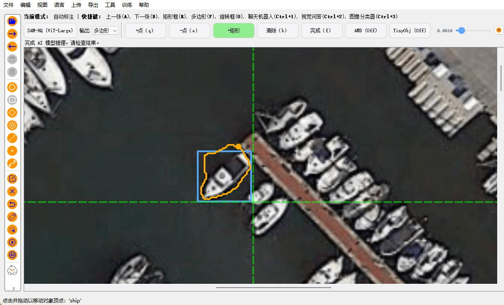
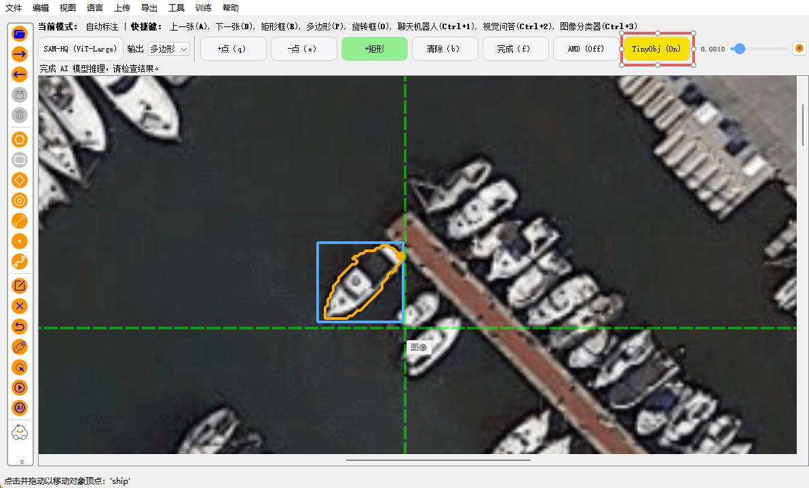

# XAnylabeling 小目标AI标注增强

优化了XAnylabeling使用SAM类模型标注小目标的表现

## 功能特性

- ✅ 提供是否开启小目标AI标注增强功能的按钮

- ✅ 适配了所有SAM类模型

- ✅ 保留了编码器特征缓存机制，只要画布上的画面未改变，标注下一处目标时仍可利用 上一次标注的特征信息，加快了推理速度

- ✅修复了用户使用多个shape作为prompts如果移动画时面可能出现的bug

## 原理说明

- **原版的问题**

小目标往往相对原图来说尺寸是非常小的，而原版后台调用模型时是将整个原图输入给模型，这会导致我们要标注的目标经过模型编码器编码后只留下了非常微小的特征，进而导致解码器输出的掩码不准确。

- **优化的逻辑**

用户在标注小目标时往往需要将画面放大，只把要标注的目标及其周围区域放在画布中。利用这一点，可以让软件后台在调用模型时只把用户看到的画面而不是整个原图送入模型，这样模型接收到的目标的尺寸更大了，经编码器编码后留下的特征也更多，输出的掩码也更准。

## 样例展示

左边为关闭小目标AI标注增强的效果，右边为打开小目标AI标注增强的效果

<table>
  <tr>
    <td></td>
    <td></td>
  </tr>
<table>

## 使用方式

```markdown
git clone https://github.com/fystero/X-AnyLabeling-for-small-tagert-autolabel-enhance.git
cd X-AnyLabeling-for-small-tagert-autolabel-enhance

pip install -r requirements-gpu.txt #GPU安装
pip install -r requirements.txt #CPU安装
```
