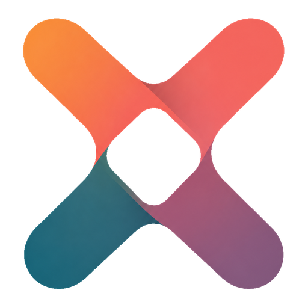

<div align="center">
  <p>
    <a href="https://github.com/CVHub520/X-AnyLabeling/" target="_blank">
      </a>
  </p>

[简体中文](README_zh-CN.md) | [English](README.md)

</div>

<p align="center">
    <a href="./LICENSE"></a>
    <a href="https://github.com/CVHub520/X-AnyLabeling/releases/latest"></a>
    <a href="https://pypi.org/project/x-anylabeling-cvhub/"></a>
    <a href="./pyproject.toml"></a>
    <a href="https://github.com/CVHub520/X-AnyLabeling/releases/latest"></a>
    <a href="https://github.com/CVHub520/X-AnyLabeling/releases"></a>
    <a href="https://modelscope.cn/collections/X-AnyLabeling-7b0e1798bcda43"></a>
</p>

<p align="center">
  <a href="https://mp.weixin.qq.com/s/Amccih1cM-B3hEfaf6koyw" target="_blank">
    
  </a>
</p>

<a href="https://mp.weixin.qq.com/s/RUb8ge-_7br0YeIImuK6YQ" target="_blank">
  
</a>

## 🥳 新功能

- `2026-08-19`：新增[图片标签](https://xanylabeling.com/zh-Hans/docs/x-anylabeling/user_guide#37-%E5%9B%BE%E7%89%87%E6%A0%87%E7%AD%BE)功能，支持标签新增、编辑、排序及批量删除。
- `2026-08-12`：新增支持 [D-FINE-seg](https://github.com/ArgoHA/D-FINE-seg) 实例分割模型。
- `2026-08-08`：新增支持 [RT-DETRv2-OBB](https://xanylabeling.com/examples/detection/obb) 旋转目标检测模型。
- `2026-08-08`：新增[魔术棒工具](https://xanylabeling.com/zh-Hans/docs/x-anylabeling/user_guide#21-%E5%88%9B%E5%BB%BA%E5%AF%B9%E8%B1%A1)，可基于连续颜色区域快速创建多边形标注。
- `2026-08-05`：发布 X-AnyLabeling v4.0.0。
- 更多详情，请参考[更新日志](./CHANGELOG.md)

## 简介

**X-AnyLabeling** 是一款轻量、高效、统一的跨平台桌面应用，面向文本、图像、视频及多模态数据提供 AI 辅助标注能力。它集成了丰富的内置工具、自动化标注工作流、先进的深度学习模型，以及灵活的多格式数据导入与导出能力。对于远程推理场景，[X-AnyLabeling-Server](https://github.com/CVHub520/X-AnyLabeling-Server) 提供轻量且可扩展的后端，用于连接自定义模型和计算资源。

## 核心特性


* 统一支持文本、图像、视频及多模态数据的标注与处理。
* 覆盖图像分类、目标检测、实例分割、姿态估计、旋转目标检测、多目标跟踪、光学字符识别、车道线标注、图像描述、视觉问答和文档解析等任务。
* 提供多边形、矩形、长方体、旋转框、四边形、圆形、线段、折线、点和掩码等标注工具，并支持文本检测、文本识别和 KIE 等任务专用工具。
* 集成多种先进的深度学习模型，支持 AI 辅助标注、自动标注和数据集批量预测。
* 支持本地与远程推理，可接入 `ONNX Runtime`、`TensorRT`、`OpenCV DNN`、`vLLM`、`SGLang` 等推理引擎与服务框架。
* 支持导入和导出 `COCO`、`VOC`、`YOLO`、`DOTA`、`MOT`、`MASK`、`PPOCR`、`MMGD`、`VLM-R1` 和 `ShareGPT` 等多种数据格式。
* 支持 Windows、Linux 和 macOS，并提供英文、简体中文、日文和韩文界面。
* 支持接入自定义模型，并提供灵活的扩展与二次开发能力。

## 模型库

| **任务类别** | **支持模型** |
| :--- | :--- |
| 🖼️ **图像分类** | YOLOv5-Cls, YOLOv8-Cls, YOLO11-Cls, InternImage, PULC |
| 🎯 **目标检测** | YOLOv5/6/7/8/9/10, YOLO11/12/26, YOLOX, YOLO-NAS, D-FINE, DAMO-YOLO, Gold_YOLO, RT-DETR, RF-DETR, DEIMv2 |
| 🖌️ **实例分割** | YOLOv5-Seg, YOLOv8-Seg, YOLO11-Seg, YOLO26-Seg, Hyper-YOLO-Seg, RF-DETR-Seg, D-FINE-seg |
| 🏃 **姿态估计** | YOLOv8-Pose, YOLO11-Pose, YOLO26-Pose, DWPose, RTMO |
| 😀 **人脸估计** | SCRFD, YOLOv6Lite-Face |
| 👣 **目标跟踪** | TrackTrack, Bot-SORT, ByteTrack, SAM2/3-Video |
| 🔄 **旋转目标检测** | YOLOv5-Obb, YOLOv8-Obb, YOLO11-Obb, YOLO26-Obb, RT-DETRv2-OBB |
| 📏 **深度估计** | Depth Anything |
| 🧩 **分割一切** | SAM 1/2/3, SAM-HQ, SAM-Med2D, EdgeSAM, EfficientViT-SAM, MobileSAM |
| ✂️ **图像抠图** | RMBG 1.4/2.0 |
| 💡 **候选框提取** | UPN |
| 🏷️ **图像标记** | RAM, RAM++ |
| 📄 **光学字符识别** | PP-OCRv4, PP-OCRv5, PP-OCRv6 |
| 🧾 **综合版面分析** | PP-DocLayoutV3 |
| 📑 **文档解析** | PaddleOCR-VL, PaddleOCR-VL-1.6 |
| 🗣️ **视觉基础模型** | Rex-Omni, Florence2 |
| 👁️ **视觉语言模型** | Qwen3-VL, Gemini, ChatGPT, GLM |
| 🛣️ **车道线检测** | CLRNet |
| 🔢 **目标计数** | CountGD, GeCO, GeCo2 |
| 📍 **视觉定位** | Grounding DINO, YOLO-World, YOLOE, SAM 3, LocateAnything |
| 📚 **其他** | 👉 [model_zoo](./docs/zh_cn/model_zoo.md) 👈 |

## 文档

0. [远程推理服务](https://github.com/CVHub520/X-AnyLabeling-Server)
1. [安装文档](./docs/zh_cn/get_started.md)
2. [用户手册](./docs/zh_cn/user_guide.md)
3. [命令行界面](./docs/zh_cn/cli.md)
4. [自定义模型](./docs/zh_cn/custom_model.md)
5. [常见问题答疑](./docs/zh_cn/faq.md)
6. [聊天机器人](./docs/zh_cn/chatbot.md)
7. [视觉问答](./docs/zh_cn/vqa.md)
8. [图像分类器](./docs/zh_cn/image_classifier.md)
9. [视频分类器](./docs/zh_cn/video_classifier.md)
10. [文档解析与智能文字识别](./docs/zh_cn/paddle_ocr.md)

## 示例

- [Classification](./examples/classification/)
  - [Image-Level](./examples/classification/image-level/README.md)
  - [Shape-Level](./examples/classification/shape-level/README.md)
- [Detection](./examples/detection/)
  - [HBB Object Detection](./examples/detection/hbb/README.md)
  - [OBB Object Detection](./examples/detection/obb/README.md)
- [Segmentation](./examples/segmentation/README.md)
  - [Instance Segmentation](./examples/segmentation/instance_segmentation/)
  - [Binary Semantic Segmentation](./examples/segmentation/binary_semantic_segmentation/)
  - [Multiclass Semantic Segmentation](./examples/segmentation/multiclass_semantic_segmentation/)
- [Description](./examples/description/)
  - [Tagging](./examples/description/tagging/README.md)
  - [Captioning](./examples/description/captioning/README.md)
- [Estimation](./examples/estimation/)
  - [Face Estimation](./examples/estimation/face_estimation/README.md)
  - [Pose Estimation](./examples/estimation/pose_estimation/README.md)
  - [Depth Estimation](./examples/estimation/depth_estimation/README.md)
- [OCR](./examples/optical_character_recognition/)
  - [Text Recognition](./examples/optical_character_recognition/text_recognition/)
  - [Key Information Extraction](./examples/optical_character_recognition/key_information_extraction/README.md)
- [MOT](./examples/multiple_object_tracking/README.md)
  - [Tracking by HBB Object Detection](./examples/multiple_object_tracking/README.md)
  - [Tracking by OBB Object Detection](./examples/multiple_object_tracking/README.md)
  - [Tracking by Instance Segmentation](./examples/multiple_object_tracking/README.md)
  - [Tracking by Pose Estimation](./examples/multiple_object_tracking/README.md)
- [iVOS](./examples/interactive_video_object_segmentation)
  - [SAM2-Video](./examples/interactive_video_object_segmentation/sam2/README.md)
  - [SAM3-Video](./examples/interactive_video_object_segmentation/sam3/README.md)
- [Matting](./examples/matting/)
  - [Image Matting](./examples/matting/image_matting/README.md)
- [Vision-Language](./examples/vision_language/)
  - [Rex-Omni](./examples/vision_language/rexomni/README.md)
  - [Florence 2](./examples/vision_language/florence2/README.md)
- [Counting](./examples/counting/)
  - [GeCo](./examples/counting/geco/README.md)
  - [GeCo2](./examples/counting/geco2/README.md)
- [Grounding](./examples/grounding/)
  - [YOLOE](./examples/grounding/yoloe/README.md)
  - [SAM 3](./examples/grounding/sam3/README.md)
  - [LocateAnything](./examples/grounding/locateanything/README.md)
- [Training](./examples/training/)
  - [Ultralytics](./examples/training/ultralytics/README.md)

## 贡献指南

我们欢迎社区协作！**X‑AnyLabeling** 项目的成长离不开开发者们的共同参与，无论是修复 Bug、优化文档、还是添加新功能，您的贡献都非常宝贵。

在参与前请阅读我们的 [贡献指南](./CONTRIBUTING.md)，并在提交 Pull Request 前确认您已同意 [贡献者许可协议 (CLA)](./CLA.md)。

如果你觉得这个项目有帮助，请点亮右上角的⭐星标⭐。如有任何问题或疑问，欢迎[创建 issue](https://github.com/CVHub520/X-AnyLabeling/issues) 或发送邮件至 cv_hub@163.com。

衷心感谢每一位为项目贡献力量的朋友 🙏

## 许可

本项目采用 [GNU General Public License v3.0](./LICENSE) 许可。您可以使用、修改和重新分发本软件，包括用于商业用途，但须遵守该许可证的相关条款。

## 赞助

X-AnyLabeling 是一个持续维护的开源项目。你的赞助将用于功能开发、模型集成、文档完善和社区支持。

<a href="https://xanylabeling.com/sponsor">
  
</a>

点击上方图片前往赞助页面。

## 致谢

衷心感谢 [AnyLabeling](https://github.com/vietanhdev/anylabeling)、[LabelMe](https://github.com/wkentaro/labelme)、[LabelImg](https://github.com/tzutalin/labelImg)、[roLabelImg](https://github.com/cgvict/roLabelImg)、[PPOCRLabel](https://github.com/PFCCLab/PPOCRLabel) 和 [CVAT](https://github.com/opencv/cvat) 的开发者与贡献者，他们的工作为本项目提供了重要基础。

## 引用

如果您在研究中使用了这个软件，请按照以下方式引用它：

```
@misc{X-AnyLabeling,
  year = {2023},
  author = {Wei Wang},
  publisher = {Github},
  organization = {CVHub},
  journal = {Github repository},
  title = {X-AnyLabeling: A Unified Desktop Platform for AI-Assisted Data Annotation},
  howpublished = {\url{https://github.com/CVHub520/X-AnyLabeling}}
}
```

<div align="center"><a href="#top">🔝 返回顶部</a></div>
