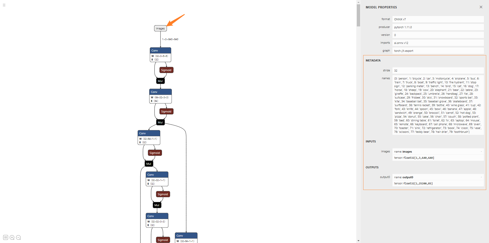

# Model Loading

X-AnyLabeling currently includes many built-in general-purpose models. For a detailed list, please refer to the [Model Zoo](../../docs/en/model_zoo.md).

> [!TIP]
> If you need to deploy a model inference service via a remote server with multi-user collaboration support, please refer to [X-AnyLabeling-Server](https://github.com/CVHub520/X-AnyLabeling-Server).

## Loading Built-in Models

Before enabling the AI-assisted labeling feature, you need to load a model. This can be done via the `AI` icon button in the left sidebar or by using the shortcut `Ctrl+A`.

Typically, when you select a model from the dropdown list, the application checks if the corresponding model files exist in the user's directory at `~/xanylabeling_data/models/${model_name}`. If they exist, the model is loaded directly. Otherwise, the application automatically downloads the files from the network to the specified directory.

Note: All built-in models are hosted by default on GitHub Releases. Therefore, you need a stable internet connection with access to GitHub; otherwise, the download might fail.

For users who fail to load models due to network issues, options include downloading the model offline and loading it manually, or modifying the model download source.

### Offline Model Download

- Open the [model_zoo.md](./model_zoo.md) file and find the configuration file corresponding to the desired model.
- Edit the configuration file, modify the model path, and optionally adjust other hyperparameters as needed.
- In the tool's interface, click **Load Custom Model** and select the path to the configuration file.

### Modify Model Download Source

For details, please refer to section `7.7 Model Download Source Configuration` in [user_guide.md](./user_guide.md).

## Loading Adapted User Custom Models

> **Adapted Models** refer to models that have already been integrated into X-AnyLabeling, requiring no custom inference code from the user. A list of adapted models can be found in the [Model Zoo](../../docs/en/model_zoo.md).

In this tutorial, we will use the [YOLOv5s](https://github.com/ultralytics/yolov5) model as an example to detail how to load a custom adapted model.

**a. Model Conversion**

Suppose you have trained a model locally. First, you can convert the `PyTorch` trained model to X-AnyLabeling's default `ONNX` file format (optional). Specifically, execute:

```bash
python export.py --weights yolov5s.pt --include onnx
```

Note: The current version does not support **dynamic inputs**, so do not set the `--dynamic` parameter.

Additionally, it is highly recommended to import the exported `*.onnx` file using the [Netron](https://netron.app/) online tool to check the input and output node information, ensuring dimensions and other details are as expected.

<p align="center">
  
</p>

**b. Model Configuration**

Once the `onnx` file is ready, you can browse the [Model Zoo](../../docs/en/model_zoo.md) file to find and copy the configuration file for the corresponding model.

Taking [yolov5s.yaml](../../anylabeling/configs/auto_labeling/yolov5s.yaml) as an example, let's look at its content:

```YAML
type: yolov5
name: yolov5s-r20230520
provider: Ultralytics
display_name: YOLOv5s
model_path: https://github.com/CVHub520/X-AnyLabeling/releases/download/v0.1.0/yolov5s.onnx
iou_threshold: 0.45
conf_threshold: 0.25
max_det: 300
classes:
  - person
  - bicycle
  - car
  ...
```

| Field          | Description                                                     | Modifiable |
|----------------|-----------------------------------------------------------------|------------|
| `type`         | Model type identifier, cannot be customized.                    | ❌         |
| `name`         | Index name of the model configuration file, keep default.       | ❌         |
| `provider`     | Model provider, can be modified based on actual situation.      | ✔️         |
| `display_name` | Name shown in the model dropdown list in the UI, customizable. | ✔️         |
| `model_path`   | Model loading path, supports relative and absolute paths.      | ✔️         |
| `iou_threshold`| IoU threshold for Non-Maximum Suppression (NMS).               | ✔️         |
| `conf_threshold`| Confidence threshold for NMS.                                  | ✔️         |
| `max_det`      | Maximum number of detections.                                  | ✔️         |
| `classes`      | List of model labels, must match the training labels.          | ✔️         |

Note that not all fields apply to every model. Refer to the definition of the specific model.

For example, looking at the implementation of the [YOLO](../../anylabeling/services/auto_labeling/__base__/yolo.py) base model, it offers additional optional configuration items:

| Field           | Description                   |
|-----------------|-------------------------------|
| `filter_classes`| Specify classes used during inference. |
| `agnostic`      | Use class-agnostic NMS.      |

Here's a typical example:

```YAML
type: yolov5
name: yolov5s-r20230520
provider: Ultralytics
display_name: YOLOv5s
model_path: /path/to/your/custom_yolov5s.onnx # Modified path
iou_threshold: 0.60
conf_threshold: 0.25
agnostic: True
filter_classes:
  - person
  - car
classes:
  - person
  - bicycle
  - car
  - ...
```

Specifically, only when using older versions of YOLOv5 (v5.0 and below), you need to specify the `anchors` and `stride` fields in the configuration file. Otherwise, **do not** specify these fields to avoid inference errors. Example:

```YAML
type: yolov5
...
stride: 32
anchors:
  - [10,13, 16,30, 33,23]  # P3/8
  - [30,61, 62,45, 59,119]  # P4/16
  - [116,90, 156,198, 373,326]  # P5/32
```

> **Tip**: For segmentation models, you can specify the `epsilon_factor` parameter to control the smoothness of the output contour points. The default value is `0.005`.

**c. Model Loading**

After understanding the above, modify the `model_path` field in the configuration file and optionally adjust other hyperparameters as needed.

The software currently supports both **relative paths** and **absolute paths** for model loading. When entering the model path, be mindful of escape characters.

Finally, in the model dropdown list in the top menu bar of the interface, find the `...Load Custom Model` option, and then import the prepared configuration file to complete the custom model loading process.

## Loading Unadapted User Custom Models

> **Unadapted Models** refer to models that have not yet been integrated into X-AnyLabeling. Users need to follow the implementation steps below for integration.

Here, we use a multi-class semantic segmentation model, `U-Net`, as an example. Follow these implementation steps:

**a. Training and Exporting Model**

Export the `ONNX` model, ensuring the output node dimension is `[1, C, H, W]`, where `C` is the total number of classes (including the background class).

> **Friendly Reminder**: Exporting to `ONNX` is optional. You can choose other model formats like `PyTorch`, `OpenVINO`, or `TensorRT` based on your needs. For an example using `Segment-Anything-2` for video object tracking, refer to the [Installation Guide](../../examples/interactive_video_object_segmentation/README.md), the configuration file definition [sam2_hiera_base_video.yaml](../../anylabeling/configs/auto_labeling/sam2_hiera_base_video.yaml), and the corresponding implementation [segment_anything_2_video.py](../../anylabeling/services/auto_labeling/segment_anything_2_video.py).

**b. Define Configuration File**

First, create a new configuration file, e.g., `unet.yaml`, in the [configuration directory](../../anylabeling/configs/auto_labeling):

```YAML
type: unet
name: unet-r20250101
display_name: U-Net (ResNet34)
provider: xxx
conf_threshold: 0.5
model_path: /path/to/best.onnx
classes:
  - cat
  - dog
  - _background_
```

Where:

| Field          | Description                                                      |
|----------------|------------------------------------------------------------------|
| `type`         | Specifies the model type. Ensure it's unique from existing types to maintain identifier uniqueness. |
| `name`         | Defines the model index for internal reference and management. Avoid conflicts with existing indices. |
| `display_name` | The model name displayed in the UI for easy identification. Ensure uniqueness. |

These three fields are mandatory. Add other fields as needed, such as provider, model path, hyperparameters, etc.

**c. Add Configuration File**

Next, add the above configuration file to the [model management file](../../anylabeling/configs/models.yaml):

```yaml
...

- model_name: "unet-r20250101"
  config_file: ":/unet.yaml"
...
```

**d. Configure UI Components**

This step can add UI components as needed. Simply add the `model_type` to the corresponding list in the [file](../../anylabeling/services/auto_labeling/__init__.py).

**e. Define Inference Service**

A key step in defining the inference service is inheriting the [Model](../../anylabeling/services/auto_labeling/model.py) base class, which allows you to implement model-specific forward inference logic.

Specifically, create a new file `unet.py` in the [model inference service directory](../../anylabeling/services/auto_labeling/). Here's an example:

```python
import logging
import os

import cv2
import numpy as np
from PyQt5 import QtCore
from PyQt5.QtCore import QCoreApplication

from anylabeling.app_info import __preferred_device__
from anylabeling.views.labeling.shape import Shape
from anylabeling.views.labeling.utils.opencv import qt_img_to_rgb_cv_img
from .model import Model
from .types import AutoLabelingResult
from .engines.build_onnx_engine import OnnxBaseModel


class UNet(Model):
    """Semantic segmentation model using UNet"""

    class Meta:
        required_config_names = [
            "type",
            "name",
            "display_name",
            "model_path",
            "classes",
        ]
        widgets = ["button_run"]
        output_modes = {
            "polygon": QCoreApplication.translate("Model", "Polygon"),
        }
        default_output_mode = "polygon"

    def __init__(self, model_config, on_message) -> None:
        # Run the parent class's init method
        super().__init__(model_config, on_message)
        model_name = self.config["type"]
        model_abs_path = self.get_model_abs_path(self.config, "model_path")
        if not model_abs_path or not os.path.isfile(model_abs_path):
            raise FileNotFoundError(
                QCoreApplication.translate(
                    "Model",
                    f"Could not download or initialize {model_name} model.",
                )
            )
        self.net = OnnxBaseModel(model_abs_path, __preferred_device__)
        self.classes = self.config["classes"]
        self.input_shape = self.net.get_input_shape()[-2:]

    def preprocess(self, input_image):
        input_h, input_w = self.input_shape
        image = cv2.resize(input_image, (input_w, input_h))
        image = np.transpose(image, (2, 0, 1))
        image = image.astype(np.float32) / 255.0
        image = (image - 0.5) / 0.5
        image = np.expand_dims(image, axis=0)
        return image

    def postprocess(self, image, outputs):
        n, c, h, w = outputs.shape
        image_height, image_width = image.shape[:2]
        # Obtain the category index of each pixel
        # target shape: (1, h, w)
        outputs = np.argmax(outputs, axis=1)
        results = []
        for i in range(c):
            # Skip the background label
            if self.classes[i] == '_background_':
                continue
            # Get the category index of each pixel for the first batch by adding [0].
            mask = outputs[0] == i
            # Rescaled to original shape
            mask_resized = cv2.resize(mask.astype(np.uint8), (image_width, image_height))
            # Get the contours
            contours, _ = cv2.findContours(mask_resized, cv2.RETR_EXTERNAL, cv2.CHAIN_APPROX_SIMPLE)
            # Append the contours along with their respective class labels
            results.append((self.classes[i], [np.squeeze(contour).tolist() for contour in contours]))
        return results

    def predict_shapes(self, image, image_path=None):
        if image is None:
            return []

        try:
            image = qt_img_to_rgb_cv_img(image, image_path)
        except Exception as e:  # noqa
            logging.warning("Could not inference model")
            logging.warning(e)
            return []

        blob = self.preprocess(image)
        outputs = self.net.get_ort_inference(blob)
        results = self.postprocess(image, outputs)
        shapes = []
        for item in results:
            label, contours = item
            for points in contours:
                # Make sure to close
                points += points[0]
                shape = Shape(flags={})
                for point in points:
                    shape.add_point(QtCore.QPointF(point[0], point[1]))
                shape.shape_type = "polygon"
                shape.closed = True
                shape.fill_color = "#000000"
                shape.line_color = "#000000"
                shape.label = label
                shape.selected = False
                shapes.append(shape)

        result = AutoLabelingResult(shapes, replace=True)
        return result

    def unload(self):
        del self.net
```

Here:

-   In the `Meta` class:
    -   `required_config_names`: Specifies mandatory fields in the model config file for proper initialization.
    -   `widgets`: Specifies controls (buttons, dropdowns, etc.) to display for this service. See [this file](../../anylabeling/services/auto_labeling/__init__.py) for definitions.
    -   `output_modes`: Specifies the output shape types supported (e.g., polygon, rectangle, rotated box).
    -   `default_output_mode`: Specifies the default output shape type.
-   `predict_shapes` and `unload` are abstract methods that **must** be implemented. They define the inference process and resource release logic, respectively.

**f. Add to Model Management**

After the above steps, open the [model configuration file](../../anylabeling/services/auto_labeling/__init__.py). Add the corresponding model type field (e.g., `unet`) to the `_CUSTOM_MODELS` list and, if necessary, add the model name to relevant configuration sections.

> **Tip**: If you don't know how to implement specific widgets, use the search panel, enter relevant keywords, and examine the implementation logic of available widgets.

Finally, go to the [Model Manager class file](../../anylabeling/services/auto_labeling/model_manager.py). In the `_load_model` method, initialize your instance as follows:

```python
...

class ModelManager(QObject):
    """Model manager"""

    def __init__(self):
        ...
    ...
    def _load_model(self, model_id):
        """Load and return model info"""
        if self.loaded_model_config is not None:
            self.loaded_model_config["model"].unload()
            self.loaded_model_config = None
            self.auto_segmentation_model_unselected.emit()

        model_config = copy.deepcopy(self.model_configs[model_id])
        if model_config["type"] == "yolov5":
            ...
        elif model_config["type"] == "unet":
            from .unet import UNet

            try:
                model_config["model"] = UNet(
                    model_config, on_message=self.new_model_status.emit
                )
                self.auto_segmentation_model_unselected.emit()
            except Exception as e:  # noqa
                self.new_model_status.emit(
                    self.tr(
                        "Error in loading model: {error_message}".format(
                            error_message=str(e)
                        )
                    )
                )
                print(
                    "Error in loading model: {error_message}".format(
                        error_message=str(e)
                    )
                )
                return
          ...
    ...
```

⚠️Note:

-   The model type field must match the `type` field defined in the configuration file (Step **b. Define Configuration File**).
-   If the model is based on `SAM` (Segment Anything Model) interaction patterns, replace `self.auto_segmentation_model_unselected.emit()` with `self.auto_segmentation_model_selected.emit()` to trigger the corresponding functionality. (Or better, use a configuration flag as shown in the example code).

# Model Export

> This section provides specific examples of converting custom models to the ONNX format for quick integration into X-AnyLabeling.

## Classification

### [InternImage](https://github.com/OpenGVLab/InternImage)

InternImage introduces a large-scale Convolutional Neural Network (CNN) model utilizing deformable convolutions as core operators. This achieves large effective receptive fields, adaptive spatial aggregation, and reduced inductive bias, enabling the learning of stronger, more robust patterns from extensive data. It surpasses current CNNs and Vision Transformers on benchmarks.

| Attribute         | Value                                                                                   |
|-------------------|-----------------------------------------------------------------------------------------|
| Paper Title       | InternImage: Exploring Large-Scale Vision Foundation Models with Deformable Convolutions |
| Publishing Units  | Shanghai AI Laboratory, Tsinghua University, Nanjing University, etc.                 |
| Publication Date  | CVPR'23                                                                                 |

Please refer to this [tutorial](../../tools/onnx_exporter/export_internimage_model_onnx.py).

### [PersonAttribute](https://github.com/PaddlePaddle/PaddleClas/blob/release/2.5/docs/zh_CN/models/PULC/PULC_person_attribute.md)

This tutorial provides users with a method to quickly build lightweight, high-precision, and practical person attribute classification models using PaddleClas PULC (Practical Ultra-Lightweight image Classification). The model can be widely used in pedestrian analysis, tracking scenarios, etc.

| Attribute         | Value                                                                                   |
|-------------------|-----------------------------------------------------------------------------------------|
| Publishing Units  | PaddlePaddle Team (Baidu)                                                               |

Please refer to this [tutorial](../../tools/onnx_exporter/export_pulc_attribute_model_onnx.py).

### [VehicleAttribute](https://github.com/PaddlePaddle/PaddleClas/blob/release/2.5/docs/zh_CN/models/PULC/PULC_vehicle_attribute.md)

This tutorial provides users with a method to quickly build lightweight, high-precision, and practical vehicle attribute classification models using PaddleClas PULC. The model is suitable for vehicle recognition, road monitoring, etc.

| Attribute         | Value                                                                                   |
|-------------------|-----------------------------------------------------------------------------------------|
| Publishing Units  | PaddlePaddle Team (Baidu)                                                               |

Please refer to this [tutorial](../../tools/onnx_exporter/export_pulc_attribute_model_onnx.py).

## Object Detection

### [RF-DETR](https://github.com/roboflow/rf-detr)

`RF-DETR` is the first real-time model to exceed 60 AP on the Microsoft COCO benchmark alongside competitive performance at base sizes. It also achieves state-of-the-art performance on RF100-VL, an object detection benchmark that measures model domain adaptability to real world problems. RF-DETR is comparable speed to current real-time objection models.

> Organization: Roboflow

Please refer to this [tutorial](../../tools/onnx_exporter/export_rfdetr_onnx.py).

### [YOLOv5_OBB](https://github.com/hukaixuan19970627/yolov5_obb)

> Author: Kaixuan Hu

Please refer to this [tutorial](https://github.com/CVHub520/yolov5_obb/tree/main).

### [YOLOv7](https://github.com/WongKinYiu/yolov7)

| Attribute         | Value                                                                                     |
|-------------------|-------------------------------------------------------------------------------------------|
| Paper Title       | YOLOv7: Trainable bag-of-freebies sets new state-of-the-art for real-time object detectors |
| Publishing Units  | Institute of Information Science, Academia Sinica, Taiwan                                |

```bash
python export.py --weights yolov7.pt --img-size 640 --grid
```

> **Note:** The `--grid` parameter must be included when running this command.

### [Gold-YOLO](https://github.com/huawei-noah/Efficient-Computing/tree/master/Detection/Gold-YOLO)

| Attribute         | Value                                                                   |
|-------------------|-------------------------------------------------------------------------|
| Paper Title       | Gathering Information Helps Explain The Locality In Structured Object Detection (Preprint includes Gold-YOLO) |
| Publishing Units  | Huawei Noah's Ark Lab                                                   |
| Publication Date  | NeurIPS'23                                                              |

```bash
# Clone the repository first
git clone https://github.com/huawei-noah/Efficient-Computing.git
cd Efficient-Computing/Detection/Gold-YOLO
# Run export for desired model weight
python deploy/ONNX/export_onnx.py --weights Gold_n_dist.pt --simplify --ort
# Or other weights: Gold_s_pre_dist.pt, Gold_m_pre_dist.pt, Gold_l_pre_dist.pt
```

### [DAMO-YOLO](https://github.com/tinyvision/DAMO-YOLO)

`DAMO-YOLO` is a fast and accurate object detection method developed by the TinyML team at Alibaba DAMO Academy's Data Analytics and Intelligence Lab. It achieves state-of-the-art performance by incorporating new techniques, including a Neural Architecture Search (NAS) backbone, an efficient re-parameterized Generalized-FPN (RepGFPN), a lightweight head, AlignedOTA label assignment, and distillation enhancement.

| Attribute         | Value                                                                 |
|-------------------|-----------------------------------------------------------------------|
| Paper Title       | DAMO-YOLO: A Report on Real-Time Object Detection                     |
| Publishing Units  | Alibaba Group                                                         |
| Publication Date  | Arxiv'22                                                              |

```bash
# Clone the repository first
git clone https://github.com/tinyvision/DAMO-YOLO.git
cd DAMO-YOLO
# Run converter for a specific config and checkpoint
python tools/converter.py -f configs/damoyolo_tinynasL25_S.py -c damoyolo_tinynasL25_S.pth --batch_size 1 --img_size 640
```

### [RT-DETR](https://github.com/lyuwenyu/RT-DETR)

Real-Time Detection Transformer (`RT-DETR`) is the first known real-time end-to-end object detector. RT-DETR-L achieves 53.0% AP on COCO val2017 at 114 FPS on a T4 GPU, while RT-DETR-X achieves 54.8% AP at 74 FPS, surpassing all YOLO detectors of the same scale in speed and accuracy. RT-DETR-R50 achieves 53.1% AP at 108 FPS, outperforming DINO-Deformable-DETR-R50 by 2.2% AP with about 21x faster FPS.

| Attribute         | Value                                                                 |
|-------------------|-----------------------------------------------------------------------|
| Paper Title       | RT-DETR: DETRs Beat YOLOs on Real-time Object Detection               |
| Publishing Units  | Baidu Inc.                                                            |
| Publication Date  | Arxiv'22 (Accepted to ICCV 2023)                                      |

Please refer to external tutorials or the official repository for ONNX export instructions, as direct commands might vary. Example article (Chinese): [https://zhuanlan.zhihu.com/p/628660998](https://zhuanlan.zhihu.com/p/628660998).

### [Hyper-YOLO](https://github.com/iMoonLab/Hyper-YOLO)

Hyper-YOLO is a novel object detection method that integrates hypergraph computation to capture complex high-order associations between visual features. It introduces a Hypergraph Computation-enhanced Semantic Collection and Scattering (HGC-SCS) framework, transforming visual feature maps into semantic space and constructing hypergraphs for high-order information propagation.

| Attribute         | Value                                                                 |
|-------------------|-----------------------------------------------------------------------|
| Paper Title       | Hyper-YOLO: When Visual Object Detection Meets Hypergraph Computation |
| Publishing Units  | Tsinghua University, Xi'an Jiaotong University                        |
| Publication Date  | TAPMI'25 (Preprint available)                                         |

Download the model, install dependencies, then modify the `Hyper-YOLO/ultralytics/export.py` file (or a similar export script within that project), setting `batch=1` and `half=False`:

```python
# Example modification within export_onnx.py or a similar script
# Ensure necessary imports (Path, YOLO, torch, os) are present
from pathlib import Path
from ultralytics import YOLO
import torch
import os

if __name__ == '__main__':
    model_path = 'hyper-yolon-seg.pt' # Or your specific model weight file
    if isinstance(model_path, (str, Path)):
        model = YOLO(model_path)

    # Ensure export arguments are set correctly
    output_filename = model.export(
        imgsz=640,
        batch=1,         # Set batch size to 1
        format='onnx',   # Specify ONNX format
        int8=False,
        half=False,      # Set half to False
        device="0",      # Or "cpu"
        verbose=False
    )
    print(f"Model exported to {output_filename}")

```

Then run the export script (adjust path as needed):

```bash
python3 Hyper-YOLO/ultralytics/export.py
```


### [D-FINE](https://github.com/Peterande/D-FINE)

`D-FINE` is a powerful real-time object detector that redefines the bounding box regression task in DETRs as Fine-grained Distribution Refinement (FDR) and introduces Global Optimal Localization Self-Distillation (GO-LSD), achieving outstanding performance without introducing additional inference and training costs.

| Attribute         | Value                                                                             |
|-------------------|-----------------------------------------------------------------------------------|
| Paper Title       | D-FINE: Redefine Regression Task of DETRs as Fine-grained Distribution Refinement |
| Publishing Units  | OUniversity of Science and Technology of China                                    |
| Publication Date  | ICLR'25 Spotlight                                                                 |

Please refer to this [tutorial](../../tools/onnx_exporter/export_dfine_onnx.py).

### [DEIMv2](https://github.com/Intellindust-AI-Lab/DEIMv2)

`DEIMv2` is an evolution of the DEIM framework while leveraging the rich features from DINOv3. Our method is designed with various model sizes, from an ultra-light version up to S, M, L, and X, to be adaptable for a wide range of scenarios. Across these variants, DEIMv2 achieves state-of-the-art performance, with the S-sized model notably surpassing 50 AP on the challenging COCO benchmark.

| Attribute        | Value                                    |
|------------------|------------------------------------------|
| Paper Title      | Real-Time Object Detection Meets DINOv3  |
| Publishing Units | Intellindust AI Lab & Xiamen University  |
| Publication Date | Arxiv'25                                 |

请参考此[教程](../../tools/onnx_exporter/export_deimv2_onnx.py)。

## Segment Anything

### [SAM](https://github.com/facebookresearch/segment-anything)

The Segment Anything Model (`SAM`) generates high-quality object masks from input prompts like points or boxes. It can produce masks for all objects in an image and was trained on a dataset of 11 million images and 1.1 billion masks. SAM demonstrates strong zero-shot performance on various segmentation tasks.

| Attribute         | Value                                                                 |
|-------------------|-----------------------------------------------------------------------|
| Paper Title       | Segment Anything                                                      |
| Publishing Units  | Meta AI Research, FAIR                                                |
| Publication Date  | ICCV'23                                                               |

For ONNX export, refer to community exporters like [https://github.com/vietanhdev/samexporter#sam-exporter](https://github.com/vietanhdev/samexporter#sam-exporter) or the official repository for potential tools.

### [Efficient-SAM](https://github.com/yformer/EfficientSAM)

`EfficientViT` (underlying EfficientSAM) is a family of vision models designed for efficient high-resolution dense prediction. It uses a novel lightweight multi-scale linear attention module as its core building block, achieving global receptive fields and multi-scale learning with hardware-efficient operations. EfficientSAM adapts this for promptable segmentation.

| Attribute         | Value                                                                                 |
|-------------------|---------------------------------------------------------------------------------------|
| Paper Title       | EfficientViT: Multi-Scale Linear Attention for High-Resolution Dense Prediction       |
| Publishing Units  | MIT HAN Lab                                                                           |
| Publication Date  | ICCV'23                                                                               |

For ONNX export, refer to the specific EfficientSAM project (e.g., linked via EfficientViT or search directly) or check benchmarking scripts like those mentioned in the EfficientViT repo: [https://github.com/microsoft/Cream/tree/main/EfficientViT#benchmarking-with-onnxruntime](https://github.com/microsoft/Cream/tree/main/EfficientViT#benchmarking-with-onnxruntime) (Note: Original provided link `CVHub520/efficientvit` seems like a fork, official repo might differ).

### [SAM-Med2D](https://github.com/OpenGVLab/SAM-Med2D)

`SAM-Med2D` is a specialized model developed to address the challenges of applying state-of-the-art image segmentation techniques to medical images.

| Attribute         | Value                                                                 |
|-------------------|-----------------------------------------------------------------------|
| Paper Title       | SAM-Med2D                                                             |
| Publishing Units  | OpenGVLab                                                             |
| Publication Date  | Arxiv'23                                                              |

Refer to the deployment instructions in the official repository: [https://github.com/OpenGVLab/SAM-Med2D#%EF%B8%8F-deploy](https://github.com/OpenGVLab/SAM-Med2D#%EF%B8%8F-deploy). (Note: Original provided link `CVHub520/SAM-Med2D` seems like a fork).

### [HQ-SAM](https://github.com/SysCV/sam-hq)

`HQ-SAM` is an enhanced version of the Segment Anything Model (SAM) designed to improve mask prediction quality, especially for complex structures, while maintaining SAM's efficiency and zero-shot capabilities. It achieves this through an improved decoding process and additional training on a specialized dataset.

| Attribute         | Value                                                                 |
|-------------------|-----------------------------------------------------------------------|
| Paper Title       | Segment Anything in High Quality                                      |
| Publishing Units  | ETH Zurich, HKUST                                                     |
| Publication Date  | NeurIPS'23                                                            |

Refer to the official HQ-SAM repository or potentially forks like [https://github.com/CVHub520/sam-hq](https://github.com/CVHub520/sam-hq) for ONNX export tutorials or scripts.

### [EdgeSAM](https://github.com/chongzhou96/EdgeSAM)

`EdgeSAM` is an accelerated variant of the Segment Anything Model (SAM), optimized for efficient execution on edge devices with minimal performance compromise. It claims significant speedups over the original SAM and MobileSAM on edge hardware.

| Attribute         | Value                                                                 |
|-------------------|-----------------------------------------------------------------------|
| Paper Title       | EdgeSAM: Prompt-In-the-Loop Distillation for On-Device Deployment of SAM |
| Publishing Units  | S-Lab, Nanyang Technological University; Shanghai AI Laboratory       |
| Publication Date  | Arxiv'23                                                              |

Refer to the official repository's export script: [https://github.com/chongzhou96/EdgeSAM/blob/main/scripts/export_onnx_model.py](https://github.com/chongzhou96/EdgeSAM/blob/main/scripts/export_onnx_model.py).

## Grounding

### [Grounding DINO](https://github.com/IDEA-Research/GroundingDINO)

`Grounding DINO` is a state-of-the-art (SOTA) zero-shot object detection model excelling at detecting objects not defined during training. Its ability to adapt to new objects and scenes makes it highly versatile for real-world applications. It performs well in Referring Expression Comprehension (REC), identifying and locating specific objects or regions in images based on text descriptions. Grounding DINO simplifies object detection by eliminating hand-designed components like Non-Maximum Suppression (NMS).

| Attribute         | Value                                                                                     |
|-------------------|-------------------------------------------------------------------------------------------|
| Paper Title       | Grounding DINO: Marrying DINO with Grounded Pre-Training for Open-Set Object Detection    |
| Publishing Units  | IDEA-CVR, IDEA-Research                                                                   |
| Publication Date  | Arxiv'23                                                                                  |

Please refer to this [tutorial](../../tools/onnx_exporter/export_grounding_dino_onnx.py).

### [YOLO-World](https://github.com/AILab-CVC/YOLO-World)

`YOLO-World` enhances the YOLO series by incorporating vision-language modeling, enabling efficient open-vocabulary object detection that excels in various tasks.

| Attribute         | Value                                                                 |
|-------------------|-----------------------------------------------------------------------|
| Paper Title       | YOLO-World: Real-Time Open-Vocabulary Object Detection                 |
| Publishing Units  | Tencent AI Lab, ARC Lab, Tencent PCG, Huazhong University of Science and Technology |
| Publication Date  | Arxiv'24                                                              |

```bash
# Ensure ultralytics package is installed and updated
# pip install -U ultralytics
# Clone the ultralytics repo if needed for specific export scripts, otherwise use the pip package
# git clone https://github.com/ultralytics/ultralytics.git
# cd ultralytics
# Use the yolo command line interface
yolo export model=yolov8s-worldv2.pt format=onnx opset=13 simplify
```

### [GeCo](https://github.com/jerpelhan/GeCo)

`GeCo` is a unified architecture for few-shot counting, achieving high-precision object detection, segmentation, and counting through novel dense queries and a counting loss.

| Attribute         | Value                                                                                         |
|-------------------|-----------------------------------------------------------------------------------------------|
| Paper Title       | GeCo: Query-Based Anchors for Fine-Grained Multi-Object Counting, Detection, and Segmentation |
| Publishing Units  | University of Ljubljana                                                                       |
| Publication Date  | NeurIPS'24                                                                                    |

Please refer to this [tutorial](../../tools/onnx_exporter/export_geco_onnx.py).

## Image Tagging

### [Recognize Anything (RAM)](https://github.com/xinyu1205/recognize-anything)

`RAM` (Recognize Anything Model) is a robust image tagging model known for its exceptional image recognition capabilities. RAM excels in zero-shot generalization, is cost-effective, reproducible, and relies on open-source, annotation-free datasets. Its flexibility makes it suitable for a wide range of applications.

| Attribute         | Value                                                                 |
|-------------------|-----------------------------------------------------------------------|
| Paper Title       | Recognize Anything: A Strong Image Tagging Model                      |
| Publishing Units  | OPPO Research Institute, IDEA-Research, AI Robotics                   |
| Publication Date  | Arxiv'23                                                              |

Please refer to this [tutorial](../../tools/onnx_exporter/export_recognize_anything_model_onnx.py). (Note: Original linked repo `Tag2Text` seems related but RAM is often associated with `recognize-anything`).
