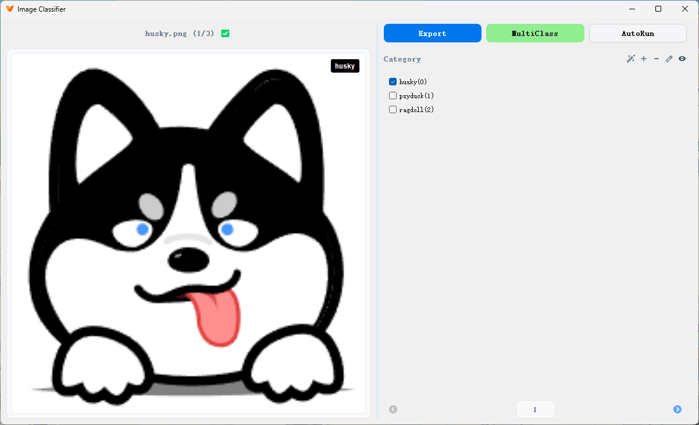
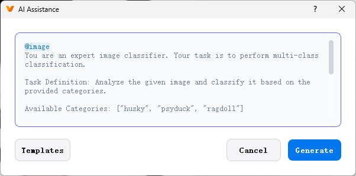
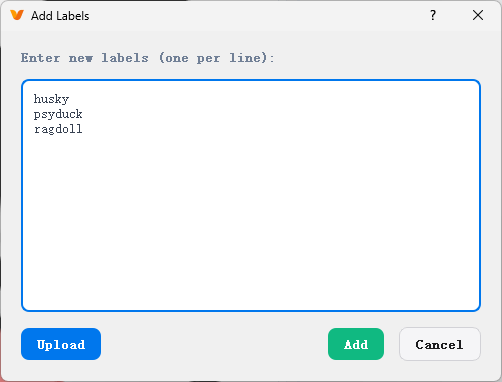
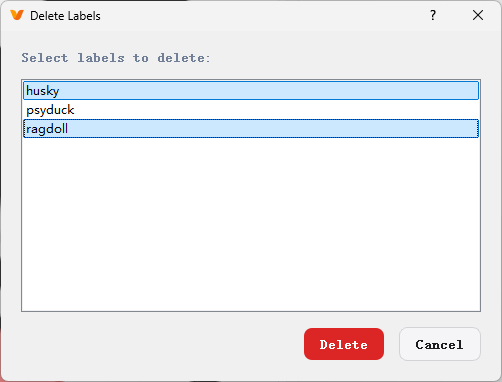
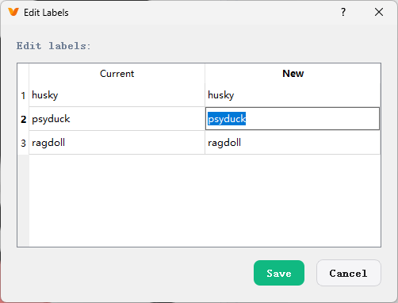
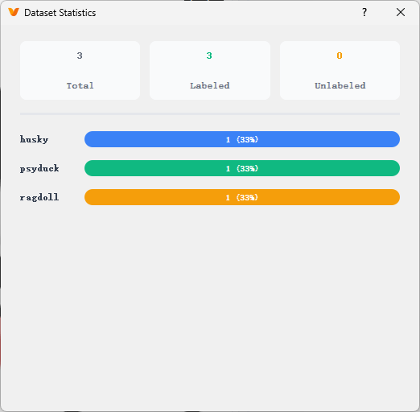

# Overview

The Image Classifier in X-AnyLabeling is a specialized feature module designed for image classification annotation. It provides a dedicated dialog interface that enables users to efficiently classify and annotate image datasets. This module supports both multi-class classification (single-label) and multi-label classification (multi-label) modes, offers comprehensive label management capabilities including adding, deleting, and editing labels, integrates AI-powered classification for both individual and batch processing, provides dataset statistics such as label usage frequency, supports keyboard shortcuts for rapid image navigation and annotation, and allows exporting classified images into category-specific folders.

<video src="https://github.com/user-attachments/assets/0652adfb-48a4-4219-9b18-16ff5ce31be0" width="100%" controls>
</video>

# Getting Started

To launch the Image Classifier window, first ensure that an image directory is loaded in the main window. Then click the Image Classifier icon (ragdoll avatar) in the left toolbar of the main window, or use the following keyboard shortcuts:

- Windows/Linux: `Ctrl` + `3`
- macOS: `⌘` + `3`

> [!NOTE]
> The main window will be automatically hidden when opening the Image Classifier window. If the taskbar icon disappears after minimizing, use `Alt` + `Tab` (Windows) or `⌘` + `Tab` (macOS) to switch back to the window. The main window will reappear after closing the classifier window.

# Tutorial

The Image Classifier features a dual-panel design with the image preview area on the left and the annotation control panel on the right.



## Left Panel - Image Preview Area

- **Filename and Progress Indicator**: Displays the current image filename and its position within the dataset (e.g., "husky.png (1/3) ✅" or "ragdoll.png (3/3) ❌").
- **Image Preview Area**: Centers the image with adaptive scaling. When labels are selected, the label text appears in real-time at the top-right corner of the preview area for quick verification.

> [!TIP]
> ✅ indicates the current image has been annotated
> ❌ indicates the current image has not been annotated

## Right Panel - Annotation Control Area

- **Function Components**:

| Button | Description |
|--------|-------------|
| Export | Export classified images into category-specific folders (MultiClass mode only) |
| MultiClass | Multi-class classification mode, only one label per image |
| MultiLabel | Multi-label classification mode, multiple labels per image (v3.2.7+) |
| AutoRun | Use AI models to automatically classify all images in batch |

> [!NOTE]
> - MultiClass mode: Suitable for mutually exclusive classification tasks, such as animal species recognition (one image can only be one species)
> - MultiLabel mode: Suitable for multi-attribute annotation tasks, such as image tagging (one image can have multiple attributes)
> - Note that when switching from MultiLabel to MultiClass mode, the system will only keep the first selected label for each image

The export function organizes classified images into the following structure:

```bash
classified/
├── husky/
│   ├── husky_playing.jpg
│   └── husky_sleeping.jpg
├── psyduck/
│   ├── psyduck_swimming.png
│   └── psyduck_standing.png
└── ragdoll/
    ├── ragdoll_grooming.jpg
    └── ragdoll_sitting.jpg
```

- **Annotation Components**:

The right center panel contains the title and the following 5 annotation components.

### AI Assistant

To use the AI-powered assistance feature, please first complete the configuration as described in the [Chatbot](../en/chatbot.md) section.


Once configured, you can access the AI intelligent dialog by clicking the magic wand (🪄) icon on the right side of the annotation components area.



The software includes a built-in standard prompt template that automatically adjusts based on the current mode (MultiClass or MultiLabel). You can use it directly or customize according to your specific requirements.

**MultiClass Mode Example:**

```prompt
@image
You are an expert image classifier. Your task is to perform multi-class classification.

Task Definition: Analyze the given image and classify it based on the provided categories.

Available Categories: ["husky", "psyduck", "ragdoll"]

Instructions:
1. Carefully examine the image and identify the main subject and their activity
2. Be precise - only select categories that clearly match what you observe

Return your result in strict JSON format:
{"husky": false, "psyduck": false, "ragdoll": false}

Set exactly ONE category to 'true' that best matches the image, keep all others as 'false'.
```

**MultiLabel Mode Example:**

```prompt
@image
You are an expert image classifier. Your task is to perform multi-label classification.

Task Definition: Analyze the given image and classify it based on the provided categories.

Available Categories: ["outdoor", "sunny", "people", "building"]

Instructions:
1. Carefully examine the image and identify the main subject and their activity
2. Be precise - only select categories that clearly match what you observe

Return your result in strict JSON format:
{"outdoor": false, "sunny": false, "people": false, "building": false}

Set ALL applicable categories to 'true', keep non-applicable ones as 'false'.
```

> For advanced usage of the intelligent dialog, including special references and template library settings, please refer to the [VQA Annotation Documentation](./vqa.md).

### Add Labels



The software provides two methods for adding labels:

1. **Manual Input**: Suitable for small numbers of labels. Enter label names directly in the text field, one per line. Label names must be unique.
2. **File Import**: Suitable for large numbers of labels. Prepare a [classes.txt](../../assets/classes.txt) file in advance (one label per line) and import it using the upload button on the left. The file content will be automatically parsed into the text field.

After confirming the label list is correct, click the Add button to complete the label addition.

> [!NOTE]
> This interface only supports adding new labels, not modifying existing ones. To edit or delete existing labels, please refer to the following sections.

### Delete Labels



The delete labels component allows you to remove existing labels. Select one or more labels by clicking (selected labels will be highlighted), then click the delete button. After confirming in the confirmation dialog, the system will automatically traverse all label files in the current task and remove all content related to the selected labels.

### Edit Labels



The label editing component displays labels in table format, with current labels shown in the left column (read-only) and editable new label names in the right column. To modify a label, double-click the right cell to enter edit mode and input the new label name. After completing all modifications, click the Save button to apply the changes.

### Dataset Statistics



The dataset statistics component provides statistical information about the current task's dataset, including:

1. **Overall Statistics**: Shows total samples, annotated count, and unannotated count in the dataset.
2. **Label Distribution**: Displays the usage frequency and percentage of each label in a horizontal bar chart format. Different colors distinguish different labels, with specific counts and percentages shown after each label.

- **Navigation Components**

Users can manually click the left/right arrows to switch between previous/next images, or use the page number input box to jump to a specific image. Additionally, the following keyboard shortcuts are available for quick image navigation:

| Shortcut | Function |
|----------|----------|
| A | Previous image |
| D | Next image |
| Ctrl+A or ⌘+A | Previous unlabeled image |
| Ctrl+D or ⌘+D | Next unlabeled image |

# Data Format

The Image Classifier's annotation information is stored in the `flags` field of X-AnyLabeling label files. For details, please refer to the [User Guide - 1.4 Saving Label Data](./user_guide.md#14-saving-label-data) section.

```json
{
  "version": "3.2.3",
  "flags": {
    "husky": true,
    "psyduck": false,
    "ragdoll": false
  },
  "shapes": [],
  "imagePath": "husky.png",
  "imageData": null,
  "imageHeight": 200,
  "imageWidth": 200,
  "description": ""
}
```
