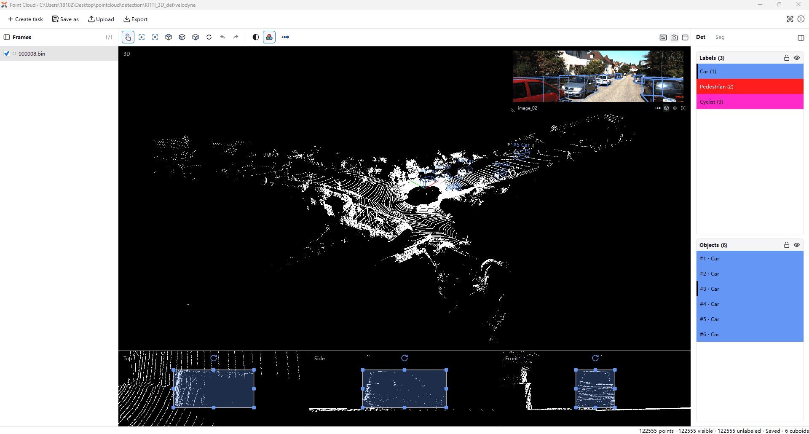
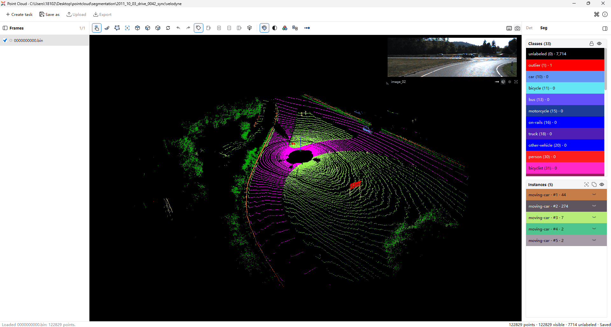

# 3D Point Cloud Annotation

A 3D point cloud is a collection of points in three-dimensional space. Each point has X, Y, and Z coordinates and may also include information such as color or intensity. Point clouds are typically captured by LiDAR sensors or depth cameras to represent the shapes of objects and the spatial structure of a scene.

X-AnyLabeling supports **3D object detection, semantic segmentation, and instance segmentation annotation**. Use 3D bounding boxes to mark the position, size, and orientation of objects such as vehicles and pedestrians; assign a class to each point to label roads, buildings, and other features; or distinguish individual objects within the same class, such as two separate cars. These annotations can be used to build datasets for autonomous driving perception, robot navigation, and 3D scene understanding.

## 3D Point Cloud Workspace

### Opening the Workspace

Click the **Point Cloud** icon in the left toolbar of the main X-AnyLabeling window, or press `Ctrl+6`, to open the 3D point cloud workspace.

The workspace contains the following areas:

- **Top toolbar**: Create tasks, import and export annotations, and save a copy of the current frame's annotations.
- **File list on the left**: Browse point cloud files and switch between frames.
- **Central annotation area**: Use the toolbar and 3D canvas to inspect and annotate point clouds. Detection tasks also provide top, side, and front views for adjusting 3D boxes.
- **Management panel on the right**: Manage classes, detection boxes, or segmentation instances, including visibility and locking.
- **Status bar at the bottom**: Check information about the current frame and the annotation save status.

> [!TIP]
> Hover over a toolbar icon to see its tooltip. Click the **⌘** icon in the upper-right corner to view the workspace shortcuts.

### Creating a Task

Start by clicking **Create task** in the top toolbar, then complete these three steps:

1. **Choose a task type and classes**: Select the task type, then add annotation classes or load a custom class file. To save the classes, click **Save labels** at the bottom left and choose a directory and JSON filename.
2. **Choose the data and output directories**: Select the directory containing your point clouds and, optionally, an annotation output directory. If the output directory is left blank, annotations are saved alongside the point clouds.
3. **Configure camera data (optional)**: Add camera image directories and calibration files as needed. Skip this step if you do not need camera images.

Click **Create task** to load the point clouds and start annotating.

### File Formats

**Point cloud files**

Both detection and segmentation tasks support the following point cloud formats:

| Format | Requirements |
| --- | --- |
| `.bin` | Each point consists of four little-endian float32 values: X, Y, Z, and intensity, for a total of 16 bytes. |
| `.ply` | Must contain `x`, `y`, and `z` coordinates; color and intensity are optional. |

**Class files**

In the first step of task creation, click **Save labels** and choose a directory and filename to save the current task's classes as JSON. The file records class IDs, names, and colors. Detection and segmentation classes are stored under `detection` and `segmentation`, respectively:

```json
{
  "version": 1,
  "detection": {
    "classes": [
      {"id": 1, "name": "Car", "color": "#6496F5"}
    ]
  },
  "segmentation": {
    "classes": [
      {"id": 0, "name": "unlabeled", "color": "#000000"},
      {"id": 10, "name": "car", "color": "#6496F5"}
    ]
  }
}
```

`id` is the class ID, `name` is the class name, and `color` is a `#RRGGBB` color. Segmentation classes must include ID `0` for unlabeled points. Detection boxes cannot use class ID `0`. A file may contain only the section for the current task. See the [sample class file](../../assets/pointcloud/pointcloud_classes.json) for a complete configuration.

### Basic Navigation

After loading a point cloud, press `V` to switch to navigation mode and adjust the view in the central 3D canvas:

- **Left-drag** to rotate the view. Horizontal movement adjusts yaw; vertical movement adjusts pitch.
- **Right-drag or middle-drag** to pan across the point cloud.
- **Scroll** to zoom in or out.
- **Fit the view** by pressing `F` to show the entire frame. You can also use the toolbar buttons for top, front, or side views, or reset the view.

Click a file in the left panel to switch frames, or press `A` / `D` to move to the previous or next frame. Use the class and object lists on the right to select annotation targets. Eye icons control visibility; lock icons control whether annotations can be edited. Check the status bar for the save status after annotating.

During segmentation, the left mouse button applies the brush or draws a polygon. Switch back to navigation mode to rotate the view. In the detection task's top, side, and front views, drag a box or its handles to adjust it. Hold `Ctrl` and left-drag, or middle-drag, to pan these views.

### Shortcuts

Click the relevant canvas to give it focus before using shortcuts. The table below lists the available shortcuts and mouse actions. Undo and redo use the standard key combinations for your operating system; check the **⌘** panel in the upper-right corner for the combinations in use.

| Shortcut / action | Function | Context |
| --- | --- | --- |
| `V` | Switch to navigation mode | All tasks |
| `A` / `PgUp` | Previous frame | All tasks |
| `D` / `PgDown` | Next frame | All tasks |
| `F` | Fit the entire point cloud in the view | All tasks |
| `Ctrl+Z` | Undo the last annotation action | All tasks |
| `Ctrl+Shift+Z` / `Ctrl+Y` | Redo; the combination depends on the operating system | All tasks |
| `Esc` | Cancel an unfinished selection, drawing, or box adjustment | Segmentation / detection |
| `Alt+U` / `Alt+O` | Move the camera up / down | 3D view |
| `Alt+J` / `Alt+L` | Move the camera left / right | 3D view |
| `Alt+I` / `Alt+K` | Zoom in / out | 3D view |
| `Shift+↑` / `Shift+↓` | Tilt the view up / down | 3D view |
| `Shift+←` / `Shift+→` | Rotate the view left / right | 3D view |
| `B` | Select the brush tool | Segmentation |
| `P` | Select the polygon tool | Segmentation |
| `Ctrl+scroll` | Adjust the brush size | Segmentation: brush tool |
| `Ctrl+left-drag` / right-drag | Pan while keeping an unfinished polygon | Segmentation: polygon tool |
| `Enter` / left double-click | Complete the polygon selection | Segmentation: polygon tool |
| `N` | Start or cancel drawing a 3D box | Detection |
| Left double-click | Create a 3D box at the preview position | Detection: drawing mode in the 3D canvas |
| `G` | Focus on the selected 3D box | Detection |
| `Delete` | Delete the selected 3D box | Detection |
| `Ctrl+D` | Duplicate the selected 3D box | Detection |
| `Ctrl+C` / `Ctrl+V` | Copy / paste a 3D box | Detection |
| `↑` / `↓` / `←` / `→` | Move the selected box along the current view axes in increments of 0.1 coordinate units | Detection |
| Left-drag or right-drag a box / handle | Move, resize, or rotate the box | Detection: top, side, and front views |
| `Shift+drag` a rotation handle | Rotate in 15° increments | Detection: top, side, and front views |
| `Ctrl+left-drag` / middle-drag | Pan the view | Detection: top, side, and front views |

## 3D Point Cloud Detection

Detection tasks use 3D bounding boxes to annotate an object's class, position, size, and orientation.



### Sample Data

The repository includes a [minimal KITTI 3D detection sample](../../assets/pointcloud/detection/KITTI_3D_det) based on training frame `000008`. It contains 122,555 points, one image from the left color camera, and six Car boxes.

```text
assets/pointcloud/detection/KITTI_3D_det/
├── velodyne/000008.bin           # Original XYZI point cloud
├── labels/000008.cuboids.json    # Boxes in the workspace format
├── image_02/000008.png           # Matching camera image
├── calibration.json             # Calibration for image_02
└── source/
    ├── calib/000008.txt          # Original KITTI calibration
    └── label_2/000008.txt        # Original KITTI labels
```

To load the existing boxes, configure a task as follows:

1. Select **Det** and load the shared [class file](../../assets/pointcloud/pointcloud_classes.json). The detection classes are Car, Pedestrian, and Cyclist; this frame contains only Car objects.
2. Set the point cloud directory to `assets/pointcloud/detection/KITTI_3D_det` and the annotation output directory to its `labels` directory.
3. Add a camera with `image_02` as its image directory and `calibration.json` as its calibration file. Create the task to view the overlays.

For additional frames, use the same filename stem for the point cloud, boxes, and image, such as `000009.bin`, `000009.cuboids.json`, and `000009.png`. Camera data is optional if you only need to annotate point clouds.

KITTI detection data provides separate calibration for each frame. Before sharing one calibration file across multiple frames, verify that their camera parameters match; otherwise, configure separate tasks.

**Conversion details**

The point cloud and image are unchanged. The boxes and calibration have been converted to the workspace format:

- Original boxes use the rectified camera coordinate system, with their position at the bottom-face center. Subtract half the box height along the camera Y axis to obtain the box center, then apply the inverse of `R0_rect × Tr_velo_to_cam` to transform it into point cloud coordinates.
- `size` is stored as `[length, width, height]`. Orientation is transformed into point cloud coordinates and stored as XYZ Euler angles in radians.
- Camera intrinsics come from the left 3×3 block of `P2`. Its translation component is incorporated into the extrinsics so that projection remains equivalent to `P2 × R0_rect × Tr_velo_to_cam`.
- `DontCare` regions do not produce 3D boxes. Occlusion values 1 and 2 become `occluded: true`; values 0 and 3 become `false`. The original TXT file retains the full occlusion state, truncation values, and 2D boxes.

**Data sources**

The sample comes from [KITTI 3D Object Detection](https://www.cvlibs.net/datasets/kitti/eval_object.php?obj_benchmark=3d), by Andreas Geiger, Philip Lenz, and Raquel Urtasun. The associated paper is *Are we ready for Autonomous Driving? The KITTI Vision Benchmark Suite* (CVPR 2012). The original files are taken from the official archives:

| Archive | Original file |
| --- | --- |
| [data_object_velodyne.zip](https://s3.eu-central-1.amazonaws.com/avg-kitti/data_object_velodyne.zip) | `training/velodyne/000008.bin` |
| [data_object_image_2.zip](https://s3.eu-central-1.amazonaws.com/avg-kitti/data_object_image_2.zip) | `training/image_2/000008.png` |
| [data_object_calib.zip](https://s3.eu-central-1.amazonaws.com/avg-kitti/data_object_calib.zip) | `training/calib/000008.txt` |
| [data_object_label_2.zip](https://s3.eu-central-1.amazonaws.com/avg-kitti/data_object_label_2.zip) | `training/label_2/000008.txt` |

The KITTI data and converted annotations are licensed under [CC BY-NC-SA 3.0](https://creativecommons.org/licenses/by-nc-sa/3.0/). See the [official KITTI copyright notice](https://www.cvlibs.net/datasets/kitti/index.php).

### Creating Objects

1. Select a class in the **Labels** panel on the right.
2. Move the pointer over the 3D canvas, press `N` or click the draw-box button, and position the preview box over the target.
3. **Double-click the left mouse button** to create the object. Alternatively, drag a rectangle in the top, side, or front view below the canvas to create a box, then adjust its dimensions along the remaining axis.
4. Check the box from all three views and adjust it to fit the object. Press `Esc` to cancel an unfinished drawing.

### Editing Objects

Select a box in the 3D canvas or the **Objects** list on the right, then press `G` to focus on it. The three views below the canvas align with the selected box's local axes, making it easier to check its position, size, and orientation.

| Action | Method |
| --- | --- |
| Move | Drag the box in one of the three views, or use the arrow keys for small adjustments. |
| Resize | Drag the square handles along the box edges. |
| Rotate | Drag a rotation handle. Hold `Shift` to rotate in 15° increments. |
| Edit exact values | Right-click in the Objects list and select **Edit object** to set the class, center coordinates, dimensions, rotation angles, and occlusion state. |
| Fit to enclosed points | Right-click and select **Fit to points** to tighten the box around the points currently inside it while preserving its orientation. Make sure the box covers the entire object first. |

The top, side, and front views show the box's local X/Y, X/Z, and Y/Z planes, respectively. Hover over a view to reveal its expand button in the upper-right corner. Click to enlarge the view, and click again to restore it.

By default, points in these views are cropped to the selected box's depth range to reduce interference from points in front of or behind it. Turn off **Crop depth to selected cuboid** to show surrounding points.

### Managing Objects

| Action | Method |
| --- | --- |
| Duplicate an object | Press `Ctrl+D` to create a slightly offset copy, then move it to the target position. |
| Reuse a box in another frame | Press `Ctrl+C`, switch to another frame, and press `Ctrl+V`. Check its position and dimensions afterward. |
| Delete | Select a box and press `Delete`, or click the delete icon in its object row. |
| Lock | Click the lock icon for a class or object to prevent accidental edits. Unlock it before editing. |
| Show or hide | Use the eye icons in class or object rows, or in the panel header, to control visibility for individual objects or an entire class. |
| Undo and redo | Use the toolbar buttons or the corresponding shortcuts. |

Pasting into another frame reuses the box's properties; it does not track the object automatically. Check each frame individually. Object IDs distinguish boxes within the current frame.

### Camera Image Assistance

When camera images are configured for a task, the matching image appears in the upper-right corner. With a calibration file, you can also overlay the point cloud and 3D boxes to check object positions.

Images and point clouds are matched by filename stem: for example, `000000.bin` matches `000000.png`. Configure an image directory and calibration file for each camera, then use the arrows in the camera panel to switch cameras. Scroll to zoom the image; drag the panel's lower-left corner to resize it. Calibration is not required to view images without overlays.

### Importing and Exporting Annotations

The **Upload** and **Export** buttons in the top toolbar support three detection annotation formats, all packaged as ZIP files:

| Format | Annotation structure |
| --- | --- |
| **Datumaro 3D** | `annotations/*.json` uses `cuboid_3d` annotations for box positions, rotations, and dimensions. X-AnyLabeling exports `annotations/default.json`. |
| **Kitti Raw Format** | `tracklet_labels.xml` stores boxes and frame information. X-AnyLabeling also exports `frame_list.txt` and `dataset_meta.json`. |
| **Sly Point Cloud Format** | `meta.json` defines classes, `ds0/ann/*.pcd.json` stores per-frame objects and boxes, and `key_id_map.json` stores key mappings. |

**Import annotations:**

1. Click **Upload**, select an annotation ZIP, and choose its format.
2. Review the frame count, object count, and number of objects to be replaced, then confirm the import.
3. Check the boxes' positions, dimensions, orientations, and classes in each frame.

Imported class names must exist in the current task. If classes are missing, reconfigure the task before importing. Frames are usually matched by filename. Formats that provide only frame indices are matched against the current sequence order, so keep filenames and frame ordering consistent.

> [!IMPORTANT]
> Importing replaces all detection boxes in matched frames, including locked boxes. Unmatched frames and point-level segmentation annotations are left unchanged. Back up your annotation files first if you need to preserve existing results.

**Export annotations:**

1. Click **Export** and choose a ZIP destination and format.
2. Optionally select **Save images** to include point clouds and linked camera images. Point clouds are converted to PCD.
3. Click **OK** to export.

Export includes all frames in the file list on the left. These formats export detection boxes; point-level segmentation results are stored in `.label` files. Kitti Raw export writes each box as a single-frame tracklet and does not create tracking relationships across frames.

### Bounding Box File Format

Annotations are saved automatically to a `.cuboids.json` file with the same filename stem as the point cloud: for example, `000000.bin` uses `000000.cuboids.json`. Click **Save as** in the top toolbar to save a separate copy of the current frame's annotations.

The file uses UTF-8 JSON:

```json
{
  "version": 1,
  "type": "pointcloud-cuboids",
  "point_cloud": "000000.bin",
  "cuboids": [
    {
      "id": 1,
      "class_id": 1,
      "center": [5.0, 2.0, 0.8],
      "size": [4.5, 1.8, 1.6],
      "rotation": [0.0, 0.0, 0.5],
      "occluded": false,
      "locked": false
    }
  ]
}
```

| Field | Definition |
| --- | --- |
| `version` / `type` | Currently `1` / `pointcloud-cuboids`. |
| `point_cloud` | Original point cloud filename, including the extension. Must match the point cloud when loading. |
| `cuboids` | Array of detection boxes for the current frame. Empty if there are no objects. |
| `id` | Object ID, unique within the current frame, in the range 1–65535. |
| `class_id` | Detection class ID in the range 1–65535, corresponding to the class file. |
| `center` | Box center `[x, y, z]` in the original point cloud coordinate system. |
| `size` | Dimensions along the box's local X, Y, and Z axes, in the same units as the point cloud. Each value must be at least 0.01. |
| `rotation` | `[rx, ry, rz]` in radians, with rotation matrix `Rx(rx) × Ry(ry) × Rz(rz)`. The object editor displays and accepts angles in degrees. |
| `occluded` | Boolean indicating whether the object is occluded. |
| `locked` | Boolean indicating whether the object is locked. |

Keep the **original point clouds, per-frame `.cuboids.json` files, and class file** when sharing annotations or continuing your work. Reload the corresponding point clouds and annotation output directory to edit existing annotations.

## 3D Point Cloud Segmentation

Segmentation tasks assign a semantic class to each point and can also distinguish individual instances within the same class. The following operations apply to a loaded **Seg** task.



### Sample Data

The repository includes a [minimal point cloud segmentation sample](../../assets/pointcloud/segmentation/2011_10_03_drive_0042_sync) with one point cloud frame from sequence `2011_10_03_drive_0042_sync`, point-level labels, and images from four cameras. The frame contains 122,829 points, existing semantic annotations for classes such as road and vegetation, and five `moving-car` instances.

```text
assets/pointcloud/segmentation/2011_10_03_drive_0042_sync/
├── velodyne/0000000000.bin       # Original XYZI point cloud
├── labels/0000000000.label       # Per-point semantic and instance labels
├── image_00/0000000000.png       # Left grayscale camera
├── image_01/0000000000.png       # Right grayscale camera
├── image_02/0000000000.png       # Left color camera
├── image_03/0000000000.png       # Right color camera
└── calibration.json             # Calibration for image_02
```

To load the existing segmentation labels, configure a task as follows:

1. Select **Seg** and load the shared [class file](../../assets/pointcloud/pointcloud_classes.json). The task uses its `segmentation` classes.
2. Set the point cloud directory to `assets/pointcloud/segmentation/2011_10_03_drive_0042_sync` and the annotation output directory to its `labels` directory.
3. Optionally add cameras. For `image_02`, select `calibration.json` to enable point cloud projection. Other cameras can display images with the calibration field left blank. Skip this step if you do not need camera images.

After creating the task, use **Classes** to inspect points by class and **Instances** to select existing instances. Try adding points, removing points, or splitting an instance. Class ID `252` represents `moving-car`. The labels retain moving-object classes, which are defined in the sample class file.

> [!NOTE]
> The sample calibration applies only to `image_02`. Other cameras require their own calibration to display point cloud overlays. For additional frames, point clouds, labels, and images must share a filename stem. Label counts and ordering must match the original point clouds.

The point clouds and images come from [KITTI](https://www.cvlibs.net/datasets/kitti/raw_data.php). See [SemanticKITTI](https://semantic-kitti.org/dataset.html) for the segmentation classes and point-level label format. The associated paper is *SemanticKITTI: A Dataset for Semantic Scene Understanding of LiDAR Sequences* (Behley et al., ICCV 2019). The data is licensed under [CC BY-NC-SA 3.0](https://creativecommons.org/licenses/by-nc-sa/3.0/); retain attribution to KITTI and SemanticKITTI when using it.

### Assigning Semantic Classes

1. Select a target class in the **Classes** panel on the right, then click **Assign semantic**.
2. Press `B` to select the brush. Hold the left mouse button to paint and release it to apply the annotation. Use `Ctrl+scroll` to adjust the brush size.
3. Alternatively, press `P` to select the polygon tool. Click along the region's boundary, then press `Enter`, double-click, or click the starting point to complete the selection.
4. Press `V` to return to navigation mode. Rotate the view to inspect edges and hidden surfaces, then continue annotating as needed.

Select another class and paint or draw a polygon to change existing point labels. Changing a point's class clears its previous instance ID. To remove incorrect annotations, select class **0 (unlabeled)** and use **Assign semantic** on the affected region. This clears both semantic and instance labels.

### Controlling the Selection Scope

By default, selection includes only surface points visible from the current viewpoint, which is useful for following visible outlines. Enable **Through selection** to select points at all depths within the brush or polygon area, allowing you to annotate an entire object at once.

Hidden or locked points are not modified by the brush or polygon tools. In dense scenes, hide unrelated classes first and inspect the result from multiple viewpoints to avoid selecting separate objects at different depths.

### Creating Instances

Semantic segmentation identifies an object's class; instance segmentation also distinguishes individual objects. For example, two cars both belong to `car`, but each should have its own instance.

1. Assign a semantic class to the target points.
2. Select that class in **Classes**, then click **Create instance**.
3. Use the brush or polygon tool to select the points of one object. Completing the selection creates an instance. Repeat for the next object.

Instance creation only affects selected points that belong to the current class; points from other classes are excluded. If selected points already belong to another instance, you will be asked to confirm their transfer. Instance IDs are assigned within each class, so an instance is identified by its class ID and instance ID together.

### Editing and Managing Instances

Select an instance in the **Instances** list on the right, then choose an operation:

| Action | Method and effect |
| --- | --- |
| Add points | Choose **Add to current instance** and select points of the same class to add them to the instance. |
| Remove points | Choose **Remove from current instance** and select the points to remove. Their semantic class is preserved. |
| Split | Choose **Split current instance** and select part of the instance to create a new instance of the same class. |
| Merge | Hold `Ctrl` to select multiple instances of the same class, then click the merge icon in the panel header. The instance ID of the current row is retained. |
| Focus | Select an instance and click the focus icon in the panel header to center the view on it. |
| Delete an instance | Click the delete icon in the instance row to clear its instance ID. The points retain their semantic class. |
| Lock | Click the lock icon for an instance or class to prevent accidental edits. Unlock it before editing. |

Merging or deleting affects the entire instance, including hidden points, and requires confirmation. You do not need to create instances for semantic segmentation alone.

### Saving and Label File Format

Semantic and instance labels are saved together automatically in a `.label` file with the same filename stem as the point cloud: for example, `000000.bin` uses `000000.label`. Class definitions use the `segmentation` section of the class JSON file described earlier. Save this file in the first step of task creation.

A `.label` file is a binary file without a header. It stores one **little-endian unsigned 32-bit integer (uint32)** per point, in the original point cloud order:

| Component | Definition |
| --- | --- |
| Lower 16 bits | Semantic class ID in the range 0–65535; 0 means unlabeled. |
| Upper 16 bits | Instance ID in the range 0–65535; 0 means no instance assigned. |
| Encoding | `label = (instance_id << 16) \| semantic_id`. |
| Decoding | `semantic_id = label & 0xFFFF`; `instance_id = label >> 16`. |
| File size | Number of points × 4 bytes. |

For example, a point with class ID `10` and instance ID `2` is stored as `(2 << 16) | 10 = 131082`. For a point with only a semantic annotation, the stored value is simply its class ID.

> [!IMPORTANT]
> Each label corresponds to a point in the original point cloud. Preserve the point count and ordering after annotation. Do not reuse the original labels after deleting, reordering, or downsampling points.

Keep the **original point clouds, per-frame `.label` files, and class file** when sharing annotations. To continue annotating, load the corresponding classes, point clouds, and annotation output directory.
