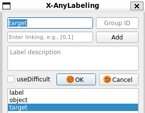

# User Manual

## 0. Table of Contents
   * [1. File Management](#1-file-management)
      * [1.1 Data Import](#11-data-import)
      * [1.2 Data Deletion](#12-data-deletion)
      * [1.3 Image Switching](#13-image-switching)
      * [1.4 Saving Label Data](#14-saving-label-data)
      * [1.5 Saving Image Data](#15-saving-image-data)
   * [2. Editing](#2-editing)
      * [2.1 Creating Objects](#21-creating-objects)
      * [2.2 Editing Objects](#22-editing-objects)
      * [2.3 Editing Labels](#23-editing-labels)
      * [2.4 Editing Images](#24-editing-images)
   * [3. View](#3-view)
      * [3.1 Canvas Visualization](#31-canvas-visualization)
      * [3.2 Image Visualization](#32-image-visualization)
      * [3.3 Object Visualization](#33-object-visualization)
      * [3.4 Crosshair](#34-crosshair)
   * [4. Annotation Import and Export](#4-annotation-import-and-export)
      * [4.1 YOLO Annotation](#41-yolo-annotation)
      * [4.2 VOC Annotation](#42-voc-annotation)
      * [4.3 COCO Annotation](#43-coco-annotation)
      * [4.4 DOTA Annotation](#44-dota-annotation)
      * [4.5 MASK Annotation](#45-mask-annotation)
      * [4.6 MOT Annotation](#46-mot-annotation)
      * [4.7 PPOCR Annotation](#47-ppocr-annotation)
      * [4.8 ODVG Annotation](#48-odvg-annotation)
  * [5. Toolbar](#5-toolbar)
      * [5.1 Data Statistics](#51-data-statistics)
      * [5.2 Save Sub-Images](#52-save-sub-images)
      * [5.3 Object Manager](#53-object-manager)
      * [5.4 Shape Type Conversion](#54-shape-type-conversion)
      * [5.5 Saving Masked Images](#55-saving-masked-images)
   * [6. Help and Language](#6-help-and-language)
      * [6.1 Getting Version Information](#61-getting-version-information)
      * [6.2 Setting Software Language](#62-setting-software-language)
   * [7. User Configuration](#7-user-configuration)
      * [7.1 Keyboard Shortcut Settings](#71-keyboard-shortcut-settings)
      * [7.2 Customizing Label Colors](#72-customizing-label-colors)
      * [7.3 Loading Predefined Labels](#73-loading-predefined-labels)
      * [7.4 Auto-Switch to Edit Mode](#74-auto-switch-to-edit-mode)
      * [7.5 Hover Auto-Highlight Mode](#75-hover-auto-highlight-mode)
  * [8. Tasks](#8-tasks)
      * [8.1 Image Classification](#81-image-classification)
      * [8.2 Object Detection](#82-object-detection)
      * [8.3 Image Segmentation](#83-image-segmentation)
      * [8.4 Pose Estimation](#84-pose-estimation)
      * [8.5 Multi-Object Tracking](#85-multi-object-tracking)
      * [8.6 Depth Estimation](#86-depth-estimation)
      * [8.7 Optical Character Recognition](#87-optical-character-recognition)
      * [8.8 Interactive Video Object Segmentation](#88-interactive-video-object-segmentation)
      * [8.9 Matting](#89-matting)
   * [9. Models](#9-models)


## 1. File Management

This section details how to import, manage, and save data using X-AnyLabeling. Users can import images and video files in various ways, including shortcuts or menu options. Additionally, it covers data deletion, image switching, and saving of labels and image data to ensure an efficient annotation process and secure data management.

### 1.1 Data Import

After opening the GUI, users can select the corresponding task type for import from the `File` dropdown menu at the top of the interface or use shortcuts.

X-AnyLabeling currently supports three data import formats:

- **Image File Directory** (Ctrl+U): Supports importing multiple files with multi-level directory nesting.
- **Single Image File** (Ctrl+I): Supports importing various formats such as `*.jpg`, `*.png`, `*.bmp`, `*.webp`, and `*.tif`.
- **Single Video File** (Ctrl+O): Supports importing video formats such as `*.mp4`, `*.avi`, `*.mov`, `*.mkv`, `*.wmv`, and `*.flv`.

### 1.2 Data Deletion

X-AnyLabeling provides data deletion functionalities as follows:

- **Delete Label File** (Ctrl+Delete): Deletes the current annotation file. This operation cannot be undone, so please proceed with caution.
- **Delete Image File** (Ctrl+Shift+Delete): Deletes the current image file, moving it to the `_delete_` folder within the current image directory.

### 1.3 Image Switching

In X-AnyLabeling, in addition to regular image switching operations, the following methods are also supported:

| Shortcut | switch_to_checked | Description |
|----------|-------------------|-------------|
| Ctrl+Shift+A | true | Jump to the previous annotated image |
| Ctrl+Shift+D | true | Jump to the next annotated image |
| Ctrl+Shift+A | false | Jump to the previous unannotated image |
| Ctrl+Shift+D | false | Jump to the next unannotated image |

You can determine the switching mode by modifying the `switch_to_checked` field in the user configuration file.

Additionally, you can jump to a specific image by entering the image name in the file search bar at the bottom right of the interface and pressing Enter.

### 1.4 Saving Label Data

X-AnyLabeling has an auto-save feature enabled by default. Upon initial startup, users can check if the `Auto Save` option is selected from the `File` dropdown menu.

Label files are saved in the current image directory in `*.json` format, with the following template:

```json
{
  "version": "${version}",
  "flags": {},
  "shapes": [
    {
      "label": "${label}",
      "score": null,
      "points": [...],
      "group_id": null,
      "description": null,
      "difficult": false,
      "shape_type": "${shape_type}",
      "flags": null,
      "attributes": {}
    }
  ],
  "imagePath": "${filename}",
  "imageData": null,  // base64
  "imageHeight": -1,
  "imageWidth": -1
}
```

⚠️ To change the label save path, select the `Change Output Directory` option from the `File` dropdown menu and set the desired save path.

### 1.5 Saving Image Data

If you want to save the current image data (default `base64` encoded) during annotation, you can enable the `Save Image Data` option from the `File` dropdown menu.

## 2. Editing

This section guides you on creating, editing, and managing various types of annotation objects and their label information in X-AnyLabeling. It covers everything from basic operations to advanced features, ensuring comprehensive guidance.

### 2.1 Creating Objects

In X-AnyLabeling, each distinct annotated object is referred to as a `shape`, with key properties such as:

| Field         | Type    | Description                                                      |
|---------------|---------|------------------------------------------------------------------|
| `label`       | String  | The category label of the object.                                |
| `score`       | Float   | The confidence score of the object, typically used in AI inference. If unavailable, it is `null`. |
| `points`      | Array   | List of vertices' coordinates, depending on the `shape_type`.    |
| `group_id`    | Integer | Group ID to associate multiple objects within the same group; `null` if not available. |
| `description` | String  | Description of the object; `null` if not available.              |
| `difficult`   | Boolean | Indicates if the object is difficult to identify; `true` means difficult. |
| `shape_type`  | String  | The shape type, such as `"rectangle"`, `"polygon"`, etc.         |
| `flags`       | Dictionary | Additional flag information for extra state or attributes; `null` if not available. |
| `attributes`  | Dictionary | Object's attribute information; an empty dictionary `{}` if not available. |
| `kie_linking` | List    | Connection information between objects, e.g., `[[1,2],[3,4]]`; an empty list `[]` if not available. |

For more details on additional fields, refer to [shape.py](../../anylabeling/views/labeling/shape.py).

X-AnyLabeling supports creating the following types of shape objects:

- **Rectangle** (R): Start drawing by left-clicking, move the cursor, and click again to finish the rectangle.
- **Rotation** (O): Start drawing by left-clicking, move the cursor, and click again to finish the rotated box.
- **Polygon** (P): Start drawing by left-clicking along the object's edge, adding segmentation points. Click on the starting point to finish. A minimum of 3 points is required.
- **Point**: Left-click to create a key point.
- **Line**: Start drawing by left-clicking, move the cursor, and click again to finish the line segment.
- **Line Strip**: Start drawing by left-clicking, move the cursor, click to add line segments, and double-click to finish.
- **Circle**: Start drawing by left-clicking, move the cursor to define the radius, and click again to finish.

Users can operate through the corresponding options in the left menu, right-click, or use shortcuts.

### 2.2 Editing Objects

X-AnyLabeling has two modes: **Drawing Mode** and **Editing Mode**.

- **Drawing Mode**: Users can create multiple objects continuously.
- **Editing Mode**: Users can edit objects (Ctrl+E), undo (Ctrl+Z), copy (Ctrl+C), paste (Ctrl+V), delete (Delete), move, scale, rotate, etc.

Users can quickly switch between drawing and editing modes using the `Ctrl+J` shortcut or the corresponding options mentioned in section 2.1.

Specific operations include:

- For rectangular objects, besides resizing by corner points, users can select multiple objects and merge them into a bounding rectangle by right-clicking and selecting "Merge Selected Objects."
- For polygon objects, in editing mode, users can drag on an edge to add a new vertex or remove a selected vertex by holding the `Shift` key and left-clicking.
- For rotation box objects, users can control the rotation angle and direction by selecting the target and using `Z`, `X`, `C`, `V`. Real-time rotation angles can also be displayed.

### 2.3 Editing Labels

When creating or editing an object, a label editing box pops up for editing the object's label information.

<div style="display: flex; align-items: center;">
  
  <div style="margin-left: 1em;">
    <table style="width: 100%;">
      <tr>
        <th>Field</th>
        <th>Description</th>
      </tr>
      <tr>
        <td>Object Label</td>
        <td>Enter the object's category label, supporting fuzzy search.</td>
      </tr>
      <tr>
        <td>Group ID</td>
        <td>For specific tasks like keypoint detection and multi-object tracking.</td>
      </tr>
      <tr>
        <td>Difficult Label</td>
        <td>Indicates if the object is difficult to recognize.</td>
      </tr>
      <tr>
        <td>Label List</td>
        <td>Shows the list of added labels, sorted alphabetically by default.</td>
      </tr>
      <tr>
        <td>Label Description</td>
        <td>Additional flag information for extra states or attributes, `null` if not available.</td>
      </tr>
      <tr>
        <td>Label Linking</td>
        <td>For linking fields in tasks like key information extraction and relationship extraction.</td>
      </tr>
    </table>
  </div>
</div>

### 2.4 Editing Images

Currently, X-AnyLabeling supports adding a `Caption` description to the current image. To do this, enter editing mode, click on the blank area of the image, and fill in the image description in the `Description` area on the right.

## 3. View

This section demonstrates how to optimize and customize the display of images and annotation objects in X-AnyLabeling, including visual adjustments of the canvas and images, as well as object information visualization settings, ensuring an efficient and intuitive annotation workflow.

### 3.1 Canvas Visualization

X-AnyLabeling currently supports the following canvas operations:

- **Zoom In** (Ctrl++)
- **Zoom Out** (Ctrl+-)
- **Reset** (Ctrl+0)

Besides setting the zoom ratio in the left window and using shortcuts, users can also zoom in on specific areas by holding the `Ctrl` key and using the mouse scroll wheel for precise annotation and small object labeling. To apply this change globally, ensure to select the `Keep Previous Zoom Ratio` option from the `View` dropdown menu.

### 3.2 Image Visualization

<p align="center">
  
</p>

X-AnyLabeling supports color adjustment for the current image. Operations include:

- Select `Brightness Contrast` from the `View` dropdown menu at the top of the interface to adjust the brightness and contrast for better visual effects.
- To apply this change globally, select `Keep Current Brightness` and `Keep Current Contrast` from the `View` dropdown menu.

Additionally, as the cursor moves, the information bar at the bottom of the GUI displays the current image's filename and annotation progress in real time.

### 3.3 Object Visualization

Object visualization features include displaying text descriptions (Ctrl+T), label names (Ctrl+L), group IDs, rotation angles, and prediction scores of annotated objects in the current image. Users can set these through shortcuts or the corresponding options in the `View` dropdown menu at the top of the interface.

Furthermore, when the cursor hovers over an object of interest, the information bar at the bottom of the GUI displays the current object's width, height, and other details.

### 3.4 Crosshair

<p align="center">
  
</p>

For the crosshair, users can adjust the width, transparency, and color by selecting the `Set Crosshair` option from the `View` dropdown menu at the top of the interface.

Moreover, as the cursor moves, the information bar at the bottom of the GUI displays real-time position coordinates.

## 4. Annotation Import and Export

At present, `X-AnyLabeling` provides functionalities for importing and exporting a variety of mainstream label file formats. Below is a brief guide on how to use these features.

### 4.1 YOLO Annotation

The latest version of X-AnyLabeling supports one-click import/export for YOLOv5/v8 label files (*.txt) for object detection, instance segmentation, rotated bounding box detection, and keypoint detection tasks.

Before importing/exporting YOLO label files, you need to prepare a label configuration file:

1. For YOLO object detection, instance segmentation, and rotated bounding box detection tasks, refer to [classes.txt](../../assets/classes.txt). Each line represents a class, with numbers incrementing from 0.
2. For YOLO keypoint detection tasks, refer to [yolov8_pose.yaml](../../assets/yolov8_pose.yaml). For the `has_visible` parameter, please refer to the [official definition](https://docs.ultralytics.com/datasets/pose/#ultralytics-yolo-format).

> To export in YOLO-Pose format, you need to assign a `group_id` to each set (bounding box and its keypoints) during annotation so that X-AnyLabeling can understand their relationships during export.

**Import Task**:
1. Click the `Upload` button in the top menu bar.
2. Select the corresponding task.
3. Upload the prepared configuration file.
4. Choose the directory where the label files are located and click OK.

**Export Task**:
1. Click the `Export` button in the top menu bar.
2. Upload the prepared configuration file.
3. Check the appropriate options as needed and click OK.

The export path defaults to the `labels` folder in the same directory as the current image directory.

> For a sample YOLO label file, refer to [demo.txt](../../assets/labels/demo.txt).

### 4.2 VOC Annotation

The latest version of X-AnyLabeling supports one-click import/export for Pascal-VOC label files (*.xml) for detection and segmentation tasks.

**Import Task**:
1. Click the `Upload` button in the top menu bar.
2. Select the corresponding task.
3. Choose the directory where the label files are located and click OK.

**Export Task**:
1. Click the `Export` button in the top menu bar.
2. Check the appropriate options as needed and click OK.

The export path defaults to the `Annotations` folder in the same directory as the current image directory.

> For a sample VOC label file, refer to [demo.xml](../../assets/Annotations/demo.xml).

### 4.3 COCO Annotation

The latest version of X-AnyLabeling supports one-click import/export for COCO label files (*.json) related to object detection and instance segmentation tasks.

Before importing/exporting COCO label files, prepare a label configuration file, referring to [classes.txt](../../assets/classes.txt), where each line represents a class, with numbers incrementing from 0.

**Import Task**:
1. Click the `Upload` button in the top menu bar.
2. Select the corresponding task.
3. Upload the prepared configuration file.
4. Choose the directory where the label files are located and click OK.

**Export Task**:
1. Click the `Export` button in the top menu bar.
2. Upload the prepared configuration file.
3. Click OK.

The export path defaults to the `annotations` folder in the same directory as the current image directory.

> For a sample COCO label file, refer to [instances_default.json](../../assets/annotations/instances_default.json).

### 4.4 DOTA Annotation

The latest version of X-AnyLabeling supports one-click import/export for DOTA label files (*.txt). The label format is defined as:

> x1 y1 x2 y2 x3 y3 x4 y4 class_name difficult

**Import Task**:
1. Click the `Upload` button in the top menu bar.
2. Select the corresponding task.
3. Choose the directory where the label files are located and click OK.

**Export Task**:
1. Click the `Export` button in the top menu bar.
2. Click OK.

The export path defaults to the `labelTxt` folder in the same directory as the current image directory.

> For a sample DOTA label file, refer to [demo_obb.txt](../../assets/labelTxt/demo_obb.txt).

### 4.5 MASK Annotation

The latest version of X-AnyLabeling supports one-click import/export for semantic segmentation mask label files (*.png).

Before importing/exporting mask label files, prepare the configuration file as follows:

1. For color images, refer to [mask_color_map.json](../../assets/mask_color_map.json).
2. For grayscale images, refer to [mask_grayscale_map.json](../../assets/mask_grayscale_map.json).

**Import Task**:
1. Click the `Upload` button in the top menu bar.
2. Select the corresponding task.
3. Upload the prepared configuration file.
4. Choose the directory where the label files are located and click OK.

**Export Task**:
1. Click the `Export` button in the top menu bar.
2. Upload the prepared configuration file.
3. Click OK.

The export path defaults to the `mask` folder in the same directory as the current image directory.

### 4.6 MOT Annotation

The latest version of X-AnyLabeling supports one-click import/export for multi-object tracking label files.

Before importing/exporting label files, prepare a label configuration file, referring to [classes.txt](../../assets/classes.txt), where each line represents a class, with numbers incrementing from 0.

**Export Task**:
1. Click the `Export` button in the top menu bar.
2. Upload the prepared configuration file.
3. Choose the save path and click OK.

**Import Task**:
1. Click the `Upload` button in the top menu bar.
2. Select the corresponding task.
3. Upload the prepared configuration file.
4. Choose the directory containing the label file (`gt.txt`) and click OK.

> For sample label files, refer to the [MOT](../../assets/MOT/) directory, which includes three subfiles: `seqinfo.ini`, `det.txt`, and `gt.txt`.

**seqinfo.ini**

The `seqinfo.ini` file contains sequence information, describing metadata for the dataset. The file includes:

```ini
[Sequence]
name = MOT            # Sequence name
imdir = mot_label     # Image directory
framerate = 30        # Frame rate
seqlength = 249       # Sequence length (number of frames)
imwidth = 1280        # Image width
imheight = 720        # Image height
imext = .jpg          # Image file extension
```

**det.txt**

The `det.txt` file contains detection results, with each line representing a detection box. The file includes:

```txt
Frame number, Track ID, Top-left x-coordinate, Top-left y-coordinate, Width, Height, Confidence, <x>, <y>, <z>
```

The last three fields are for the `MOT3D` task and are set to **-1** by default.

**gt.txt**

The `gt.txt` file contains tracking annotation information, with each line representing an annotation box. The file includes:

```txt
Frame number, Track ID, Top-left x-coordinate, Top-left y-coordinate, Width, Height, Validity flag, Class ID, Visibility ratio
```

The **validity flag** indicates whether the current trajectory is valid, with `0` for invalid data (ignore) and `1` for valid data (activate). Users can set this using the `useDifficult` flag in the label manager, where ☑️ indicates an invalid trajectory.

---

Additionally, for the [MOTS](https://motchallenge.net/data/MOTS/) dataset format, the v2.4.0+ version offers corresponding export settings. The specific steps for implementation are as follows:
1. Click on the `Export` - `Export MOTS Annotations` button in the top menu bar.
2. Upload the prepared configuration file.
3. Select the save path and click 'OK' to proceed.

It is important to note that the default exported mots labels are not in the final official dataset format. Here, we provide the corresponding conversion code for reference:
```bash
python3 tools/label_converter.py --task mots --mode custom_to_gt --src_path /path/to/your/custom_gt.txt
```

> [!NOTE]
> Before executing the conversion, you need to install the `pycocotools` library first.

### 4.7 PPOCR Annotation

The latest version of X-AnyLabeling (v2.4.0+) supports one-click import/export for the following two PPOCR tasks:
- Text Detection and Recognition: Locates text areas in the input image and recognizes the text content.
- Key Information Extraction: Extracts key information from images, including semantic entity recognition and relation extraction.

**Import Task**:
1. Click the `Upload` button in the top menu bar.
2. Select the corresponding task.
3. Choose the appropriate label file and click OK to upload.

**Export Task**:
1. Click the `Export` button in the top menu bar.
2. Click OK.

For the **Text Detection and Recognition** task, the export path defaults to the `ppocr-rec` folder in the same directory as the current image directory, which contains:
1. `Label.txt`: Annotation results
2. `rec_gt.txt`: Recognition results
3. `crop_img`: Images corresponding to the recognition results for training

For the **Key Information Extraction** task, the export path defaults to the `ppocr-kie` folder in the same directory as the current image directory, which contains:
1. `class_list.txt`: List of label classes
2. `ppocr_kie.json`: KIE annotation results

For sample label files, refer to [ppocr-rec](../../assets/ppocr/ppocr-rec/) and [ppocr-kie](../../assets/ppocr/ppocr-kie/).

### 4.8 ODVG Annotation

The latest version of X-AnyLabeling supports one-click import/export for Grounding task-related label files, specifically ODVG annotations.

Before importing/exporting ODVG label files, you need to prepare a label configuration file. For reference, see [classes.txt](../../assets/classes.txt), where each line represents a category, with the numbering incrementing from top to bottom.

**Import Task**:
1. Click the `Upload` button in the top menu bar.
2. Select the corresponding task.
3. Choose the directory where the label files are located and click OK.

**Export Task**:
1. Click the `Export` button in the top menu bar.
2. Select the corresponding task.
3. Upload the prepared configuration file.
4. Choose the save path and click OK.

> For the style of ODVG label files, refer to [ODVG](../../assets/ODVG).


### 5. Toolbar

### 5.1 Data Statistics

`X-AnyLabeling` includes a data statistics feature, allowing users to easily access an overview of the current task's data. By selecting the **Tools** dropdown in the top menu bar and clicking on **Overview**, users can view the current data status. This feature supports the following:

- One-click export of statistical reports
- Statistics for a specified range of data
- Label statistics for both image and object dimensions

<p align="center">
  
</p>

### 5.2 Save Sub-Images

To use the save sub-images feature, follow these steps:

1. Prepare a custom class file. For an example, refer to [classes.txt](../../assets/classes.txt).
2. Click on the **Tools** -> **Save Sub-Images** option in the top menu bar, and upload the corresponding custom class file. A sub-image folder named `x-anylabeling-crops` will be generated in the current directory, containing the targets categorized by class name.

### 5.3 Object Manager

`X-AnyLabeling` offers global management of label objects. Users can perform the following operations:

- **Delete Labels**: Remove unnecessary labels.
- **Rename Labels**: Update label names to align with new classification standards.
- **Change Label Colors**: Adjust label colors to improve distinguishability.

These actions can be accessed through the **Tools** -> **Object Manager** option in the top menu bar, opening the label management window.

### 5.4 Shape Type Conversion

`X-AnyLabeling` provides a shape type conversion feature, allowing users to change shape types through the **Tools** option in the top menu bar. The supported conversions include:

- **Rectangular Box to Rotated Box**: Convert rectangular box labels to rotated box labels.
- **Rotated Box to Rectangular Box**: Convert rotated box labels to rectangular box labels.
- **Polygon to Bounding Box**: Convert polygon labels to bounding box labels.

Note: The `Rotated Box to Rectangular Box` and `Polygon to Bounding Box` conversions use the maximum bounding rectangle by default, which may result in the loss of some label information, such as rotation angle. These actions are **irreversible**, so use them with caution.

### 5.5 Saving Masked Images

To implement the masked image saving feature, follow the steps below:
1. For areas that require `masking`, they can be identified using `rectangle`, `rotation`, or `polygon` objects, with the label name set to `__mask__`;
2. Click on the **Tools** -> **Save Masked Image** option in the top menu bar to set the fill color block. The default value is (114, 114, 114). The resulting images are saved by default in the `x-anylabeling-mask-image` folder.

## 6. Help and Language

### 6.1 Getting Version Information

<p align="center">
  
</p>

In the top menu bar, users can click on **Help** -> **Information** to view detailed information about the current version, including version number and runtime environment.

### 6.2 Setting Software Language

In the top menu bar, users can select the desired language from the **Language** dropdown menu. The software currently supports **Chinese** and **English**. After switching the language, the software will automatically restart. Please ensure that all data is saved before switching to prevent data loss.


## 7. User Configuration

The user configuration file for `X-AnyLabeling` is located in the `.xanylabelingrc` file in the current user's directory. You can find this file at the following locations:

- **Linux**: `~/.xanylabelingrc`
- **Windows**: `C:\Users\<username>\.xanylabelingrc`

In this configuration file, you can adjust various user-customized settings, such as interface layout, keyboard shortcuts, and more.

### 7.1 Keyboard Shortcut Settings

The current default keyboard shortcuts in X-AnyLabeling are as follows. Users can modify them according to their needs to avoid conflicts:

| Shortcut              | Function                                      |
|-----------------------|-----------------------------------------------|
| d                     | Open the next file                            |
| a                     | Open the previous file                        |
| Ctrl + Shift + d      | Open the next checked/unchecked file          |
| Ctrl + Shift + a      | Open the previous checked/unchecked file      |
| p or Ctrl + n         | Create a polygon                              |
| o                     | Create a rotated box                          |
| r or Ctrl + r         | Create a rectangular box                      |
| i                     | Run the model                                 |
| q                     | Positive sample point in `SAM Mode`           |
| e                     | Negative sample point in `SAM Mode`           |
| b                     | Clear hint points quickly in `SAM Mode`       |
| f                     | Confirm completion in `SAM Mode`              |
| g                     | Group selected objects                        |
| u                     | Ungroup selected objects                      |
| s                     | Hide selected objects                         |
| w                     | Show selected objects                         |
| Alt + g               | Edit group id                                 |
| Ctrl + Delete         | Delete label file                             |
| Ctrl + Shift + Delete | Delete image file                             |
| Ctrl + q              | Exit the current application                  |
| Ctrl + i              | Open image file                               |
| Ctrl + o              | Open video file                               |
| Ctrl + u              | Load all images from a directory              |
| Ctrl + e              | Edit labels                                   |
| Ctrl + j              | Edit polygons                                 |
| Ctrl + c              | Copy selected objects                         |
| Ctrl + v              | Paste selected objects                        |
| Ctrl + d              | Copy polygons                                 |
| Ctrl + g              | Show annotation statistics for current task   |
| Ctrl + h              | Show all objects in current image             |
| Ctrl + p              | Toggle preserve previous mode                 |
| Ctrl + y              | Toggle auto-use last label                    |
| Ctrl + m              | Activate batch annotation                     |
| Ctrl + a              | Enable auto annotation                        |
| Ctrl + s              | Save current annotations                      |
| Ctrl + l              | Show/Hide labels                              |
| Ctrl + t              | Show/Hide text                                |
| Ctrl + Shift + s      | Change output directory                       |
| Ctrl + 0              | Zoom to original size                         |
| Ctrl + + or Ctrl +=   | Zoom in                                       |
| Ctrl + f              | Fit to window                                 |
| Ctrl + Shift + f      | Fit to width                                  |
| Ctrl + Shift + m      | Merge selected rectangle shapes               |
| Ctrl + z              | Undo last action                              |
| Delete                | Delete selected shape                         |
| Esc                   | Deselect object                               |
| Backspace             | Delete selected point                         |
| ↑→↓←                  | Move selected object using keyboard arrows    |
| zxcv                  | Rotate selected rotation using the keyboard   |

### 7.2 Customizing Label Colors

To modify custom label colors, follow these steps:

1. Open the configuration file `.xanylabelingrc` in your user directory using a text editor or command-line tool.
2. Locate the `shape_color` field and set its value to "manual" to manually set label colors.
3. Find the `label_colors` section, which contains the labels and their corresponding colors.
4. Locate the label you want to modify, such as "person," "car," "bicycle," etc.
5. Set the color using RGB values, e.g., `[255, 0, 0]` for red, `[0, 255, 0]` for green, and `[0, 0, 255]` for blue.
6. Replace the color values for the corresponding label, save the file, and close the editor.

Example configuration:
```YAML
...
default_shape_color: [0, 255, 0]
shape_color: manual  # null, 'auto', 'manual'
shift_auto_shape_color: 0
label_colors:
  person: [255, 0, 0]
  car: [0, 255, 0]
  bicycle: [0, 0, 255]
  ...
...
```

After completing these steps, the custom label colors will be applied. The next time you use these labels during annotation, they will display in the colors you set.

> In X-AnyLabeling v2.4.0+, label colors can be directly set through the GUI. Navigate to `Tools` -> `Label Manager` in the menu bar. Note that these changes are only effective for the current session.

### 7.3 Loading Predefined Labels

To load `predefined labels`, you can modify the `labels` field in the configuration file. When defining label names with **pure numbers**, be sure to enclose them in single quotes `''`. Example:

```YAML
...
labels:
- car
- '1'
- apple
- _phone
```

### 7.4 Auto-Switch to Edit Mode

In X-AnyLabeling v2.4.0 and above, there is a feature for **auto-switching to edit mode**. You can configure this in the `auto_switch_to_edit_mode` field in the configuration file:

| Option   | Function                                         |
|----------|--------------------------------------------------|
| true     | Automatically switches to edit mode after creating an object. |
| false    | Allows the creation of multiple objects of the same type continuously; manual switch to edit mode is required. |

### 7.5 Hover Auto-Highlight Mode

In X-AnyLabeling v2.4.0 and above, the **hover auto-highlight mode** feature is available. You can set this using the `auto_highlight_shape` field in the configuration file:

| Option   | Function                                        |
|----------|-------------------------------------------------|
| true     | Automatically highlights objects when hovering over them with the mouse, facilitating quick adjustments to the selected object. |
| false    | Requires the user to manually click on an object to highlight it when hovering. |

Note: In `multi-label classification tasks`, if the user manually uploads a property file, the `auto_highlight_shape` field will be set to `false` to prevent accidental switching of the property window status bar, thus improving user experience.


## 8. Tasks

### 8.1 Image Classification

- Image-level classification: [Link](../../examples/classification/image-level/README.md)
- Object-level classification: [Link](../../examples/classification/shape-level/README.md)

### 8.2 Object Detection

- Horizontal Bounding Box Detection: [Link](../../examples/detection/hbb/README.md)
- Oriented Bounding Box Detection: [Link](../../examples/detection/obb/README.md)

### 8.3 Image Segmentation

- Semantic & Instance Segmentation: [Link](../../examples/segmentation/README.md)

### 8.4 Pose Estimation

- Keypoint Detection: [Link](../../examples/estimation/pose_estimation/README.md)

### 8.5 Multi-Object Tracking

- Multi-Object Tracking: [Link](../../examples/multiple_object_tracking/README.md)

### 8.6 Depth Estimation

- Depth Estimation: [Link](../../examples/estimation/depth_estimation/README.md)

#### 8.7 Optical Character Recognition

- Text Detection and Recognition: [Link](../../examples/optical_character_recognition/text_recognition/README.md)
- Key Information Extraction: [Link](../../examples/optical_character_recognition/kie/README.md)

### 8.8 Interactive Video Object Segmentation

- Interactive Video Object Segmentation: [Link](../../examples/interactive_video_object_segmentation/README.md)

### 8.9 Matting

- Image Matting: [Link](../../examples/matting/image_matting/README.md)

## 9. Models

For information on how to load and export models, refer to the [custom_model.md](./custom_model.md) document.