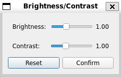
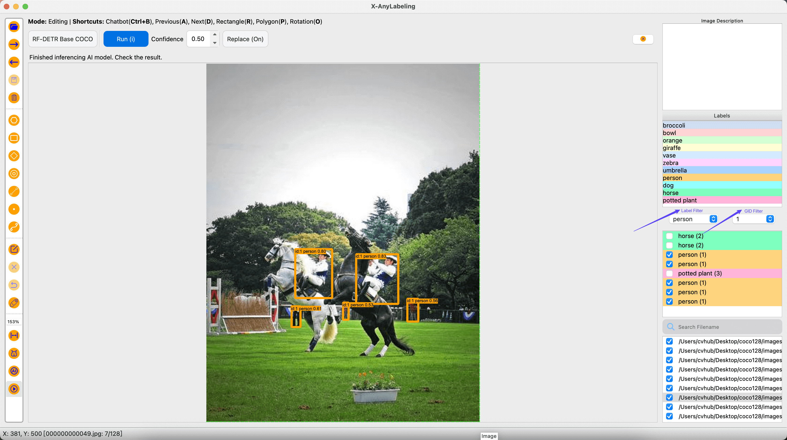
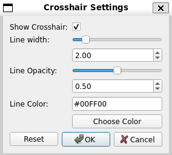
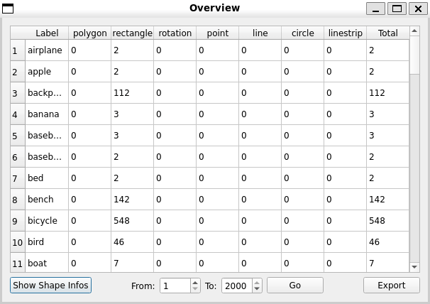
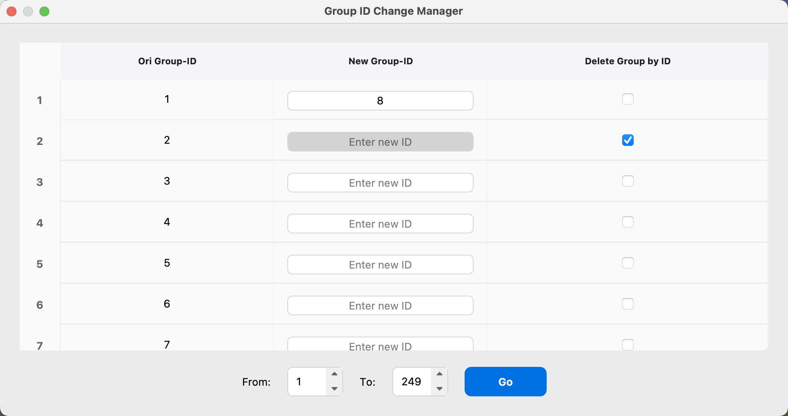
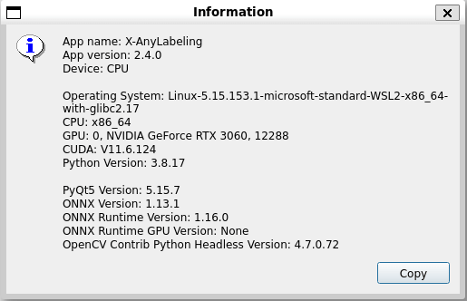

# User Manual

This guide provides comprehensive instructions for using X-AnyLabeling, covering everything from basic file management and annotation tasks to advanced features and customization.

## 0. Table of Contents
   * [1. File Management](#1-file-management)
      * [1.1 Importing Data](#11-importing-data)
      * [1.2 Deleting Data](#12-deleting-data)
      * [1.3 Switching Images](#13-switching-images)
      * [1.4 Saving Label Data](#14-saving-label-data)
      * [1.5 Embedding Image Data](#15-embedding-image-data)
   * [2. Editing](#2-editing)
      * [2.1 Creating Shapes](#21-creating-shapes)
      * [2.2 Editing Shapes](#22-editing-shapes)
      * [2.3 Editing Labels](#23-editing-labels)
      * [2.4 Adding Image Captions](#24-adding-image-captions)
   * [3. View Options](#3-view-options)
      * [3.1 Canvas Controls](#31-canvas-controls)
      * [3.2 Image Display](#32-image-display)
      * [3.3 Shape Display](#33-shape-display)
      * [3.4 Crosshair Customization](#34-crosshair-customization)
      * [3.5 Navigator](#35-navigator)
   * [4. Annotation Formats (Import/Export)](#4-annotation-formats-importexport)
      * [4.1 YOLO Format](#41-yolo-format)
      * [4.2 VOC Format](#42-voc-format)
      * [4.3 COCO Format](#43-coco-format)
      * [4.4 DOTA Format](#44-dota-format)
      * [4.5 Mask Format](#45-mask-format)
      * [4.6 MOT Format](#46-mot-format)
      * [4.7 PPOCR Format](#47-ppocr-format)
      * [4.8 ODVG Format](#48-odvg-format)
      * [4.9 VLM-R1-OVD Format](#49-vlm-r1-ovd-format)
      * [4.10 MMGD Format](#410-mmgd-format)
   * [5. Toolbar Tools](#5-toolbar-tools)
      * [5.1 Data Statistics (Overview)](#51-data-statistics-overview)
      * [5.2 Save Cropped Images](#52-save-cropped-images)
      * [5.3 Label Manager](#53-label-manager)
      * [5.4 Shape Type Conversion](#54-shape-type-conversion)
      * [5.5 Digit Shortcut Manager](#55-digit-shortcut-manager)
      * [5.6 Group ID Manager](#56-group-id-manager)
      * [5.7 Shape Manager](#57-shape-manager)
   * [6. Help and Language](#6-help-and-language)
      * [6.1 About X-AnyLabeling](#61-about-x-anylabeling)
      * [6.2 Setting the Language](#62-setting-the-language)
   * [7. Configuration](#7-configuration)
      * [7.1 Keyboard Shortcuts](#71-keyboard-shortcuts)
      * [7.2 Custom Label Colors](#72-custom-label-colors)
      * [7.3 Predefined Labels](#73-predefined-labels)
      * [7.4 Auto-Switch to Edit Mode](#74-auto-switch-to-edit-mode)
      * [7.5 Hover Auto-Highlight](#75-hover-auto-highlight)
      * [7.6 Shape Appearance](#76-shape-appearance)
      * [7.7 Model Download Source](#77-model-download-source)
   * [8. Supported Tasks](#8-supported-tasks)
      * [8.1 Image Classification](#81-image-classification)
      * [8.2 Object Detection](#82-object-detection)
      * [8.3 Image Segmentation](#83-image-segmentation)
      * [8.4 Pose Estimation](#84-pose-estimation)
      * [8.5 Multi-Object Tracking](#85-multi-object-tracking)
      * [8.6 Depth Estimation](#86-depth-estimation)
      * [8.7 Optical Character Recognition (OCR)](#87-optical-character-recognition-ocr)
      * [8.8 Interactive Video Object Segmentation (IVOS)](#88-interactive-video-object-segmentation-ivos)
      * [8.9 Matting](#89-matting)
      * [8.10 Vision-Language Tasks](#810-vision-language-tasks)
      * [8.11 Zero-Shot Counting](#811-zero-shot-counting)
      * [8.12 Grounding](#812-grounding)
   * [9. Custom Models](#9-custom-models)
   * [10. Advanced Features](#10-advanced-features)


## 1. File Management

This section explains how to import, manage, and save data in X-AnyLabeling. You can import images and videos using various methods, including menu options and keyboard shortcuts. It also covers deleting data, switching between images, and saving labels, helping you maintain an efficient workflow and manage your data securely.

### 1.1 Importing Data

After opening the application, select the type of data you want to import from the `File` menu or use the keyboard shortcuts:

X-AnyLabeling supports importing data in the following ways:

- **Image File Directory** (`Ctrl+U`): Import all image files within a selected directory, including those nested in subdirectories.
- **Single Image File** (`Ctrl+I`): Import an individual image file (formats: `*.jpg`, `*.png`, `*.bmp`, `*.webp`, `*.tif`).
- **Single Video File** (`Ctrl+O`): Import an individual video file (formats: `*.mp4`, `*.avi`, `*.mov`, `*.mkv`, `*.wmv`, `*.flv`). Video frames will be extracted for annotation.

### 1.2 Deleting Data

X-AnyLabeling offers the following options for deleting data:

- **Delete Label File** (`Ctrl+Delete`): Deletes the annotation file (`.json`) associated with the currently displayed image. **Warning:** This action cannot be undone.
- **Delete Image File** (`Ctrl+Shift+Delete`): Moves the currently displayed image file and its corresponding label file (if any) to a `_delete_` subfolder within the image directory.

### 1.3 Switching Images

Navigate between images in your dataset using these methods:

- **Next/Previous Image**: Use the `D` key (next) or `A` key (previous) to move sequentially through the image list.
- **Jump to Annotated/Unannotated**:
    - `Ctrl+Shift+D`: Jump to the next image that already has annotations.
    - `Ctrl+Shift+A`: Jump to the previous image that already has annotations.
    *(Note: The behavior of `Ctrl+Shift+D`/`Ctrl+Shift+A` can be configured to jump to the next/previous *unannotated* image instead. Modify the `switch_to_checked` field in the user configuration file.)*
- **Jump to Specific Image**: Type the exact filename (including extension) into the file search bar at the bottom right and press `Enter`.

The checkboxes in the file list are not editable by default. To enable editing, set `file_list_checkbox_editable` to `true` in the configuration file.

### 1.4 Saving Label Data

X-AnyLabeling enables auto-save by default. You can verify or toggle this setting via `File` > `Auto Save`.

Label files are saved in `*.json` format in the same directory as the images by default. The structure is:

```json
{
  "version": "${version}", // X-AnyLabeling version
  "flags": {},             // Image-level flags (if any)
  "shapes": [              // List of annotated shapes
    {
      "label": "${label}",        // Category label
      "score": null,            // Confidence score (e.g., from model), null if N/A
      "points": [...],          // List of [x, y] coordinates defining the shape
      "group_id": null,         // ID for grouping related shapes (e.g., pose keypoints)
      "description": null,      // Optional text description for the shape
      "difficult": false,       // Flag if the object is difficult to identify
      "shape_type": "${shape_type}", // e.g., "rectangle", "polygon"
      "flags": null,            // Shape-level flags (if any)
      "attributes": {}          // Dictionary of custom attributes
    }
    // ... more shapes
  ],
  "description": null,      // Optional text description for the image
  "chat_history": [         // Chat history (for chatbot)
    {
      "role": "user",
      "content": "Hi",
      "image": null
    },
    {
      "role": "assistant",
      "content": "Hi there! How can I help you today?",
      "image": null
    }
    // ... more dialogs
  ],
  "vqaData": {
    "question": "What animals are shown in the image?",
    "answer": "zebras",
    "split": "train",
    "task": "QA",
    "tags": [
      "natural"
    ],
    // ... more items
  },
  "imagePath": "${filename}", // Relative path to the image file
  "imageData": null,         // Base64 encoded image data (if enabled, see 1.5)
  "imageHeight": -1,         // Image height in pixels
  "imageWidth": -1           // Image width in pixels
}
```

⚠️ **To save labels to a different location:** Select `File` > `Change Output Directory` and choose your preferred path. The relative `imagePath` in the JSON will be adjusted accordingly.

### 1.5 Embedding Image Data

To embed the image data (encoded in `base64` by default) directly into the `.json` label file, enable the `Save Image Data` option under the `File` menu. This increases the JSON file size but makes it self-contained.

## 2. Editing

This section explains how to create, edit, and manage different types of annotation objects (shapes) and their associated labels in X-AnyLabeling.

### 2.1 Creating Shapes

In X-AnyLabeling, each distinct annotated object is called a `shape`. Key properties stored for each shape include:

| Field         | Type    | Description                                                      |
|---------------|---------|------------------------------------------------------------------|
| `label`       | String  | Category label of the object.                                    |
| `score`       | Float   | Confidence score (often from AI model inference). `null` if not available. |
| `points`      | Array   | List of `[x, y]` coordinates defining the shape vertices.        |
| `group_id`    | Integer | ID to group multiple related shapes (e.g., keypoints for a pose). `null` if not grouped. |
| `description` | String  | Optional text description for the shape.                         |
| `difficult`   | Boolean | Flags the object as difficult to identify (`true` if difficult).   |
| `shape_type`  | String  | Type of shape, e.g., `"rectangle"`, `"polygon"`.                 |
| `flags`       | Dictionary | Dictionary for additional flags or attributes. `null` if none.      |
| `attributes`  | Dictionary | Dictionary for custom object attributes. Empty `{}` if none.      |
| `kie_linking` | List    | Information linking shapes (e.g., for Key Info Extraction). Empty `[]` if none. |

For detailed field definitions, see [`shape.py`](../../anylabeling/views/labeling/shape.py).

X-AnyLabeling supports creating the following types of shapes:

- **Rectangle** (`R`): Click and drag to define opposite corners, or click once for the first corner and again for the second.
- **Rotated Rectangle** (`O`): Click to set the first point, click again for the second point defining one side, then move the cursor to set the height and click a third time.
- **Polygon** (`P`): Click along the object's boundary to place vertices. Click the starting point or double-click the last point to close the polygon. Requires at least 3 points.
- **Point**: Click to place a point.
- **Line**: Click to set the start point, move the cursor, and click again to set the end point.
- **Line Strip**: Click to place the first point, then click to add subsequent points for connected line segments. Double-click to finish.
- **Circle**: Click to set the center, move the cursor to define the radius, and click again.

You can create shapes using the tools in the left toolbar, the right-click context menu, or keyboard shortcuts.

### 2.2 Editing Shapes

X-AnyLabeling provides two shape interaction modes:

- **Drawing Mode** allows rapid creation of new shapes.
- **Editing Mode** enables editing operations such as switching modes (`Ctrl+E`), undo (`Ctrl+Z`), copy (`Ctrl+C`), paste (`Ctrl+V`), delete (`Delete`), move, resize, and rotate.

Press `Ctrl+J` to quickly switch between Drawing and Editing modes. Additional object-specific operations:

- **Rectangles**: You can drag a rectangle's corner handles to resize it, or select multiple rectangles and merge them using the right-click menu. Mouse wheel editing is also supported; when enabled via the `wheel_rectangle_editing` setting, scrolling inside the rectangle scales it, while scrolling outside adjusts the nearest edge.
- **Polygons**: In Editing Mode, dragging an edge adds a new vertex, and holding `Shift` while clicking a vertex removes it. Polygons also support merging via the right-click menu.
- **Rotated Rectangles**: Select a rotated rectangle and press `Z`, `X`, `C`, or `V` to rotate it in different directions. A real-time display of the rotation angle is available via the View menu.

Additionally, you can quickly copy the coordinates of any selected shape to your clipboard using the **Copy Coordinates** option from the right-click context menu. For rectangles, this outputs the format `[x1, y1, x2, y2]` (top-left and bottom-right corners), while other shape types output `[x1, y1, x2, y2, x3, y3, ...]` (all vertex coordinates).

> [!TIP]
> X-AnyLabeling provides two convenient shape navigation features:
> - **Loop Through Objects** (Ctrl+Shift+N): Sequentially zoom in on each shape in the canvas for detailed inspection of annotation quality.
> - **Loop Select Objects** (Ctrl+Shift+C): Sequentially select each shape in the canvas for quick editing or management of annotations.

### 2.3 Editing Labels

When you create a shape or select an existing one in Edit Mode, the label panel appears (usually on the right), allowing you to edit its properties:

| Field              | Description                                                          |
|--------------------|----------------------------------------------------------------------|
| **Shape Label**    | Enter or select the object's category label (supports fuzzy search). |
| **Group ID**       | Assign a numeric ID to group related shapes (e.g., for poses, tracking). |
| **Difficult**      | Check this box if the object is difficult to recognize.             |
| **Label List**     | Displays available labels, allowing selection.                      |
| **Description**    | Add optional text notes specific to this shape instance.             |
| **Label Linking**  | Used for linking shapes in tasks like Key Information Extraction (KIE). |
| **Attributes**     | (If configured) Set custom attributes for the shape.               |

### 2.4 Adding Image Captions

X-AnyLabeling allows you to add a description or caption to the entire image:
1. Enter Edit Mode (`Ctrl+E`).
2. Click on an empty area of the canvas (not on a shape).
3. Enter your text in the `Description` field in the right panel. This is saved in the `flags` field of the main JSON structure.

## 3. View Options

This section explains how to customize the view settings in X-AnyLabeling, including adjusting the canvas, image appearance, and how shape information is displayed, to optimize your workflow.

### 3.1 Canvas Controls

- **Zoom In** (`Ctrl + +` or `Ctrl + =`)
- **Zoom Out** (`Ctrl + -`)
- **Zoom to Actual Size (100%)** (`Ctrl + 0`)
- **Zoom to Fit Window** (`Ctrl + F`)
- **Zoom to Fit Width** (`Ctrl + Shift + F`)

In addition to using menu options and shortcuts, you can zoom dynamically by holding `Ctrl` and using the mouse scroll wheel. This is useful for precise annotations, especially on small objects.

To maintain the current zoom level when switching between images, enable `View` > `Keep Previous Zoom Ratio`.

### 3.2 Image Display

<p align="center">
  
</p>

X-AnyLabeling allows you to adjust the brightness and contrast of the current image for better visibility:

- Select `View` > `Brightness Contrast` to open the adjustment controls.
- To apply the current adjustments to all subsequent images in the session, enable `View` > `Keep Current Brightness` and `View` > `Keep Current Contrast`.

The status bar at the bottom displays the current filename, annotation progress (e.g., "Image 5/100"), and cursor coordinates.

### 3.3 Shape Display

You can control the visibility of various shape attributes:

- Toggle display of label names next to shapes (`Ctrl+L` or `View` > `Show Labels`).
- Toggle display of shape descriptions (`Ctrl+T` or `View` > `Show Text`).
- Toggle display of other info like Group IDs, rotation angles, scores (check `View` menu for options).

When you hover over a shape, its dimensions (width and height) are displayed in the status bar.

<p align="center">
  
</p>

> [!TIP]
> The right panel features **Label Filters** and **Group ID Filters** for filtering shapes by label or group ID. X-AnyLabeling v3.2.4+ adds the ability to select/deselect all shapes at once, making it easier to manage multiple shapes simultaneously.

### 3.4 Crosshair Customization

<p align="center">
  
</p>

You can customize the appearance (width, transparency, color) of the crosshair cursor via `View` > `Set Crosshair`. The status bar shows the cursor's real-time pixel coordinates.

### 3.5 Navigator

X-AnyLabeling v3.2.3+ introduces a navigator feature that helps you quickly navigate to any area of high-resolution images.

To open the navigator, simply click `View` -> `Navigator` in the menu bar or press the shortcut key `F9`. The navigator displays a thumbnail of the current image in a separate window, with a red frame indicating your current visible area.

You can click anywhere on the thumbnail to quickly jump to that location, or drag the red frame to move your view. The navigator also displays all your annotated objects in real-time, giving you a clear overview of your progress.

At the bottom of the navigator, you can precisely set the zoom ratio through the input box (supporting 1% to 1000%), or drag the slider to adjust it. Additionally, you can use the mouse wheel to zoom directly in either the main canvas or the navigator window.

This feature is particularly useful when working with ultra-high resolution images, allowing you to maintain precise local operations while keeping the global perspective.

## 4. Annotation Formats (Import/Export)

`X-AnyLabeling` supports importing and exporting annotations in various standard formats. This section provides a guide for each. Access import/export functions via the `File` menu or dedicated toolbar buttons (e.g., `Import Annotations`, `Export Annotations`).

> [!TIP]
> You can also consider to use the command-line tool for batch conversions! The CLI provides more efficient and flexible label format conversion capabilities, especially suited for large-scale datasets. See the [CLI docs](./cli.md#3-label-format-conversion) for details.

**General Notes:**
- **Configuration Files:** Many formats require specific configuration files (e.g., listing class names) for import/export. Ensure these are prepared correctly.
- **Default Export Path:** By default, exported files are saved to a format-specific subfolder (e.g., `labels`, `Annotations`, `mask`) within the current image directory. You can usually specify a different output path during export.

### 4.1 YOLO Format

Supports YOLOv5/v8 format (`*.txt`) labels for object detection, instance segmentation, rotated bounding boxes, and keypoint detection.

**Configuration:**
- **Detection/Segmentation/Rotation:** Prepare a `classes.txt` file listing class names, one per line (0-indexed). See example: [`classes.txt`](../../assets/classes.txt).
- **Keypoint Detection (Pose):** Prepare a `*.yaml` file defining the skeleton and class names. See example: [`yolov8_pose.yaml`](../../assets/yolov8_pose.yaml). Refer to the [Ultralytics Docs](https://docs.ultralytics.com/datasets/pose/#ultralytics-yolo-format) for format details (e.g., `kpt_shape`, `flip_idx`).

> **Note:** For YOLO-Pose export, you must assign the same `group_id` to each bounding box and its corresponding keypoints during annotation so they are correctly associated.

**Importing:**
1. Click the `Import` button in the top menu bar.
2. Select the corresponding task.
3. Upload the prepared configuration file.
4. Select the directory containing the label files.
5. Optionally check "Preserve Existing Annotations" to merge new annotations with existing ones.
6. Click OK to confirm.

**Exporting:**
1. Select `Export Annotations` > `Export YOLO Annotations`.
2. Select the corresponding task.
3. Provide the required configuration file.
4. Configure options (e.g., coordinate format) if prompted and click OK.
5. Export path defaults to a `labels` subfolder. Sample: [`demo.txt`](../../assets/labels/demo.txt).

### 4.2 VOC Format

Supports Pascal VOC format (`*.xml`) labels for object detection (bounding boxes) and segmentation (polygons saved within the XML, if applicable).

**Configuration:** None usually required for standard VOC detection import/export. For segmentation, ensure labels match your desired classes.

**Importing:**
1. Select `Import Annotations` > `Import VOC Annotations`.
2. Select the directory containing the `*.xml` files (usually named `Annotations`).

**Exporting:**
1. Select `Export Annotations` > `Export VOC Annotations`.
2. Configure options if prompted and click OK.
3. Export path defaults to an `Annotations` subfolder. Sample: [`demo.xml`](../../assets/Annotations/demo.xml).

### 4.3 COCO Format

Supports COCO format (`*.json`) labels for object detection, instance segmentation, and keypoint detection.

**Configuration:**
- **Detection (rectangle) / Segmentation (polygon):** Prepare a `classes.txt` file. For export, ensure `_background_` is the first class if required by your training framework. `__ignore__` can also be included.
- **Keypoint Detection (pose):** Prepare a `*.yaml` file similar to YOLO Pose (e.g., [`yolov8_pose.yaml`](../../assets/yolov8_pose.yaml)).
- **Instance Segmentation (polygon):** Prepare a [`labels.txt`](../../assets/labels.txt) file.

**Importing:**
1. Select `Import Annotations` > `Import COCO Annotations`.
2. Select the task type.
3. Provide the required configuration file (`classes.txt` or `*.yaml`).
4. Select the COCO `*.json` annotation file.

**Exporting:**
1. Select `Export Annotations` > `Export COCO Annotations`.
2. Select the task type.
3. Provide the required configuration file.
4. Click OK.
5. Export path defaults to an `annotations` subfolder, saving a single `*.json` file. Sample: [`annotations`](../../assets/annotations).

### 4.4 DOTA Format

Supports DOTA format (`*.txt`) labels for oriented (rotated) object detection. Label format per line:
`x1 y1 x2 y2 x3 y3 x4 y4 class_name difficult`

**Configuration:** None required for import/export, class names are read/written directly.

**Importing:**
1. Select `Import Annotations` > `Import DOTA Annotations`.
2. Select the directory containing the `*.txt` label files (usually `labelTxt`).

**Exporting:**
1. Select `Export Annotations` > `Export DOTA Annotations`.
2. Click OK.
3. Export path defaults to a `labelTxt` subfolder. Sample: [`demo_obb.txt`](../../assets/labelTxt/demo_obb.txt).

### 4.5 Mask Format

Supports importing and exporting semantic segmentation masks as single-channel or color image files (`*.png`).

**Configuration:** Prepare a `*.json` mapping file defining the pixel value (or RGB color) for each class name.
- Color masks: See [`mask_color_map.json`](../../assets/mask_color_map.json).
- Grayscale masks: See [`mask_grayscale_map.json`](../../assets/mask_grayscale_map.json).

**Importing:**
1. Select `Import Annotations` > `Import MASK Annotations`.
2. Provide the `*.json` mapping file.
3. Select the directory containing the mask image files (`*.png`).

**Exporting:**
1. Select `Export Annotations` > `Export MASK Annotations`.
2. Provide the `*.json` mapping file.
3. Click OK.
4. Export path defaults to a `mask` subfolder.

### 4.6 MOT Format

Supports importing and exporting Multi-Object Tracking (MOT) challenge format labels.

**Configuration:** Prepare a `classes.txt` file listing class names (0-indexed).

**Importing (`gt.txt`):**
1. Select `Import Annotations` > `Import MOT Annotations`.
2. Provide the `classes.txt` configuration file.
3. Select the directory containing the `gt.txt` file (and potentially `seqinfo.ini`).

**Exporting (creates `gt.txt`, `det.txt`, `seqinfo.ini`):**
1. Select `Export Annotations` > `Export MOT Annotations`.
2. Provide the `classes.txt` configuration file.
3. Choose the output directory and click OK.

> Sample files (`seqinfo.ini`, `det.txt`, `gt.txt`) are available in the [`MOT`](../../assets/MOT/) directory.

**File Formats:**
- **`seqinfo.ini`**: Sequence metadata (name, frame rate, dimensions, etc.).
- **`det.txt`**: Detection results (used by some trackers, format: `frame,id,bb_left,bb_top,bb_width,bb_height,conf,-1,-1,-1`). Exported detections might have default confidence/ID.
- **`gt.txt`**: Ground truth tracking annotations (format: `frame,id,bb_left,bb_top,bb_width,bb_height,valid,class_id,visibility`).
    - `id`: Corresponds to the `group_id` assigned in X-AnyLabeling.
    - `valid`: `1` for valid, `0` for invalid/ignored. This corresponds to the 'Difficult' checkbox in the label editing panel; checking 'Difficult' marks the trajectory as invalid (`0`).
    - `class_id`: 0-indexed based on your `classes.txt`.

**MOTS (Segmentation Tracking) Export:**
X-AnyLabeling (v2.4.0+) also supports exporting polygon annotations in a MOTS-compatible format.
1. Select `Export Annotations` > `Export MOTS Annotations`.
2. Provide the `classes.txt` configuration file.
3. Choose the save path and click OK.

> [!NOTE]
> The exported `mots_gt.txt` requires conversion to the official MOTS challenge format using a script. A sample converter is provided:
> ```bash
> # Requires pycocotools: pip install pycocotools
> python3 tools/label_converter.py --task mots --mode custom_to_gt --src_path /path/to/your/exported_mots_gt.txt
> ```

### 4.7 PPOCR Format

Supports importing/exporting labels for PaddleOCR (PPOCR) tasks (v2.4.0+).

**Tasks Supported:**
- **Text Detection and Recognition:** Locates text boxes and recognizes content.
- **Key Information Extraction (KIE):** Extracts entities and relations from text regions.

**Importing:**
1. Select `Import Annotations` > `Import PPOCR Annotations`.
2. Select the task (Recognition or KIE).
3. Choose the appropriate label file (`Label.txt` for Rec, `kie.json` for KIE).

**Exporting:**
1. Select `Export Annotations` > `Export PPOCR Annotations`.
2. Select the task.
3. Click OK.

**Export Paths & Files:**
- **Recognition:** Defaults to `ppocr-rec` subfolder. Contains:
    - `Label.txt`: Detection & transcription annotations.
    - `rec_gt.txt`: Recognition ground truth (transcriptions only).
    - `crop_img/`: Cropped images of text regions for recognition training.
- **KIE:** Defaults to `ppocr-kie` subfolder. Contains:
    - `class_list.txt`: List of KIE entity classes.
    - `ppocr_kie.json`: KIE annotation results (linking text regions).

Samples: [`ppocr-rec`](../../assets/ppocr/ppocr-rec/), [`ppocr-kie`](../../assets/ppocr/ppocr-kie/).

### 4.8 ODVG Format

Supports importing/exporting ODVG format annotations for visual grounding tasks.

**Configuration:** Prepare a `classes.txt` file listing category names.

**Importing:**
1. Select `Import Annotations` > `Import ODVG Annotations`.
2. Select the directory containing the ODVG label files.

**Exporting:**
1. Select `Export Annotations` > `Export ODVG Annotations`.
2. Provide the `classes.txt` configuration file.
3. Choose the save path and click OK.

Sample: [`ODVG`](../../assets/ODVG).

### 4.9 VLM-R1-OVD Format

Supports importing/exporting VLM-R1-OVD format (`.jsonl`) labels, often used for Open-Vocabulary Detection tasks.

**Configuration (Export):**
- `classes.txt` (Optional): Provide a `classes.txt` file to export only annotations matching those specific categories/phrases. If omitted, all unique labels found in the images are used as prompts for export.

**Importing:**
1. Select `Import Annotations` > `Import VLM-R1-OVD Annotations`.
2. Choose the `.jsonl` annotation file.

**Exporting:**
1. Select `Export Annotations` > `Export VLM-R1-OVD Annotations`.
2. (Optional) Provide the `classes.txt` file if filtering categories.
3. Fill in other configuration items if prompted and click OK.
4. Images without any labels (or matching labels if `classes.txt` is used) are automatically skipped during export.
Sample: [`vlm_r1_ovd.jsonl`](../../assets/vlm_r1_ovd.jsonl).

### 4.10 MMGD Format

X-AnyLabeling v3.1.2+ supports one-click import of annotation files generated by [MM-Grounding-DINO](https://github.com/open-mmlab/mmdetection/blob/main/configs/mm_grounding_dino/README.md) predictions.

**Importing:**
1. Click the `Import` button in the top menu bar.
2. Select the corresponding task type.
3. Upload the category file.
4. Select the directory containing the annotation files, choose the categories of interest, set the confidence threshold according to your needs, and click OK.

The [`classes.txt`](../../assets/classes.txt) file is used for mapping label indices to category names. Each line represents a category, with indices assigned sequentially starting from 0 (top to bottom).

## 5. Toolbar Tools

The toolbar (usually at the top or integrated with the menu) provides access to additional tools and functionalities.

### 5.1 Data Statistics (Overview)

`X-AnyLabeling` provides a data statistics tool (`Tools` > `Overview`) for reviewing your annotation progress.

**Features:**
- **Flexible Scope**: Analyze all images or select a specific range using sliders or input fields. Statistics update in real-time.
- **Detailed Breakdown**: View counts per label category and per shape type (rectangle, polygon, etc.). Get an overall dataset summary.
- **Export Reports**: Generate a zip archive containing detailed CSV files (`label_infos.csv`, `shape_infos.csv`) and the class list (`classes.txt`).

<p align="center">
  
</p>

**Usage:**
1. Go to `Tools` > `Overview`.
2. Review the statistics displayed in the window.
3. (Optional) Select a specific image range to analyze.
4. Click `Export` to save the detailed reports as a zip file.

### 5.2 Save Cropped Images

The cropped image saving function can be implemented through the following steps:

1. Click **Tools** > **Save Cropped Images** in the top menu bar.
2. In the popup dialog, configure:
   - Save Path: Choose the target folder for saving cropped images
   - Min Width: Set minimum width in pixels for filtering
   - Min Height: Set minimum height in pixels for filtering
3. After clicking OK, the system will automatically export all annotated objects sorted by category name to the specified path.

### 5.3 Label Manager

`X-AnyLabeling` provides tools for managing labels globally across your dataset via `Tools` > `Label Manager`.

**Operations:**
- **Delete Labels**: Remove specific label classes entirely from the list of available labels.
- **Rename Labels**: Change the name of existing label classes. This updates the label list but does *not* automatically update existing annotations using the old name.
- **Control Label Visibility**: Use the `Visible` column checkboxes to show or hide specific labels on the canvas.
- **Change Label Colors**: Modify the display color for specific label classes *for the current session only*. (For persistent changes, see [7.2 Custom Label Colors](#72-custom-label-colors)).

**Visibility Quick Actions**:
- Right-click on the `Visible` column to quickly:
  - **Select All**: Show all labels at once
  - **Deselect All**: Hide all labels at once
- Visibility settings persist across image switches and take effect after clicking the `Go` button.

### 5.4 Shape Type Conversion

You can convert between certain shape types using the `Tools` menu. Supported conversions include:

- **Rectangle to Rotated Box**
- **Rotated Box to Rectangle**
- **Polygon to Bounding Box**
- **Polygon to Rotated Box**

> **Note:** Converting *to* Rectangle or Bounding Box uses the axis-aligned bounding box, losing rotation or precise boundary information. This conversion is **irreversible** within the tool, so use it carefully.

### 5.5 Digit Shortcut Manager

The Digit Shortcut Manager is a practical feature provided by X-AnyLabeling that allows users to configure numeric keys (0-9) for quick shape creation, significantly improving labeling efficiency. 

By pre-setting the drawing mode and label name corresponding to each numeric key, users can quickly create desired annotation shapes with a single keystroke during the labeling process.

To open the Digit Shortcut Manager, select **Tools** in the top menu bar of the main interface, then click on the **Digit Shortcut Manager** option, or simply use the shortcut key **Alt+D**.

In the Digit Shortcut Manager dialog, users can see a table containing all numeric keys (0-9), with each row including the following information:

- **Digit**: Represents the numeric key (0-9) on the keyboard
- **Drawing Mode**: Choose the type of shape to draw from the dropdown menu, including rectangle, polygon, rotation, circle, line, point, linestrip, or none
- **Label**: Specify the default label name for the shape (required)

**Configuring Shortcuts**: Select the drawing mode corresponding to the digit, enter the default label name for that shape (required when a drawing mode is enabled), then click **OK** to save the settings.

**Resetting Shortcuts**: Click the **Reset** button to clear all shortcut settings. The system will display a confirmation dialog, and all configurations will be cleared after confirmation.

**Using Shortcuts**: In the labeling interface, simply press the configured numeric key (0-9). The system will automatically switch to the corresponding drawing mode with the preset label name. After drawing is complete, the annotation will automatically use the preset label name.

**Offline Configuration**: In addition to configuration through the GUI interface, users can directly configure shortcuts in the `.xanylabelingrc` configuration file in their user directory. The configuration format is as follows:

```yaml
digit_shortcuts:
  0: {mode: polygon, label: person}
  1: {mode: rectangle, label: car}
  2: {mode: rotation, label: truck}
  # More configurations...
```

Digit shortcut settings configured through the GUI interface will be automatically synchronized and saved to the `.xanylabelingrc` configuration file in the current user directory, and will be automatically loaded the next time the software is started. Similarly, if you directly modify the configuration file, the software will automatically recognize and apply these changes after restart.

By properly configuring numeric shortcuts, you can significantly improve labeling efficiency and reduce repetitive operations, particularly suitable for scenarios that require frequent switching between different annotation types.

### 5.6 Group ID Manager

The Group ID Manager is a batch management feature for group ID fields, allowing users to uniformly modify and delete group IDs within a specified range. You can access it in two ways:

- Select **Tools** -> **Group ID Manager** from the top menu bar in the main interface
- Use the shortcut key **Alt+G**

<p align="center">
  
</p>

### 5.7 Shape Manager

The Shape Manager handles batch annotation operations for video frame sequences. Access it via **Tools -> Shape Manager** or press **Alt+S**.

Four operation modes are available (mutually exclusive):

- **Delete All Annotations**: Removes all JSON annotation files within the specified frame range while preserving image files. Automatically unchecks the corresponding frames after execution.

- **Delete All Images with Annotations**: Deletes both images and annotations. Image files are moved to the `_delete_` backup directory rather than being permanently deleted. The file list refreshes automatically after completion.

- **Remove Selected Shapes**: Searches for and removes objects matching the currently selected shape within the frame range. If a frame contains only matching objects, the entire annotation file is deleted; otherwise, only matching objects are removed. At least one shape must be selected on the canvas before use.

- **Add Selected Shapes**: Batch copies the currently selected shapes to specified frames. The system automatically detects boundaries and skips shapes that exceed the image range, while avoiding duplicate additions of existing identical objects. Annotation files are auto-created for frames without them, and corresponding frames are automatically checked upon completion.

Set the start and end frame numbers: From defaults to the current frame, To defaults to empty and must be manually filled. Frame numbers correspond to the file list index (starting from 1). Clicking Go triggers a confirmation dialog before execution. Remove and add operations support progress display and mid-process cancellation.

> ![NOTE]
> Note that delete annotation operations are irreversible, while deleted images can be manually recovered from the backup directory.

## 6. Help and Language

### 6.1 About X-AnyLabeling

<p align="center">
  
</p>

Select `Help` > `About` to view the application version and runtime environment details (e.g., Python version, library versions).

### 6.2 Setting the Language

Select your preferred interface language (`Chinese` or `English`) from the `Language` menu.

**Important:** The application will restart automatically after changing the language. Save your work before switching languages to avoid data loss.

## 7. Configuration

`X-AnyLabeling` stores user preferences in a configuration file named `.xanylabelingrc`, located in your user's home directory:

- **Linux/macOS**: `~/.xanylabelingrc`
- **Windows**: `C:\Users\<YourUsername>\.xanylabelingrc`

You can manually edit this file (it's in YAML format) to customize settings like keyboard shortcuts, label colors, and default behaviors. Close X-AnyLabeling before editing and restart it afterwards for changes to take effect.

### 7.1 Keyboard Shortcuts

The default keyboard shortcuts are listed below. You can customize these in the `.xanylabelingrc` file if needed (e.g., to resolve conflicts with system shortcuts or match personal preferences).

| Shortcut              | Function                                         | Notes                                      |
|-----------------------|--------------------------------------------------|--------------------------------------------|
| `d`                   | Next Image                                       |                                            |
| `a`                   | Previous Image                                   |                                            |
| `Ctrl+Shift+d`        | Next Annotated/Unannotated Image                 | Behavior depends on `switch_to_checked` config |
| `Ctrl+Shift+a`        | Previous Annotated/Unannotated Image             | Behavior depends on `switch_to_checked` config |
| `p`                   | Create Polygon Tool                              | Shortcut might vary (check interface)      |
| `o`                   | Create Rotated Rectangle Tool                    | Shortcut might vary                        |
| `r`                   | Create Rectangle Tool                            | Shortcut might vary                        |
| `i`                   | Run AI Model Inference                           | If model loaded                            |
| `q`                   | Add Positive Point (SAM)                         | SAM Interactive Segmentation Mode          |
| `e`                   | Add Negative Point (SAM)                         | SAM Interactive Segmentation Mode          |
| `b`                   | Clear Points (SAM)                               | SAM Interactive Segmentation Mode          |
| `f`                   | Finalize Shape (SAM)                             | SAM Interactive Segmentation Mode          |
| `g`                   | Group Selected Shapes                            | Assigns next available group ID            |
| `u`                   | Ungroup Selected Shapes                          | Sets group ID to null                      |
| `s`                   | Hide Selected Shapes                             | Temporarily hide                           |
| `w`                   | Show Hidden Shapes                               | Show previously hidden shapes              |
| `Alt+d`               | Open Digit Shortcut Manager                      | Configure numeric key shortcuts            |
| `Alt+g`               | Open Group ID Manager                            | Manually set group ID                      |
| `Alt+l`               | Open Label Manager                               | Rename, Delete, Hide/Show, Adjust Color    |
| `Alt+s`               | Open Shape Manager                               | Add, Delete, Remove                        |
| `Ctrl+Delete`         | Delete Current Label File (`.json`)              | **Irreversible**                           |
| `Ctrl+Shift+Delete`   | Delete Current Image & Label File                | Moves to `_delete_` folder                 |
| `Ctrl+1`              | Open Chatbot                                     |                                            |
| `Ctrl+2`              | Open Visual Question Answering Dialog            |                                            |
| `Ctrl+3`              | Open Image Classifier Dialog                     |                                            |
| `Ctrl+q`              | Quit Application                                 |                                            |
| `Ctrl+i`              | Open Single Image File                           |                                            |
| `Ctrl+o`              | Open Single Video File                           |                                            |
| `Ctrl+u`              | Open Image Directory                             |                                            |
| `Ctrl+e`              | Toggle Edit Mode                                 | Switch between drawing & editing shapes    |
| `Ctrl+j`              | Edit Polygon Points                              | Fine-tune polygon vertices                 |
| `Ctrl+c`              | Copy Selection                                   | Copies selected shape(s)                   |
| `Ctrl+v`              | Paste Selection                                  | Pastes copied shape(s)                     |
| `Ctrl+d`              | Duplicate Selection                              | Creates copy of selected shape(s)          |
| `Ctrl+g`              | Show Statistics (Overview Window)                | Opens Data Statistics Tool                 |
| `Ctrl+h`              | Toggle All Shapes Visibility                     | Show/Hide all annotations on canvas        |
| `Ctrl+p`              | Toggle Preserve Previous Mode                    | (Needs clarification - likely relates to keeping label/settings) |
| `Ctrl+y`              | Toggle 'Use Last Label'                          | Auto-fills next shape with previous label  |
| `Ctrl+Shift+y`        | Toggle 'Use Last Group ID'                       | Auto-fills next gid with previous label    |
| `Ctrl+m`              | Toggle Batch Mode                                | (Needs clarification - likely multi-image annotation) |
| `Ctrl+a`              | Toggle Auto-Annotation                           | (Needs clarification - likely AI-assist)   |
| `Ctrl+s`              | Save Current Annotations                         | Manual save (if auto-save is off)          |
| `Ctrl+l`              | Toggle Label Text Visibility                     | Show/Hide label names on shapes            |
| `Ctrl+t`              | Toggle Description Text Visibility               | Show/Hide shape descriptions on shapes     |
| `Ctrl+k`              | Toggle Linking Display                           | Show/Hide shape linking visualization      |
| `Ctrl+Shift+l`        | Toggle Attributes Display                        | Show/Hide shape attributes on canvas       |
| `Ctrl+Shift+s`        | Set Output Directory                             | Change where `.json` files are saved       |
| `Ctrl+0`              | Zoom to Actual Size (100%)                       |                                            |
| `Ctrl++` / `Ctrl+=`   | Zoom In                                          |                                            |
| `Ctrl+-`              | Zoom Out                                         |                                            |
| `Ctrl+f`              | Zoom to Fit Window                               |                                            |
| `Ctrl+Shift+f`        | Zoom to Fit Width                                |                                            |
| `Ctrl+Shift+m`        | Merge Selected Shapes                            | Creates bounding box around selection      |
| `Ctrl+Shift+n`        | Cycle Through Shapes                             | Zoom in next shape on canvas               |
| `Ctrl+Shift+c`        | Cycle Select Shapes                              | Selects next shape on canvas               |
| `Ctrl+z`              | Undo Last Action                                 |                                            |
| `Delete`              | Delete Selection                                 | Deletes selected shape(s)                  |
| `Esc`                 | Deselect Object / Cancel Drawing                 |                                            |
| `Backspace`           | Delete Selected Point (Polygon Edit)             | While editing polygon points (`Ctrl+J`)    |
| `↑`, `→`, `↓`, `←`    | Move Selection (Arrow Keys)                      | Nudge selected shape(s)                    |
| `z`, `x`, `c`, `v`    | Rotate Selection                                 | Rotates selected shape(s) (if applicable)  |
| `F9`                  | Show/Hide Navigator                              | Toggle navigator window                    |

### 7.2 Custom Label Colors

To persistently define custom colors for specific labels:

1. Open the `.xanylabelingrc` file in a text editor.
2. Ensure the `shape_color:` field is set to `manual`. If it's `null` or `auto`, change it to `manual`.
3. Find or add the `label_colors:` section.
4. Add or modify entries for your labels using the format `label_name: [R, G, B]`, where R, G, B are integer values from 0 to 255.
5. Save the file and restart X-AnyLabeling.

Example configuration:
```YAML
# ... other settings ...
default_shape_color: [0, 255, 0] # Default color if label not in list (Green)
shape_color: manual           # Use colors defined below ('auto' cycles colors)
shift_auto_shape_color: 0     # Offset for 'auto' color cycling
label_colors:
  person: [220, 20, 60]     # Crimson
  car: [0, 0, 142]          # Navy Blue
  bicycle: [119, 11, 32]    # Maroon
  traffic light: [255, 165, 0] # Orange
  # Add more labels and their RGB colors here
# ... other settings ...
```

> **Note:** Since v2.4.0, you can also temporarily change label colors for the *current session* via `Tools` > `Label Manager`. Changes made there are not saved to the configuration file.

### 7.3 Predefined Labels

To offer flexibility in label management and meet diverse usage scenarios, X-AnyLabeling supports not only loading labels via startup command-line arguments but also provides two additional convenient methods for loading predefined labels.

**Option 1: Set via Config File (Persistent)**

Edit the `labels` field in the config file to define your labels.
Note: If a label is a number, wrap it in single quotes (`''`) to avoid parsing issues. For example:

```yaml
labels:
- car
- '1'
- '2'
- 苹果
- _phone
```

**Option 2: Upload via Interface (Temporary)**

Create a simple `.txt` file with one label per line:

```txt
person
car
bicycle
dog
cat
```

Then upload it through the menu: `Upload` → `Upload Label Classes File`.

🔔 **Tips:**

* Labels set via the config file are saved permanently and remain after restarting the software — ideal for fixed, long-term label sets.
* Labels uploaded via the interface are temporary and reset after restarting — useful when frequently switching between different label sets.

### 7.4 Auto-Switch to Edit Mode

To streamline the annotation workflow, you can configure the application to automatically switch to **Edit Mode** immediately after a shape is created. This is useful if you frequently need to adjust a shape right after drawing it. This behavior is controlled by the `auto_switch_to_edit_mode` setting in the `.xanylabelingrc` file.

- Set to `true` to enable automatic switching to Edit Mode.
- Set to `false` (the default) to remain in Drawing Mode, which allows for the continuous creation of multiple shapes.

### 7.5 Hover Auto-Highlight

For quicker selection of shapes, you can enable **Hover Auto-Highlight**. When this feature is active, simply moving your mouse cursor over a shape will highlight it, making it clear which shape will be selected if you click. This is controlled by the `auto_highlight_shape` setting in the `.xanylabelingrc` file.

- Set to `true` to highlight shapes on hover.
- Set to `false` (the default) to only highlight shapes upon clicking them.

*Note: When working on multi-label classification tasks with a custom attributes file loaded, this setting is automatically disabled to prevent accidentally changing the active shape while interacting with the attributes panel.*

### 7.6 Shape Appearance

Customize the default appearance of shapes (colors during drawing/selection, point size, line width) by editing the `shape:` section in the `.xanylabelingrc` file:

```YAML
shape:
  # Default drawing colors (RGBA: Red, Green, Blue, Alpha)
  line_color: [0, 255, 0, 128]       # Outline color (Green, semi-transparent)
  fill_color: [220, 220, 220, 150]  # Fill color (Light Gray, semi-transparent)
  vertex_fill_color: [0, 255, 0, 255] # Vertex color (Green, opaque)

  # Colors when selected/hovered (RGBA)
  select_line_color: [255, 255, 255, 255] # Outline color (White, opaque)
  select_fill_color: [0, 255, 0, 155]    # Fill color (Green, semi-transparent)
  hvertex_fill_color: [255, 255, 255, 255] # Vertex color (White, opaque)

  # Sizes (in pixels)
  point_size: 10 # Diameter of points/vertices
  line_width: 4  # Width of shape outlines
```

### 7.7 Model Download Source

`X-AnyLabeling` downloads pre-trained models used for AI-assisted features (like SAM or detection models). You can configure the download source (Model Hub). The source is determined in the following order of priority:

1.  **Environment Variable (Highest Priority)**:
    *   Set the `XANYLABELING_MODEL_HUB` environment variable before launching the application.
    *   Example (Linux/macOS): `export XANYLABELING_MODEL_HUB=modelscope`
    *   Example (Windows): `set XANYLABELING_MODEL_HUB=modelscope`
    *   Setting this to `modelscope` forces downloads from ModelScope (often faster for users in China). Any other value (or if unset) falls back to the next priority level.

2.  **Configuration File (Medium Priority)**:
    *   Edit the `model_hub:` setting in `.xanylabelingrc`.
    *   Set it to `modelscope` to use ModelScope, or `github` (default) to use models hosted on GitHub Releases.
    *   This setting is used only if the `XANYLABELING_MODEL_HUB` environment variable is not set to `modelscope`.
    ```yaml
    # In .xanylabelingrc
    language: en_US # Or zh_CN
    model_hub: github  # Options: github, modelscope
    # ... other settings ...
    ```

3.  **Language Setting (Lowest Priority)**:
    *   If neither the environment variable nor the config file is explicitly set to `modelscope`, the default behavior depends on the language setting in `.xanylabelingrc`:
        *   If `language: zh_CN` (Chinese), it defaults to `modelscope`.
        *   Otherwise (e.g., `language: en_US`), it defaults to `github`.

## 8. Supported Tasks

X-AnyLabeling supports various annotation tasks. Follow the links below for specific guides and examples for each task type:

### 8.1 Image Classification
  - Image-level: [Link](../../examples/classification/image-level/README.md)
  - Object-level (Shape Attributes): [Link](../../examples/classification/shape-level/README.md)

### 8.2 Object Detection
  - Horizontal Bounding Box (HBB): [Link](../../examples/detection/hbb/README.md)
  - Oriented Bounding Box (OBB): [Link](../../examples/detection/obb/README.md)

### 8.3 Image Segmentation
  - Semantic & Instance Segmentation (Polygons): [Link](../../examples/segmentation/README.md)

### 8.4 Pose Estimation
  - Keypoint Detection: [Link](../../examples/estimation/pose_estimation/README.md)

### 8.5 Multi-Object Tracking
  - MOT/MOTS: [Link](../../examples/multiple_object_tracking/README.md)

### 8.6 Depth Estimation
  - Depth Annotation: [Link](../../examples/estimation/depth_estimation/README.md)

### 8.7 Optical Character Recognition (OCR)
  - Text Detection & Recognition: [Link](../../examples/optical_character_recognition/text_recognition/README.md)
  - Key Information Extraction (KIE): [Link](../../examples/optical_character_recognition/kie/README.md)

### 8.8 Interactive Video Object Segmentation (IVOS)
  - SAM2-Video: [Link](../../examples/interactive_video_object_segmentation/sam2/README.md)
  - SAM3-Video: [Link](../../examples/interactive_video_object_segmentation/sam3/README.md)


### 8.9 Matting
  - Image Matting (Alpha Masks): [Link](../../examples/matting/image_matting/README.md)

### 8.10 Vision-Language Tasks
  - Florence 2 Examples: [Link](../../examples/vision_language/florence2/README.md)

### 8.11 Zero-Shot Counting
  - GeCo Counting by Detection/Segmentation: [Link](../../examples/counting/geco/README.md)

### 8.12 Grounding
  - YOLOE: [Link](../../examples/grounding/yoloe/README.md)
  - SAM 3: [Link](../../examples/grounding/sam3/README.md)

## 9. Custom Models

For details on integrating and using your own custom AI models within X-AnyLabeling for assisted annotation, refer to the [Custom Models](./custom_model.md) guide.

## 10. Advanced Features

- Remote Server Guide: [Link](https://github.com/CVHub520/X-AnyLabeling-Server)
- Chatbot Guide: [Link](../en/chatbot.md)
- VQA Guide: [Link](../en/vqa.md)
- Image Classifier: [Link](../en/image_classifier.md)
- Ultralytics Training Platforms: [Link](../../examples/training/ultralytics/README.md)
