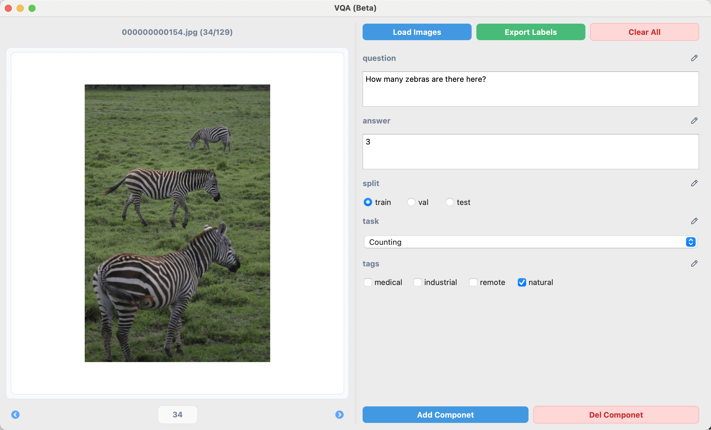
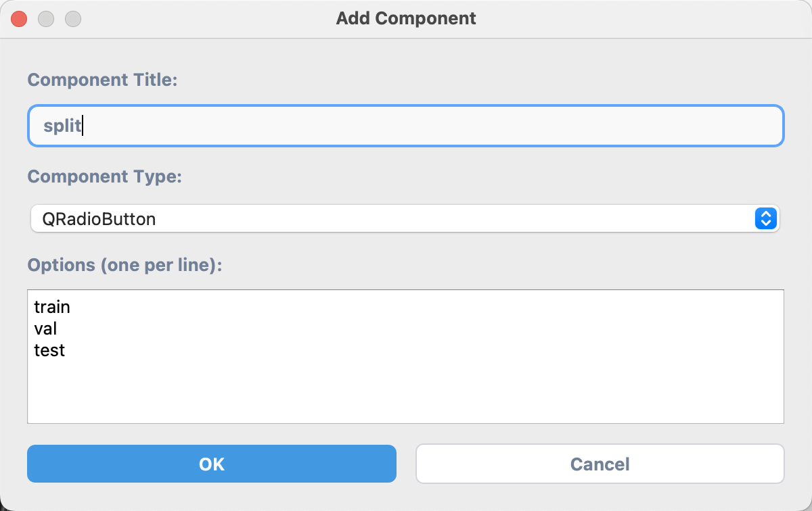
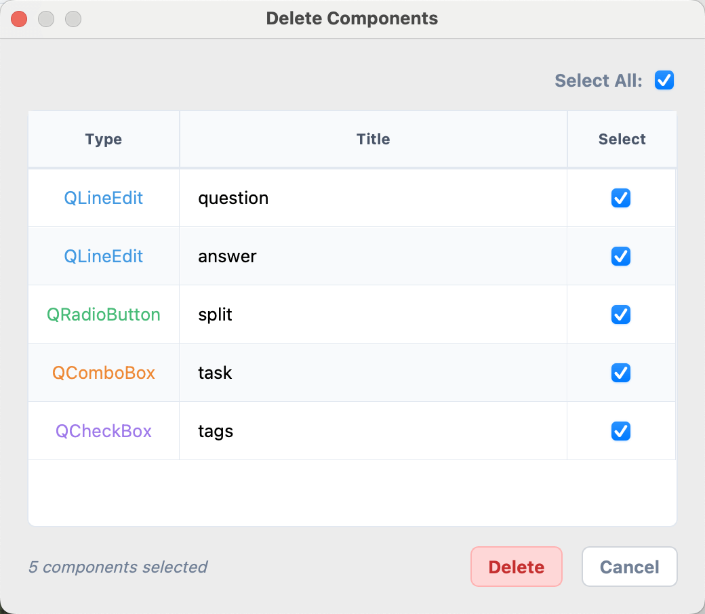

# Overview

The `X-AnyLabeling` Visual Question Answering (VQA) tool is a professional system designed specifically for annotating image question-answering datasets.

This tool enables the creation of question-answer pairs corresponding to images, offers multiple input component types, and provides high configurability to flexibly adapt to different annotation task requirements.

The VQA tool is particularly well-suited for building high-quality visual question-answering training data and can be used for cutting-edge model training tasks such as supervised fine-tuning and visual Chain of Thought (CoT).

<video src="https://github.com/user-attachments/assets/92807672-f101-475b-b790-9caa1c31da05" width="100%" controls>
</video>

# Getting Started

## Accessing the VQA Tool

To open the VQA tool, click the Visual Question Answering icon in the left toolbar of X-AnyLabeling or use the following keyboard shortcuts to quickly launch the chatbot dialog interface:

- Windows/Linux: `Ctrl` + `1`
- macOS: `⌘` + `1`

## Initial Setup

Upon each startup, the system automatically loads the default configuration from the following path. You can add custom components according to your annotation requirements to build a personalized annotation interface:

```bash
~/xanylabeling_data/vqa/components.json
```

# User Interface

The VQA tool features a dual-panel interface design with an image display and navigation area on the left, and an annotation control area on the right for configuring, editing, and exporting question-answer pairs.



## Left Panel - Image Display Area

* **Filename and Progress Indicator**: Displays the current image filename and its position within the dataset (e.g., `000000000154.jpg (33/128)`).
* **Image Preview Area**: Centers and displays the image with adaptive scaling support.
* **Image Navigation Features**:
  * "Previous / Next" buttons for sequential browsing
  * Page number input box for quick navigation

## Right Panel - Annotation Control Area

* **Operation Functions**:
  * **Load Images**: Load image directory
  * **Export Labels**: Export annotation data in JSONL format
  * **Clear All**: Clear all annotation items for the current image

* **Annotation Components Area**: Dynamically loads annotation components based on user configuration with real-time editing support. Component types include:

  **Text Input Box (`QLineEdit`)**
  * Used for open-ended Q&A such as image descriptions, detailed answers, etc.

  **Radio Button Group (`QRadioButton`)**
  * Suitable for single-choice questions like task type selection, dataset partitioning, etc.
  * First option is selected by default
  * Supports custom option content

  **Checkbox Group (`QCheckBox`)**
  * Suitable for multiple-choice questions like image labels, attribute marking, etc.
  * Supports multiple selections with no default selection

  **Dropdown Menu (`QComboBox`)**
  * Suitable for single-choice scenarios with many options
  * Displays "-- Select --" prompt by default
  * Supports custom option lists

* **Component Management Area**:
  * **Add Component**: Add new annotation components
  * **Del Component**: Delete configured components

<div style="display: flex; justify-content: space-between;">
  
  
</div>

# Data Storage

X-AnyLabeling enables auto-save by default for VQA annotations. All annotation data is automatically saved to JSON files in the same directory as the images.

## VQA Data Format

VQA annotation data is stored in the `vqaData` field within the label file. The data structure includes all the information captured through the configured components:

```json
{
  "version": "3.0.0",
  "flags": {},
  "shapes": [],
  ...
  "vqaData": {
    "question": "How many zebras are there here?",
    "answer": 3,
    "split": "train",
    "task": "Counting",
    "tags": [
      "natural"
    ]
  },
  "imagePath": "0000000000154.jpg",
  "imageHeight": 640,
  "imageWidth": 480
}
```

## Data Export

Use the **Export Labels** button to export all VQA annotations in JSONL format, where each line contains the annotation data for one image as below:

```jsonl
{"image": "0000000000154.jpg", "question": "What animals are shown in the image?", "answer": "Two zebras are grazing in the grassland", "split": "train"}
{"image": "0000000000155.jpg", "question": "What is the cat doing?", "answer": "sleeping", "split": "val"}
...
```
