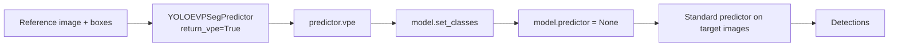
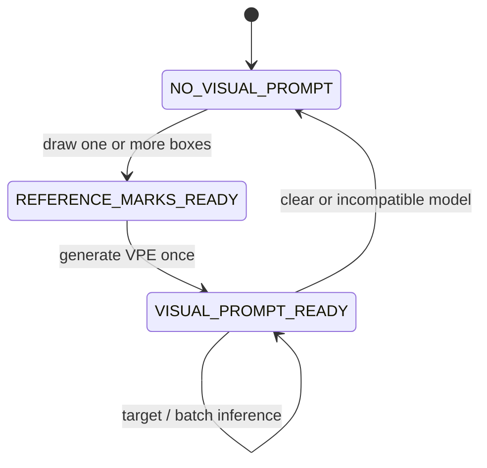
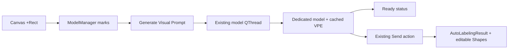
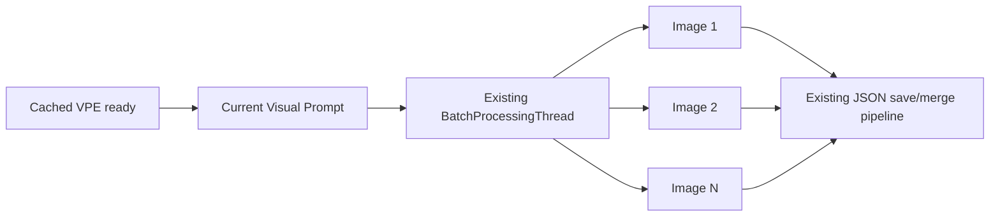
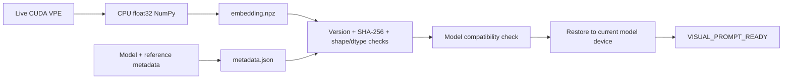

# Vision Prompt architecture

## Existing X-AnyLabeling flow

The current implementation is centered on
`anylabeling/services/auto_labeling/yoloe.py::YOLOE`.

`Canvas.update_auto_labeling_marks()` converts temporary ADD rectangles to
`{"type": "rectangle", "data": [x1, y1, x2, y2], "label": 1}`.
`AutoLabelingWidget.on_new_marks()` forwards them through
`ModelManager.set_auto_labeling_marks()`. YOLOE collects every `data` value,
assigns class zero, and runs the current image with `YOLOEVPSegPredictor`.
After inference it clears `self.marks`, converts Ultralytics detections to
rectangle or polygon `Shape` objects, and returns `AutoLabelingResult`.

YOLOE lazily owns three independent model instances:

- `_text_model`: standard checkpoint with MobileCLIP embeddings set by
  `set_classes()`; rebuilt when text classes change.
- `_visual_model`: standard checkpoint used with `YOLOEVPSegPredictor`.
- `_prompt_free_model`: prompt-free checkpoint with a vocabulary fused from a
  temporary standard checkpoint.

The instances are released only by `unload()`. In the validated upstream
implementation, the visual predictor remains attached after intra-image visual
inference, while the temporary marks are cleared.

## Existing batch flow

`run_all_images()` classifies `yoloe` as a text-prompt batch model. It always
opens a `TextInputDialog`; an empty value selects prompt-free mode. The worker
calls the same blocking `ModelManager.predict_shapes(..., batch=True)` for each
path and saves its `AutoLabelingResult` through the normal X-AnyLabeling JSON
pipeline. Progress and cancellation already exist.

Visual prompting cannot currently be selected for batch because marks are
image-local and consumed after one inference, no VPE is retained, and the
batch-mode selector only represents text/prompt-free state.

## Validated YOLOE cross-image flow

The currently installed THU-MIG/yoloe API requires the visual predictor only
for VPE generation. Target inference must occur after setting classes and
removing that predictor. The measured single-class VPE is `[1, 1, 512]`.

## Implemented Phase 2 backend

The state lives with the loaded YOLOE service, not on the canvas. Phase 2 adds
a dedicated `_cross_image_visual_model`, so `set_classes(VPE)` and predictor
changes cannot contaminate `_text_model`, legacy `_visual_model`, or
`_prompt_free_model`.

The production backend now exposes:

- `build_visual_prompt(reference_image, reference_boxes, classes)`
- `set_visual_prompt(vpe, classes, reference)`
- `clear_visual_prompt()`
- `has_visual_prompt()` / `visual_prompt_ready`
- `predict_with_visual_prompt(target_image)`

`build_visual_prompt()` accepts one or more same-class boxes from a single
reference image, validates coordinates against the image, resets any existing
predictor, generates the VPE, sets classes, and removes the visual predictor.
The cached tensor remains on the model device and is detached from autograd.
`predict_with_visual_prompt()` uses the ordinary segmentation predictor and
returns the existing `AutoLabelingResult`/`Shape` representation without
changing or clearing the cached VPE.

`predict_shapes()` uses the following precedence: temporary marks retain the
legacy intra-image flow; a non-empty text prompt uses the text model; otherwise
a ready cached VPE uses the cross-image model; with no ready VPE it uses the
prompt-free model. Clearing the cross-image state restores prompt-free behavior.

## Implemented Phase 3 panel integration

`AutoLabelingWidget` now exposes Generate, status, and Clear controls only when
the loaded model declares the YOLOE widget set. Canvas rectangles continue to
flow through the existing mark signal. `ModelManager` publishes a UI-safe
status dictionary and runs VPE generation on its existing model execution
`QThread`; the same execution lock prevents VPE generation and target
inference from mutating YOLOE concurrently.

Successful generation removes only the temporary auto-labeling rectangles from
the canvas. It does not clear the cached VPE. Clear is rejected while the model
execution thread is busy and otherwise releases only cross-image state.
The existing postprocess, Shape, result signal, preservation policy, and
annotation editor remain the only output pipeline.

## Implemented Phase 4 batch flow

YOLOE now presents an explicit batch prompt selector with `Current Visual
Prompt`, `Text Prompt`, and `Prompt-Free`. Selecting the current prompt starts
from the first image in the opened folder and passes an explicit visual-prompt
flag through the existing `BatchProcessingThread` and `ModelManager`.

The explicit backend path bypasses temporary reference marks and calls target
inference only. It never invokes VPE build or set operations. Progress and
cancel remain the existing batch mechanisms. Each image is isolated: a read or
save failure is logged, reported, counted, and skipped without writing an empty
annotation or stopping later images. The completion popup distinguishes
success, cancellation, and completion with failed images.

## Implemented Phase 5 profile lifecycle

`VisualPromptProfile` is an independent serialization boundary. A live CUDA
tensor is converted with `detach().cpu().float().numpy()` and saved as
`embedding.npz`; JSON-safe model and reference metadata is saved separately as
`metadata.json`. Python pickle and arbitrary object deserialization are not
used.

The metadata file is written last and acts as the commit marker. Loading
requires profile version 1, a fixed embedding filename, a matching SHA-256,
finite float32 data, consistent `[1, classes, embedding]` dimensions, valid
reference boxes, and JSON-only metadata. Compatibility checks model family,
checkpoint filename and byte size, YOLOE architecture, and embedding
dimension before changing the live prompt. A failed or incompatible load does
not replace the current cached VPE.

Profiles are stored below `get_work_directory()/visual_prompts/<name>` by the
minimal panel action. Loading restores the array through `set_visual_prompt`,
which moves it to the dedicated model's actual device, binds classes once,
and resets the encoder predictor before target inference.
