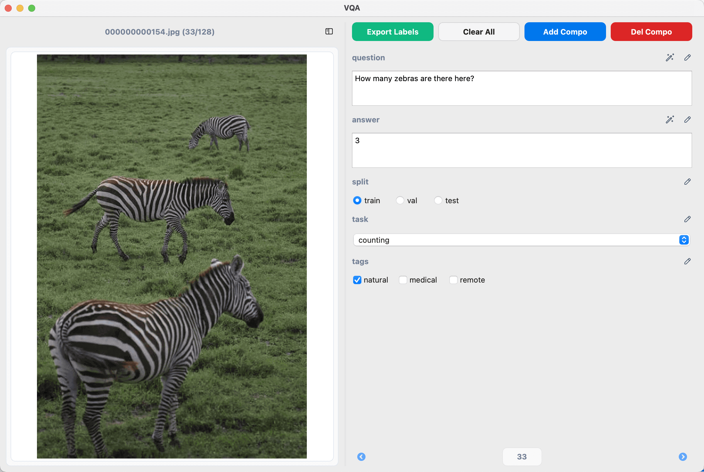
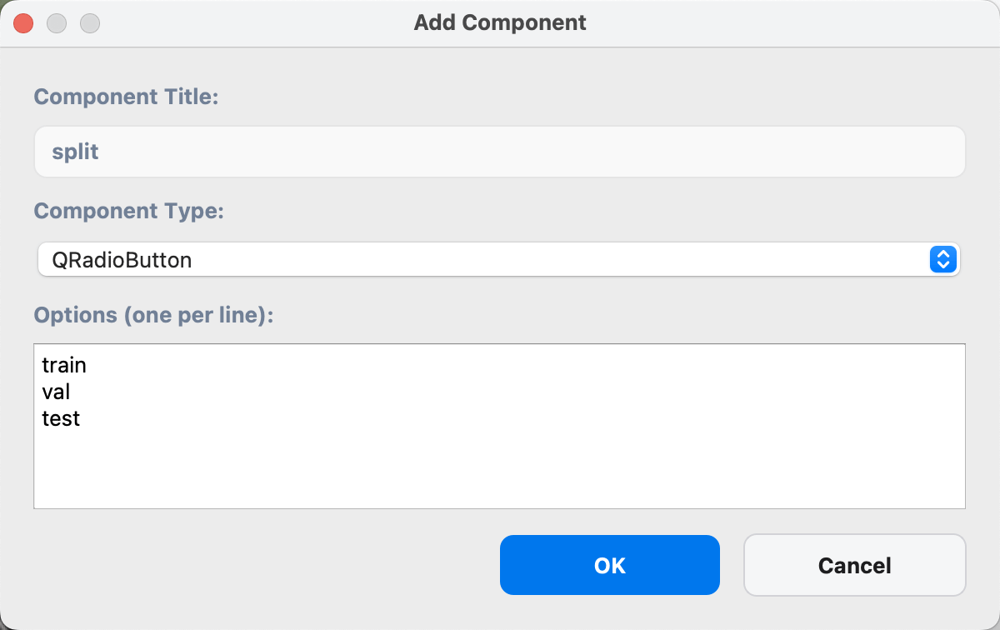
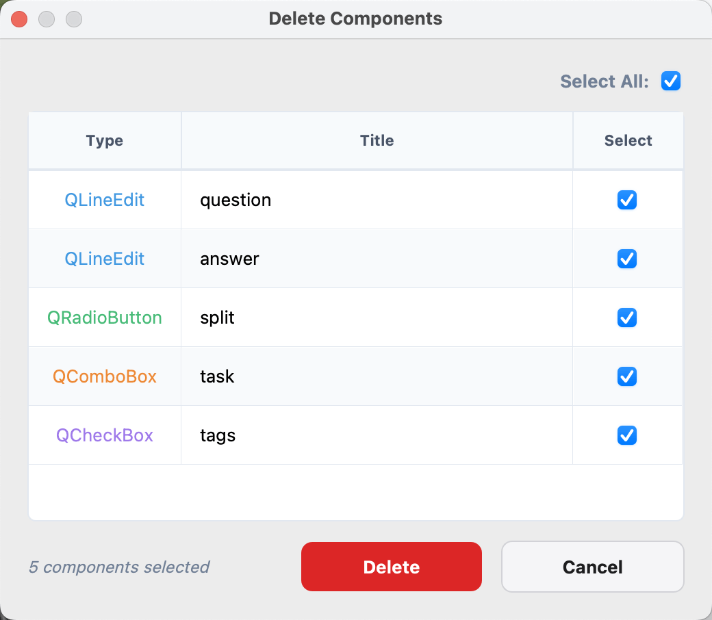
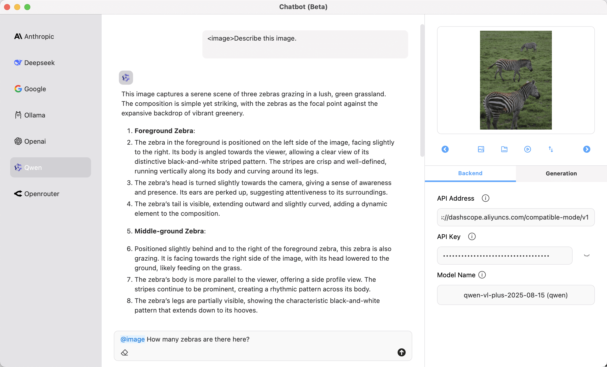
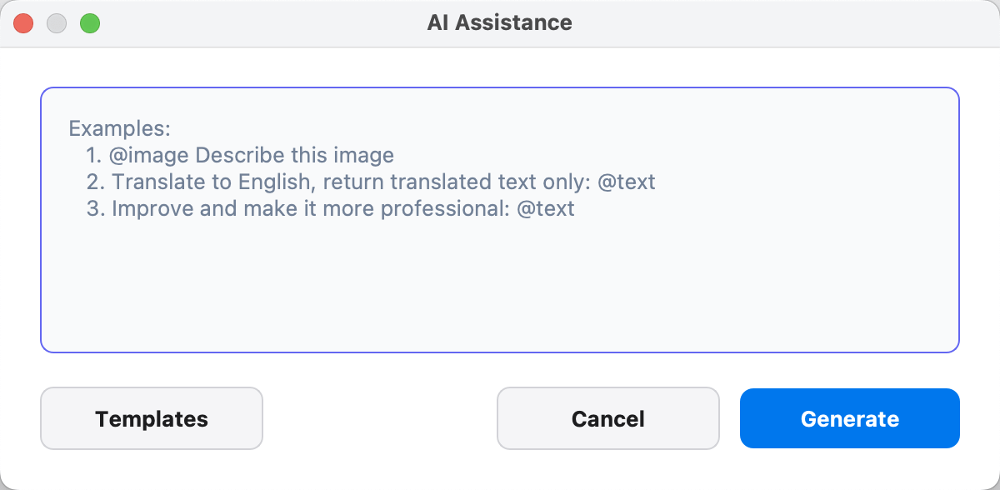
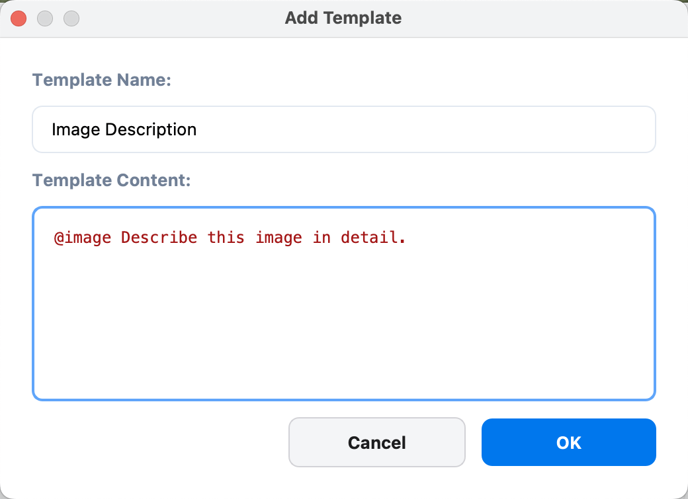
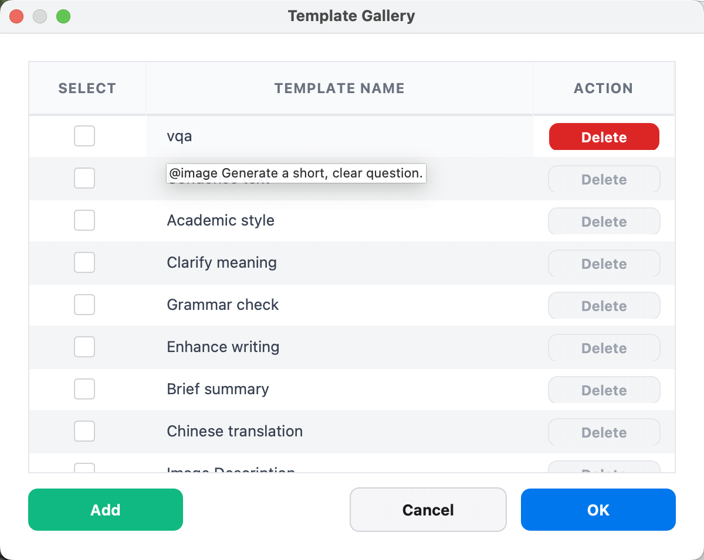
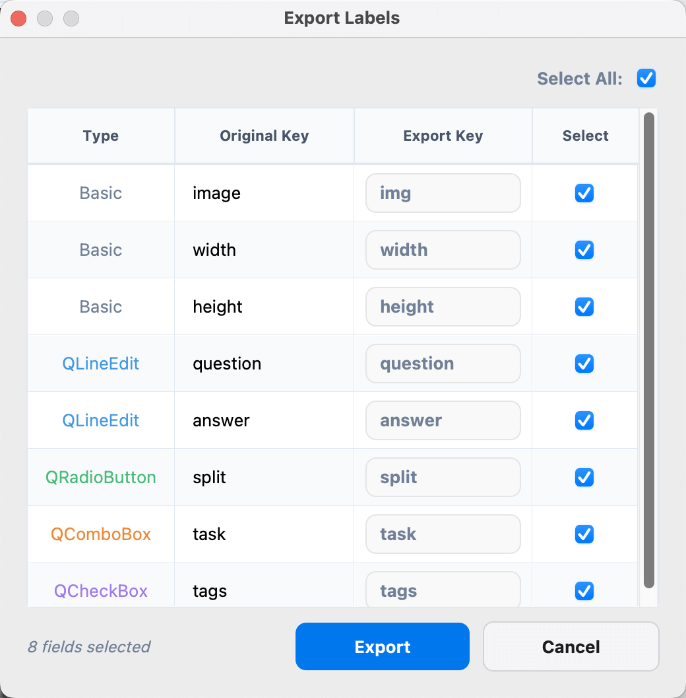

# 概述

`X-AnyLabeling` 视觉问答工具是一款专为多模态图像问答数据集标注设计的专业系统。该工具不仅支持创建图像对应的问题-答案对，还集成了智能辅助功能，提供丰富的输入组件类型和高度的可配置性。通过灵活适应不同标注任务的需求，可为监督式微调，强化学习后训练等任务提供高质量的训练语料。

<video src="https://github.com/user-attachments/assets/53adcff4-b962-41b7-a408-3afecd8d8c82" width="100%" controls>
</video>

# 启动

要打开视觉问答工具，请先确保主窗口图像目录已加载，随后点击主窗口左侧工具栏中的视觉问答图标或使用如下快捷键快速启动 VQA 对话窗口。

- Windows/Linux: `Ctrl` + `2`
- macOS: `⌘` + `2`

每次启动时，系统会自动从下述路径加载默认配置，用户可按需修改：

```bash
~/xanylabeling_data/vqa/components.json
```

# 教程

视觉问答工具采用双面板设计，左侧为图像预览区域，右侧为标注控制区域。



## 左侧面板 - 图像预览区

* **文件名与进度指示**：显示当前图像文件名及其在数据集中的位置（如：`000000000154.jpg (33/128)`）。
* **图像预览区域**：居中显示图像，支持自适应缩放。
* **面板打开/隐藏**：点击侧边栏图标可展开/收起左侧面板。

## 右侧面板 - 标注控制区

* **功能组件区**：

| 功能按钮 | 说明 |
|----------|------|
| Export Labels | 导出标注数据为 JSONL 格式 |
| Clear All | 清除当前图像的所有标注项 |
| Add Component | 新增标注组件 |
| Del Component | 删除已配置组件 |

* **标注组件区**：

| 组件名称 | 组件类型 | 说明 |
|----------|------| ------|
| 文本输入框 | QLineEdit | 用于开放式问答，如图像描述、详细回答等 |
| 单选按钮组 | QRadioButton | 适用于单选题，如任务类型选择、数据集划分等，仅支持单选 |
| 复选框组 | QCheckBox | 适用于多选题，如图像标签、属性标记等，支持多选 |
| 下拉菜单 | QComboBox | 适用于选项较多的单选场景，支持自定义选项列表 |

<div style="display: flex; justify-content: space-between;">
  
  
</div>

特别地，对于文本输入框组件，系统集成了强大的AI智能辅助功能，可以帮助用户更高效地完成标注工作。要启用此功能，请先参照 [Chatbot](../zh_cn/chatbot.md) 章节完成相关配置。



完成配置后，你可以通过点击标题栏右侧的魔法棒（🪄）图标来打开AI智能对话框。



系统支持纯文本和图文多模态智能提示功能，提供以下特殊引用符：

**基础引用**
- `@image`：引用当前图像，AI 将理解并分析图像内容
- `@text`：引用当前文本输入框中的已有内容

**跨组件引用**
- `@widget.组件名称`：引用其他 QLineEdit 组件的值，如 `@widget.question` 引用名为 "question" 的组件内容

**标注数据引用**
- `@label.shapes`：引用当前图像的所有标注对象信息
- `@label.imagePath`：引用图像文件路径
- `@label.imageHeight`：引用图像高度
- `@label.imageWidth`：引用图像宽度
- `@label.flags`：引用标注标记

**使用示例**
```
描述图像中的对象：@image
结合现有标注分析：@image 基于标注信息 @label.shapes 进行分析
引用其他组件：根据问题 "@widget.question" 生成答案
```

为了提高标注效率和提示词的复用性，我们还提供了强大的提示模板库功能。系统预置了一些常用的基础提示模板，同时用户也可以根据具体项目需求，灵活地添加、编辑和删除自定义提示词。这些模板可以帮助用户快速构建高质量的提示，提升标注效率。



鼠标悬停在提示文本上方时，系统会以悬浮提示的形式展示完整的提示内容，方便快速预览。对于用户自定义的提示词，你可以通过双击提示文本字段来快速编辑和修改提示的标题与具体内容。



# 数据

X-AnyLabeling 采用自动保存机制，确保您的标注工作不会丢失。标注数据会以 JSON 格式自动保存在与图像文件相同的目录下。对于本任务，所有标注信息都被组织在标签文件的 `vqaData` 字段中。该字段包含了通过各类配置组件采集的所有标注数据，形成结构化的数据存储：

```json
{
  "version": "3.2.1",
  "flags": {},
  "shapes": [],
  ...
  "vqaData": {
    "question": "How many zebras are there here?",
    "answer": 3,
    "split": "train",
    "task": "Counting",
    "tags": [
      "natural"
    ]
  },
  "imagePath": "0000000000154.jpg",
  "imageHeight": 640,
  "imageWidth": 480
}
```

完成标注任务后，您可以点击 `Export Labels` 按钮导出标注数据。导出对话框提供了灵活的字段选择选项，主要包含以下两类：

- **基础字段**：包含图像文件名称以及相应的宽高信息
- **自定义组件字段**：包含所有已配置的自定义组件及其对应的标注数据



导出数据默认采用 `JSONL` 格式，每行包含一条完整的标注记录。以下是导出文件的示例内容：

```jsonl
{"image": "0000000000154.jpg", "width": 640, "height": 480, "question": "图像中有几只斑马？", "answer": 3, "split": "train"}
{"image": "0000000000155.jpg", "width": 640, "height": 480, "question": "猫在做什么？", "answer": "睡觉", "split": "val"}
```