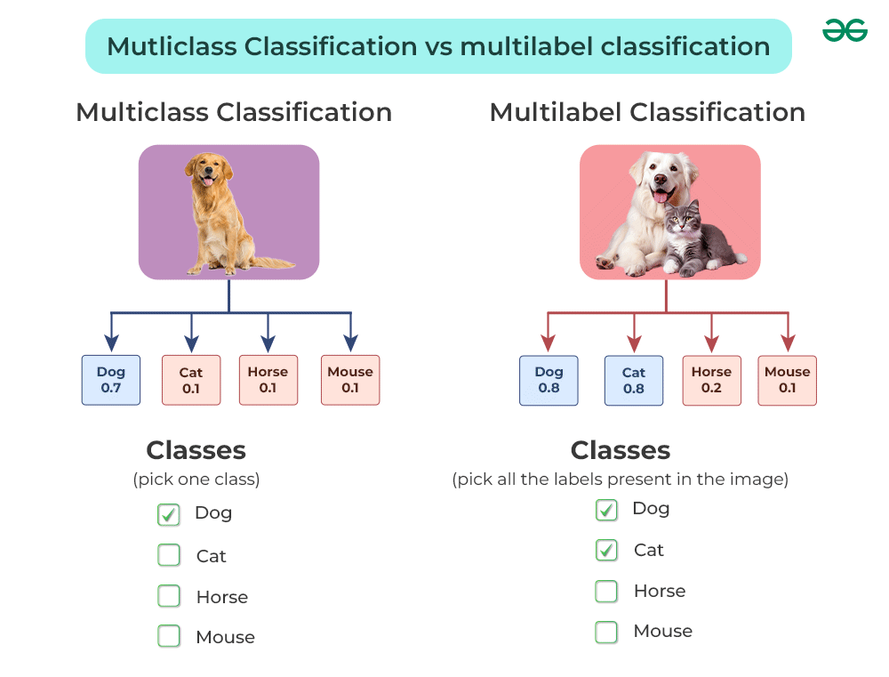
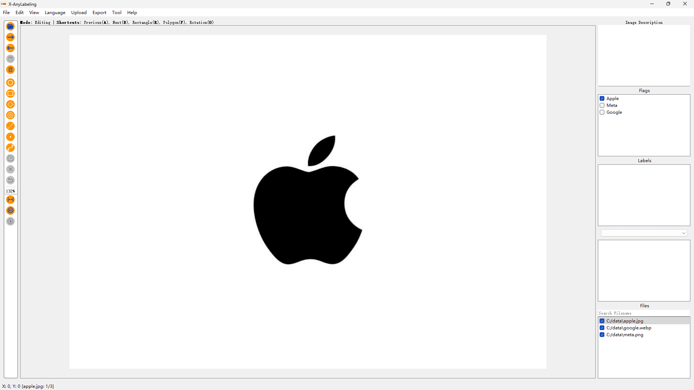
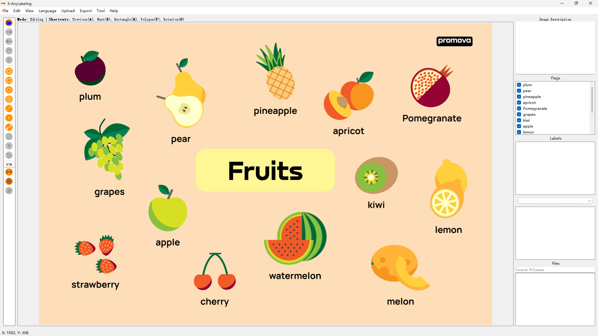

# Image-level Classification Example

## Introduction

**Image Classification** is the task of assigning a specific label or class to an entire image, which can be divided into different categories, i.e., Multiclass Classification and  Multilabel Classification.



> **Multiclass Classification** focuses on categorizing data into more than two classes.



> **Multilabel Classification** allows for each instance to be associated with multiple labels simultaneously, enabling the assignment of multiple binary labels to a single image.



## Usage

### GUI Import

**Step 0: Preparation**

Prepare a flags file like [logo_flags.txt](./logo_flags.txt) or [fruit_flags.txt](./fruit_flags.txt). An example is shown below:

```txt
Apple
Meta
Google
```

**Step 1: Run the Application**

```bash
python anylabeling/app.py
```

**Step 2: Upload the Configuration File**

Click on `Upload -> Upload Image Flags File` in the top menu bar and select the prepared configuration file to upload.

### Command Line Loading

**Option 1: Quick Start**

> [!TIP]
> This option is suitable for a quick startup.

```bash
python anylabeling/app.py --flags Apple,Meta,Google
```

> [!CAUTION]
> Remember separate custom labels with a comma ','.

**Option 2: Using a Configuration File**

```bash
python anylabeling/app.py --flags flags.txt
```

> [!NOTE]
> Here, each line represents a category.


For detailed output examples, refer to [this folder](./sources/).
