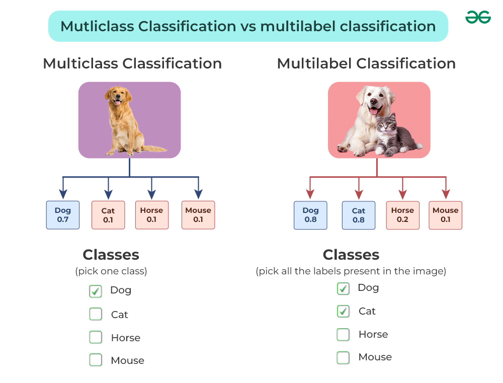
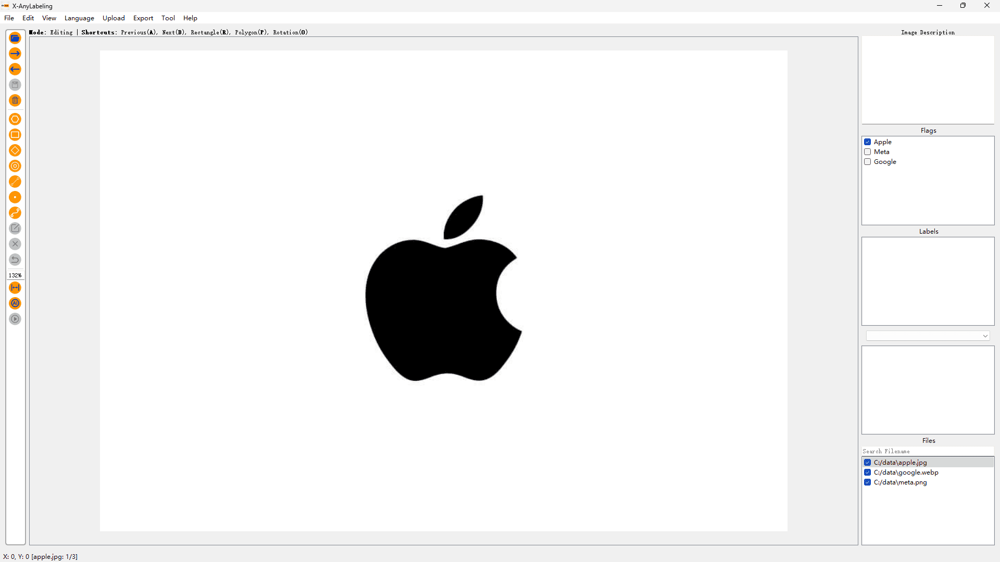
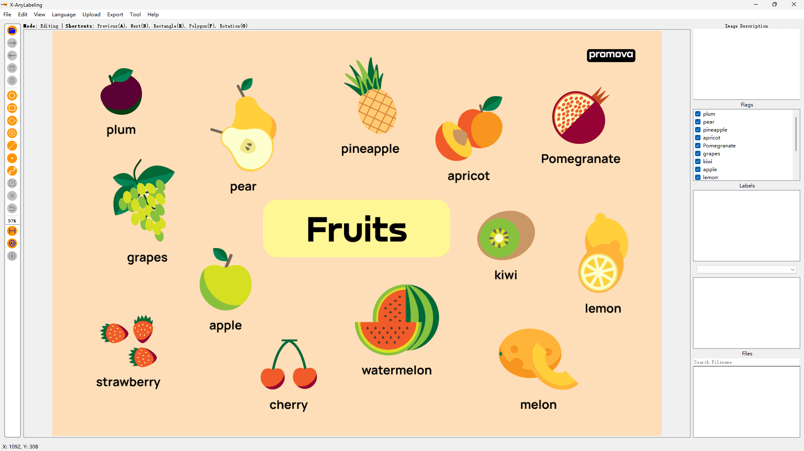

# Image-level Classification Example

## Introduction

Image classification assigns labels to an entire image. X-AnyLabeling supports multiclass and multilabel classification.



> **Multiclass classification** assigns exactly one class to each image.



> **Multilabel classification** allows each image to have multiple labels.



## Usage

### GUI Import

**Step 0: Preparation**

Prepare a flags file like [logo_flags.txt](./logo_flags.txt) or [fruit_flags.txt](./fruit_flags.txt). An example is shown below:

```txt
Apple
Meta
Google
```

**Step 1: Run the Application**

```bash
python anylabeling/app.py
```

**Step 2: Upload the Configuration File**

Click on `Upload -> Upload Image Flags File` in the top menu bar and select the prepared configuration file to upload.

### Command Line Loading

**Option 1: Quick Start**

> [!TIP]
> This option is suitable for a quick startup.

```bash
python anylabeling/app.py --flags Apple,Meta,Google
```

> [!CAUTION]
> Separate labels with commas.

**Option 2: Using a Configuration File**

```bash
python anylabeling/app.py --flags flags.txt
```

> [!NOTE]
> Each line in the file represents one category.

For detailed output examples, refer to [this folder](./sources/).
