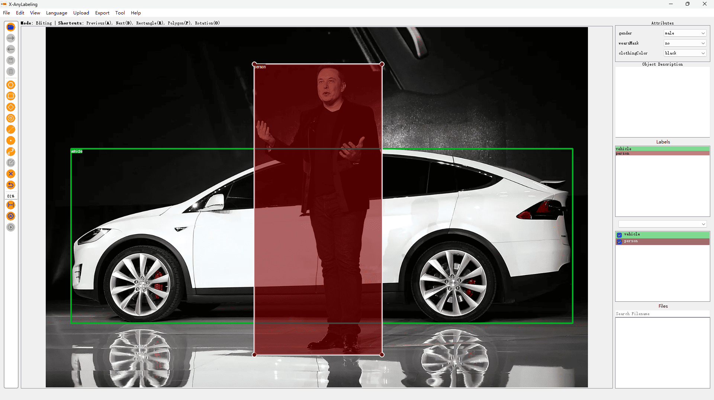
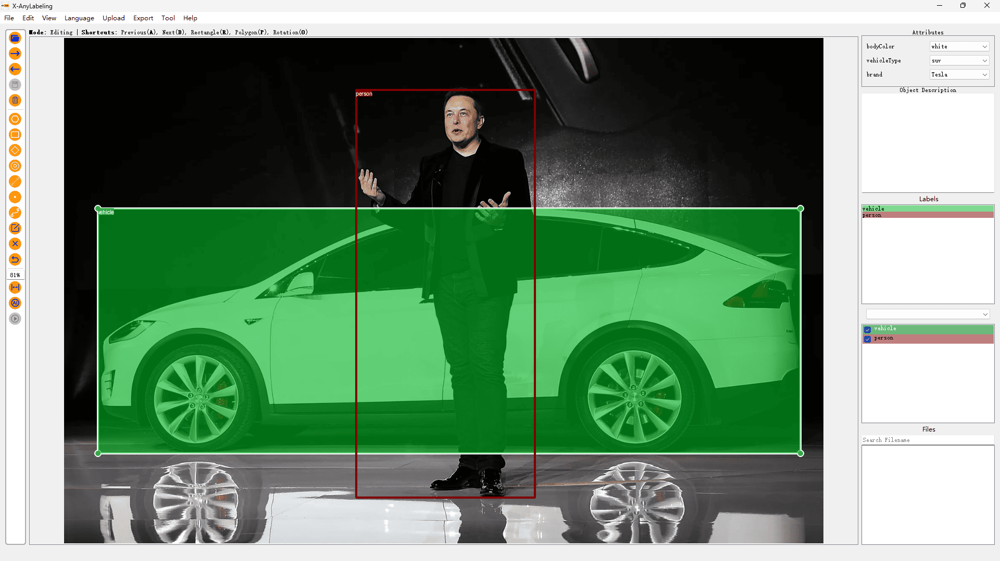
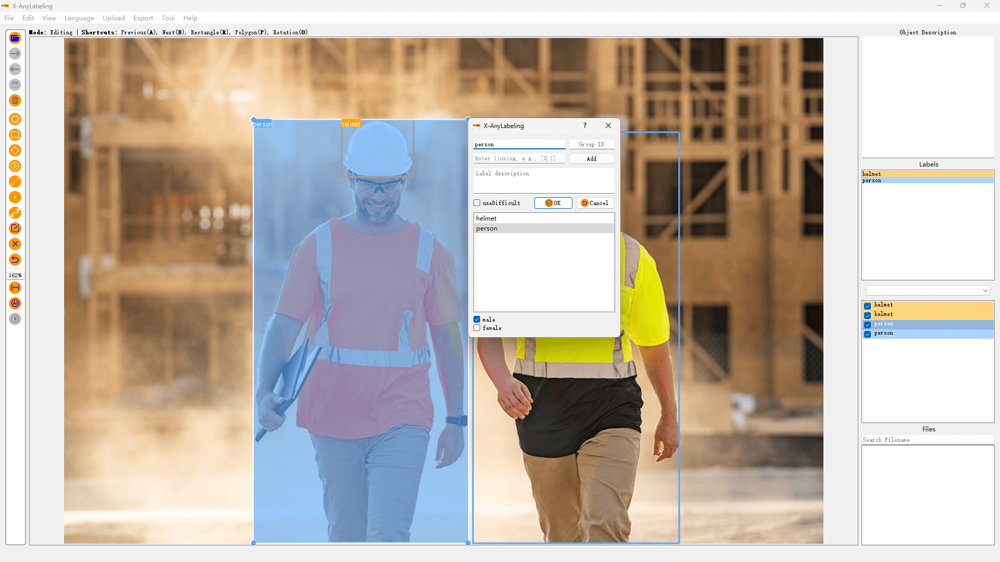
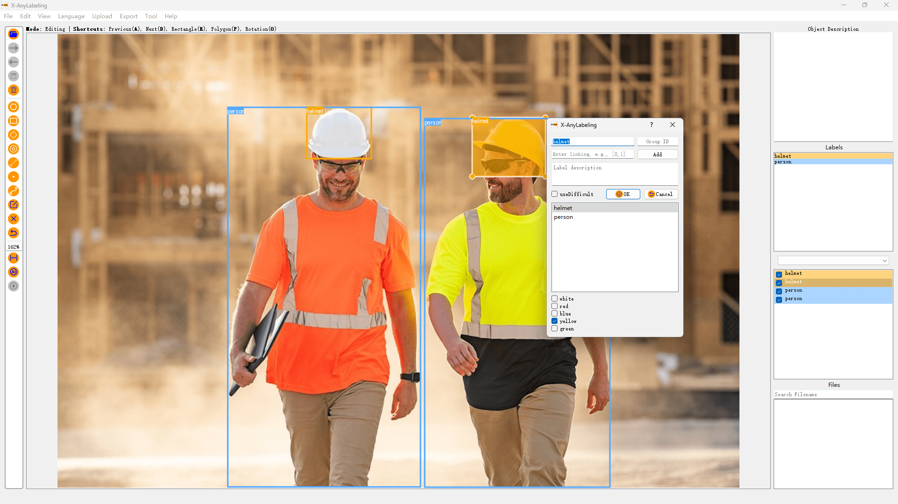

# Shape-level Classification Example

## Multi-task Classification

### Introduction

**Multi-task Classification** involves training a model to perform multiple classification tasks simultaneously. For example, a model could be trained to classify both the type of person and vehicle attributes in a single image.




### Usage

**Step 0: Preparation**

Prepare a attributes file like [attributes.json](./attributes.json). An example is shown below:

```json
{
    "vehicle": {
        "bodyColor": [
            "red",
            "white",
            "blue"
        ],
        "vehicleType": [
            "SUV",
            "sedan",
            "bus",
            "truck"
        ]
    },
    "person": {
        "wearsGlasses": ["yes", "no"],
        "wearsMask": ["yes", "no"],
        "clothingColor": [
            "red",
            "green",
            "blue"
        ]
    },
    "__widget_types__": {
        "vehicle": {
            "bodyColor": "radiobutton",
            "vehicleType": "combobox"
        },
        "person": {
            "wearsGlasses": "radiobutton",
            "wearsMask": "radiobutton",
            "clothingColor": "combobox"
        }
    }
}

```

> [!NOTE]
> **Widget Types Configuration (X-AnyLabeling v3.2.4+)**
> 
> You can specify the widget type for each attribute using the `__widget_types__` section:
> - `"radiobutton"`: Single-click selection, ideal for yes/no or few options
> - `"combobox"`: Dropdown selection, suitable for many options (default)
> 
> If `__widget_types__` is not specified, all attributes default to combobox.

**Step 1: Run the Application**

```bash
python anylabeling/app.py
```

**Step 2: Upload the Configuration File**

Click on `Upload -> Upload Attributes File` in the top menu bar and select the prepared configuration file to upload.

> [!TIP]
> Starting from X-AnyLabeling v3.2.4+, you can use **Loop Select Shapes** (Ctrl+Shift+C) to sequentially select each shape on the canvas for efficient attribute annotation. This enables you to quickly cycle through all shapes and assign attributes without having to manually click each one.

> [!NOTE]
> **Attributes Label Color Customization (X-AnyLabeling v3.3.0+)**
> 
> You can customize the colors of attribute labels displayed on the canvas by configuring the `.xanylabelingrc` file in your user directory. Add or modify the following settings under the `canvas` section:
> 
> ```yaml
> canvas:
>   attributes:
>     background_color: [33, 33, 33, 255]  # Background color (RGBA)
>     border_color: [66, 66, 66, 255]      # Border color (RGBA)
>     text_color: [33, 150, 243, 255]      # Text color (RGBA)
> ```
> 
> Color values use RGBA format: `[R, G, B, A]`, where each value ranges from 0-255.

For detailed output examples, refer to [this file](./sources/multi-task/elon-musk-tesla.json).


## Multiclass & Multilabel Classification

Similar to [Image-Level Classification](../image-level/README.md), you can also conduct multiclass and multilabel classification for Shape-Level Annotation.




## Usage

### GUI Import (Recommended)

**Step 0: Preparation**

Prepare a flags file like [label_flags.yaml](./label_flags.yaml). An example is shown below:

```YAML
person:
  - male
  - female
helmet:
  - white
  - red
  - blue
  - yellow
  - green
```

**Step 1: Run the Application**

```bash
python anylabeling/app.py
```

**Step 2: Upload the Configuration File**

Click on `Upload -> Upload Label Flags File` in the top menu bar and select the prepared configuration file to upload.

### Command Line Loading

**Option 1: Quick Start**

```bash
python anylabeling/app.py --labels person,helmet --labelflags "{'person': ['male', 'female'], 'helmet': ['white', 'red', 'blue', 'yellow', 'green']}" --validatelabel exact
```

> [!TIP]
> The `labelflags` key field supports regular expressions. For instance, you can use patterns like `{person-\d+: [male, tall], "dog-\d+": [black, brown, white], .*: [occluded]}`.

**Option 2: Using a Configuration File**

```bash
python anylabeling/app.py --labels labels.txt --labelflags label_flags.yaml --validatelabel exact
```

For detailed output examples, refer to [this file](./sources/multi-label/worker.json).


