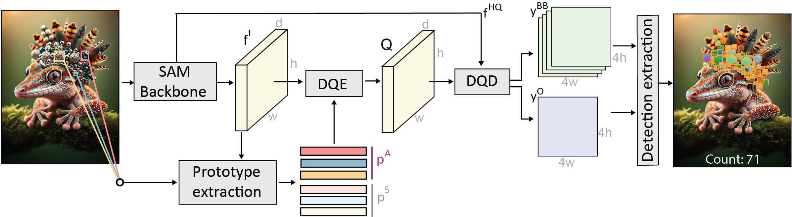

# GeCo Example

## Introduction

[GeCo](https://github.com/jerpelhan/GeCo) (NeurIPS'24) is a novel low-shot counter that uses a unified architecture for accurate object detection, segmentation, and count estimation, robustly generalizing object prototypes and employing a novel counting loss for direct optimization of the detection task, significantly outperforming existing methods.

## Usage 🚀

1. 📁 Load your media into X-AnyLabeling:
   - 🖼️ Images: Press `Ctrl+I` for a single image or `Ctrl+U` for a folder
   - 🎥 Videos: Press `Ctrl+O`

2. 🤖 Download GeCo model files manually

   Currently, due to GitHub release size limitations (>2GB), you need to manually download the GeCo model files from one of the following sources:

   - 🔗 [ModelScope (recommended for China users)](https://www.modelscope.cn/models/CVHub520/geco_sam_hq_vit_h/files)
   - 🌐 [Google Drive](https://drive.google.com/file/d/19iZwXUSVaxkwoKWisifWGspWwfUSzGaF/view)

   After downloading, place the files in the expected directory described in the custom model documentation. [[English](../../../docs/en/custom_model.md) | [中文版](../../../docs/zh_cn/custom_model.md)].

3. ✏️ Drawing and labeling:
   - 📦 Click the `Rect` tool to start
   - 🎯 Draw one or more bounding boxes around objects of interest
   - ✅ Press `F` or click `Finish` when done
   - 🏷️ Enter the class name for the labeled object
   - ↩️ Made a mistake? Press `B` or click `Clear` to undo

