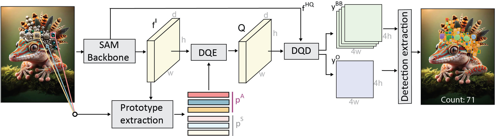

# GeCo Example

## Introduction

[GeCo](https://github.com/jerpelhan/GeCo) is a low-shot counting model that uses exemplar boxes to detect, segment, and count objects.

## Usage

1. Load an image with `Ctrl+I`, an image directory with `Ctrl+U`, or a video with `Ctrl+O`.

2. Download the GeCo model files manually.

   Because the complete model is larger than the GitHub Release asset limit, download it from one of these sources:

   - [ModelScope](https://www.modelscope.cn/models/CVHub520/geco_sam_hq_vit_h/files)
   - [Google Drive](https://drive.google.com/file/d/19iZwXUSVaxkwoKWisifWGspWwfUSzGaF/view)

   After downloading, update the paths in the model configuration as described in the custom model guide ([English](../../../docs/en/custom_model.md) | [中文版](../../../docs/zh_cn/custom_model.md)).

3. Select the `Rect` prompt tool and draw one or more exemplar boxes around the target objects.
4. Press `F` or click `Finish`, then enter the class name.
5. Press `B` or click `Clear` to remove the current prompts and try again.
