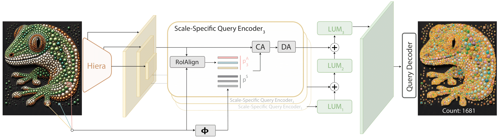

# GECO2 Example

## Introduction

[GECO2](https://github.com/jerpelhan/GECO2) is a few-shot object counting model designed for dense and scale-varying scenes. Instead of relying on heuristic image tiling or aggressive upscaling, it builds exemplar-aware query features across multiple backbone resolutions and fuses them into a high-resolution detection map. This makes it better suited for crowded images with small objects, large objects, or both at the same time. In the X-AnyLabeling workflow, GECO2 is exposed through the remote inference service provided by X-AnyLabeling-Server.

## Installation

This example uses the remote-server workflow. Before using GECO2 in X-AnyLabeling, make sure [X-AnyLabeling-Server](https://github.com/CVHub520/X-AnyLabeling-Server) is installed and running.

1. Follow the X-AnyLabeling-Server installation guide in the server repository.
2. Enable `geco2` in `configs/models.yaml`.
3. Prepare the GECO2 model weights required by the server.
4. Start the server.
5. In X-AnyLabeling, configure the remote server endpoint in your user configuration and select `Remote-Server` from the auto-labeling panel.

> [!TIP]
> You can refer to the [X-AnyLabeling-Server](https://github.com/CVHub520/X-AnyLabeling-Server) repository for the latest setup instructions, model configuration examples, and weight download links.

## Usage

Launch the X-AnyLabeling client, press `Ctrl+A` or click the `AI` button in the left menu bar to open the auto-labeling panel. In the model dropdown list, select `Remote-Server`, then choose `GECO2`.

<video src="https://github.com/user-attachments/assets/da8b0c7b-f35a-487a-bcbc-cdb20583ff34" width="100%" controls>
</video>

> [!NOTE]
> Replace the placeholder GIF above with your final GECO2 demo.

1. Load an image into X-AnyLabeling.
2. Choose the rectangle prompt tool in the auto-labeling panel.
3. Draw one or more exemplar boxes around the target objects you want to count.
4. Click `Run Rect` to send the image and exemplar prompts to the remote server.
5. Review the returned counting boxes shown by the model.
6. Adjust the confidence threshold if needed and run again for a stricter or looser result.

## Practical Tips

- Use clean exemplar boxes that tightly cover representative instances.
- When object scale varies a lot, provide exemplars from different size ranges if possible.
- For very dense scenes, start with a moderate confidence threshold and then refine based on over-counting or under-counting behavior.
- GECO2 is intended for remote inference in this integration, so the client depends on a reachable X-AnyLabeling-Server instance.

See [User Guide](../../../docs/en/user_guide.md) for more details.
