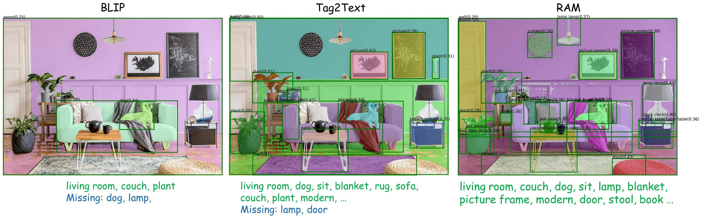
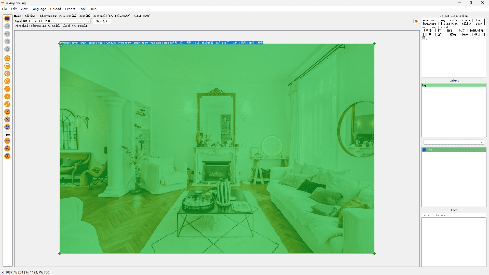
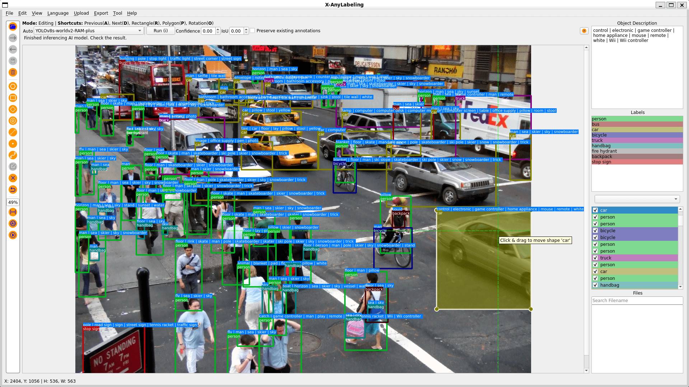

# Tagging Annotation Example

Tagging assigns descriptive labels to an entire image or to selected shapes.

## Tagging Model

X-AnyLabeling includes [RAM](../../../anylabeling/configs/auto_labeling/ram_swin_large_14m.yaml) and [RAM++](../../../anylabeling/configs/auto_labeling/ram_plus_swin_large_14m.yaml) for image- or shape-level tagging. Tagging models can also be combined with detection and segmentation models, as in [GroundingSAM](../../../anylabeling/configs/auto_labeling/groundingdino_swinb_attn_fuse_sam_hq_vit_l_quant.yaml).

Here:

- **[RAM](https://arxiv.org/abs/2306.03514)** is a strong image tagging model, which can recognize any common category with high accuracy.
- **[RAM++](https://arxiv.org/abs/2310.15200)** is the next generation of RAM, which can recognize any category with high accuracy, including both predefined common categories and diverse open-set categories.

## Image-level Tagging

## Shape-level Tagging

For detailed output examples, refer to [this folder](./sources/).
