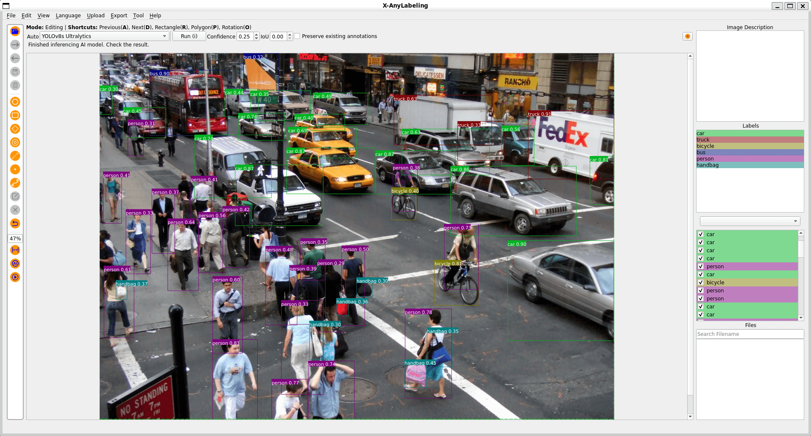
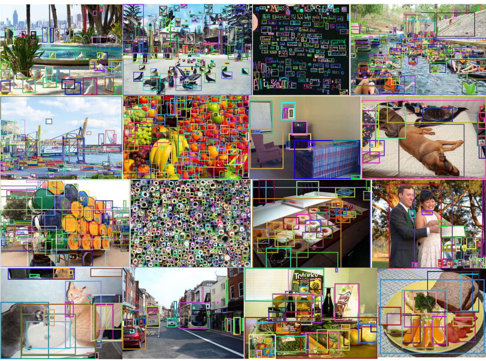

# Object Detection Example


## Introduction

Object detection is a computer vision solution that identifies objects, and their locations, in an image.



## Basic Usage

Here's how to set up for the object detection job:

- Start by adding the image files.
- Then, tap the `rectangle` button on the left menu or press the `R` key to quickly create a rectangle shape.
- Finally, type in the matching name in the label dialog.

## Advanced Usage

### Object Detection


1. Import your image (`Ctrl+I` or `Ctrl+U`) or video (`Ctrl+O`) file into the X-AnyLabeling.
2. Select and load the `YOLO11` model, or choose from other available object detection models.
3. Initiate the process by clicking `Run (i)`. Once you've verified that everything is set up correctly, use the keyboard shortcut `Ctrl+M` to process all images in one go.


### Region Proposal



Let's take the [Universal Proposal Network](https://arxiv.org/pdf/2411.18363) (UPN) model as an example to demonstrate advanced usage, which adopts a dual-granularity prompt tuning strategy to generate comprehensive proposals for objects at both instance and part levels:

- `fine_grained_prompt`: For detecting detailed object parts and subtle differences between similar objects. This mode excels at identifying specific features like facial characteristics or distinguishing between similar species.
- `coarse_grained_prompt`: For detecting broad object categories and major scene elements. This mode focuses on identifying general objects like people, vehicles, or buildings without detailed sub-categorization.


Before you begin, make sure you have the following prerequisites installed:

**Step 0:** Download and install Miniconda from the [official website](https://docs.anaconda.com/miniconda/).

**Step 1:** Create a new Conda environment with Python version `3.9` or higher, and activate it:

```bash
conda create -n x-anylabeling-upn python=3.9 -y
conda activate x-anylabeling-upn
```

You'll need to install Pytorch first. Follow the instructions [here](https://pytorch.org/get-started/locally/) to install related dependencies.

Afterward, you can install ChatRex on a GPU-enabled machine using:

```bash
git clone https://github.com/IDEA-Research/ChatRex.git
cd ChatRex
pip install -v -e .
# install deformable attention for universal proposal network
cd chatrex/upn/ops
pip install -v -e .
# Back to the project root directory
cd -
```

Finally, install the necessary dependencies for X-AnyLabeling (v2.5.0+):

```bash
cd ..
git clone https://github.com/CVHub520/X-AnyLabeling
cd X-AnyLabeling
```

Now, you can back to the installation guide ([简体中文](../../../docs/zh_cn/get_started.md) | [English](../../../docs/en/get_started.md)) to install the remaining dependencies.


Here's how to set up for the UPN job:

1. Import your image (`Ctrl+I`) or video (`Ctrl+O`) file into X-AnyLabeling
2. Select and load the `Universal Proposal Network (IDEA)` model from the model list
3. Click `Run (i)` to start processing. After verifying the results are satisfactory, use `Ctrl+M` to batch process all images

Additionally, you can adjust the following parameters to filter detection results directly from the GUI:

- Detection Mode: Switch between `Coarse Grained` and `Fine Grained` modes using the dropdown menu next to the model selection
- Confidence Threshold: Adjust the confidence score (0-1) using the "Confidence" spinner control
- IoU Threshold: Control the Non-Maximum Suppression (NMS) threshold (0-1) using the "IoU" spinner control


### Text-Visual Prompting Grounding

The [OpenVision](../../../anylabeling/configs/auto_labeling/open_vision.yaml) model demonstrates advanced usage with dual-granularity prompt tuning for comprehensive object detection at both instance and part levels. It combines the [CountGD](https://github.com/niki-amini-naieni/CountGD) model for counting-based detection and the [Segment Anything Model](https://github.com/facebookresearch/segment-anything) for precise segmentation, enabling both coarse and fine-grained object analysis.

---

Follow these step-by-step instructions to install the environment:

1. Create and activate the environment:
   ```bash
   conda create -n countgd python=3.9.19 -y
   conda activate countgd
   ```

2. Downgrade the NVIDIA driver to version 12.1 and reinstall it if necessary:
   ```bash
   pip install torch==2.2.1 torchvision==0.17.1 torchaudio==2.2.1 --index-url https://download.pytorch.org/whl/cu121
   ```
   Alternatively, you can follow [this method](https://blog.csdn.net/Slience_me/article/details/139860610) to manage multiple CUDA environments.

3. Clone the CountGD repository and navigate to it:
   ```bash
   git clone https://github.com/niki-amini-naieni/CountGD.git
   cd CountGD
   ```

4. Install dependencies and set up GroundingDINO:
   ```bash
   pip install -r requirements.txt
   export CC=/usr/bin/gcc-11  # Ensure GCC 11 is used for compilation
   cd models/GroundingDINO/ops
   python setup.py build install
   python test.py
   ```

5. Clone the X-AnyLabeling repository and navigate to the project directory:
   ```bash
   cd /path/to/x-anylabeling/project
   git clone https://github.com/CVHub520/X-AnyLabeling
   cd X-AnyLabeling
   ```

6. Follow the [instructions](https://github.com/CVHub520/X-AnyLabeling/blob/main/docs/zh_cn/get_started.md#112-%E5%AE%89%E8%A3%85) to install the required packages, ensuring compatibility with your local CUDA version.

7. Run the application:
   ```bash
   python anylabeling/app.py
   ```

---

For a demonstration of the workflow, watch the demo video here: [[Youtube](https://www.youtube.com/watch?v=QtoVMiTwXqk) | [Bilibili](https://www.bilibili.com/video/BV1jyqrYyE74)]


X-AnyLabeling supports three different prompting modes for object detection and annotation:

- **Point Prompting Mode**: 
  - Uses the Segment Anything Model (SAM) to generate high-precision segmentation masks
  - Activated by clicking points on the target object
  - Best for detailed object segmentation and boundary detection
  - Ideal for irregular shapes and precise annotations

- **Rectangle Prompting Mode**: 
  - Leverages the CountGD model to detect visually similar objects
  - Activated by drawing a bounding box around an example object
  - Automatically finds and annotates similar objects in the image
  - Optimal for batch detection of multiple similar objects

- **Text Prompting Mode**: 
  - Powered by Grounding DINO for text-guided object detection
  - Activated by entering natural language descriptions
  - Locates objects based on textual descriptions
  - Perfect for finding objects by their semantic description

> [!NOTE]
> Please note that the current model is experimental and may not perform as expected, and it may have the following limitations:
> - The model weights are trained on [FSC-147](https://github.com/cvlab-stonybrook/LearningToCountEverything), which may not perform well on out-of-distribution objects.
> - The model inference is very resource-intensive, as it is designed as a two-stage pipeline.
> - The current model is not able to effectively distinguish between similar objects, which may lead to some false positives.