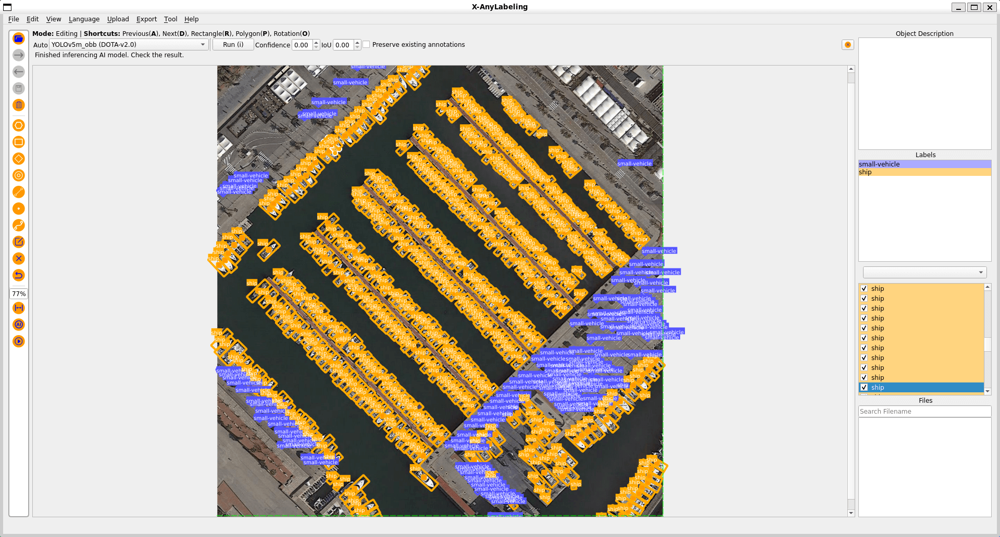

# Oriented Bounding Boxes Object Detection Example

## Introduction

Oriented object detection surpasses standard object detection by adding angular precision to pinpoint objects in images.



## Usage

To annotate rotated objects:

- Import the image file.
- Click the `Rotation` button on the left toolbar, or press `O`, to draw a rotated box.
- Select the corresponding rotated box object and drag the rotation handle above it to adjust the angle directly, or use the following shortcut keys:

| Shortcut Key | Description                |
| ------------ | -------------------------- |
| z            | Rotate counterclockwise by a large angle (default: 1.0°) |
| x            | Rotate counterclockwise by a small angle (default: 0.1°) |
| c            | Rotate clockwise by a small angle (default: 0.1°) |
| v            | Rotate clockwise by a large angle (default: 1.0°) |

To display rotation angles, open `View` in the menu bar and enable `Show Degrees`.

> [!NOTE]
> **Rotation increment customization**
>
> You can customize the rotation increment angles by configuring the `.xanylabelingrc` file in your user directory. Add or modify the following settings under the `canvas` section:
>
> ```yaml
> canvas:
>   rotation:
>     large_increment: 1.0  # degrees, corresponds to Z/V keys
>     small_increment: 0.1  # degrees, corresponds to X/C keys
> ```
>
> The increment values are specified in degrees and can be adjusted to suit your annotation precision requirements.
