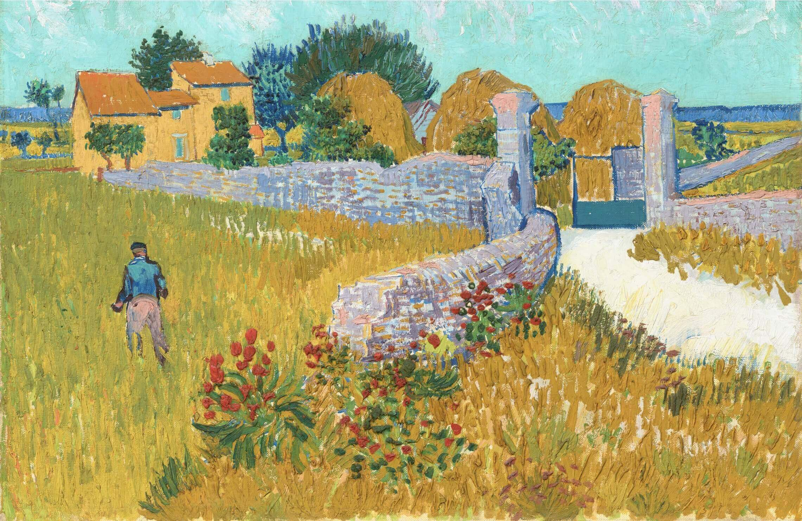
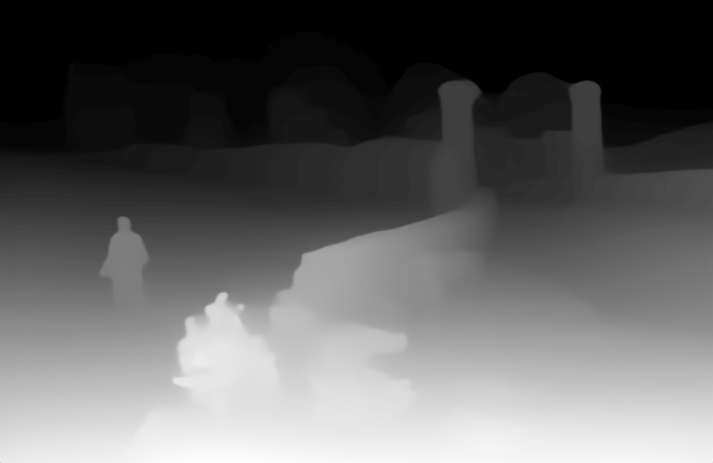
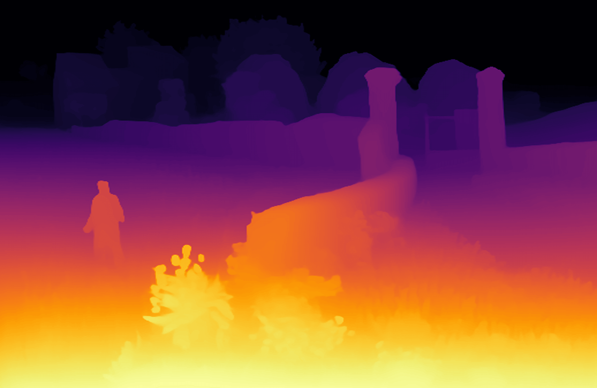

# Depth Estimation Example

**Depth estimation** model are usually used to approximate the relative distance of every pixel in an image from the camera, also known as depth.

## Depth Estimation Model

X-AnyLabeling offers a range of depth models for using, including [Depth Anything V1](../../anylabeling/configs/auto_labeling/depth_anything_vit_b.yaml) and [Depth Anything V2](../../anylabeling/configs/auto_labeling/depth_anything_v2_vit_b.yaml).

- **[Depth Anything V1](https://arxiv.org/abs/2401.10891)** is a highly practical solution for robust monocular depth estimation by training on a combination of 1.5M labeled images and 62M+ unlabeled images.
- **[Depth Anything V2](https://arxiv.org/abs/2406.09414)** significantly outperforms its predecessor, V1, in terms of fine-grained detail and robustness. In comparison to SD-based models, V2 boasts faster inference speed, a reduced number of parameters, and enhanced depth accuracy.

<video src="https://github.com/user-attachments/assets/6542cc1f-8031-4e44-88a9-8c40452d130b" 
       controls 
       width="100%" 
       height="auto" 
       style="max-width: 720px; height: auto; display: block; object-fit: contain;">
</video>

## Usage

1. Import your image (`Ctrl+I`) or video (`Ctrl+O`) file into the X-AnyLabeling.
2. Select and load the Depth-Anything related model, or choose from other available depth estimation models.
3. Initiate the process by clicking `Run (i)`. Once you've verified that everything is set up correctly, use the keyboard shortcut `Ctrl+M` to process all images in one go.

The output, once completed, will be automatically stored in a `x-anylabeling-depth` subdirectory within the same folder as your original image.

<div style="display: flex; width: 100%; margin: 0; padding: 0;">

  <figure style="flex: 1; max-width: 33.3333%; margin: 0; padding: 0; display: flex; flex-direction: column; align-items: center;">
    
    <figcaption style="text-align: center;">Source</figcaption>
  </figure>

  <figure style="flex: 1; max-width: 33.3333%; margin: 0; padding: 0; display: flex; flex-direction: column; align-items: center;">
    
    <figcaption style="text-align: center;">Depth Anything V1 (Gray)</figcaption>
  </figure>

  <figure style="flex: 1; max-width: 33.3333%; margin: 0; padding: 0; display: flex; flex-direction: column; align-items: center;">
    
    <figcaption style="text-align: center;">Depth Anything V2 (Color)</figcaption>
  </figure>

</div>

> [!Tip]
> Two output modes are supported: grayscale and color. You can switch between these modes by modifying the `render_mode` parameter in the respective configuration file.

## Advanced: Depth Calibration

By default, depth estimation models output **relative depth** (normalized 0-1 values) which only indicates which areas are closer or farther. To convert these to **real-world distances**, you can enable depth calibration by adding the following parameters to your configuration file:

```yaml
min_depth: 0.5    # Minimum distance in meters
max_depth: 20.0   # Maximum distance in meters
save_raw_depth: true  # Save calibrated depth as .npy file
```

**Example Configuration:**

```yaml
type: depth_anything_v2
name: depth_anything_v2_vit_b
display_name: Depth-Anything-V2-Base
model_path: depth_anything_v2_vitb.onnx
render_mode: color
min_depth: 1.0
max_depth: 50.0
save_raw_depth: true
```

When enabled, the output will include:
- **Visualization image**: Color or grayscale heatmap (same as before)
- **`*_depth.npy` file**: Calibrated depth map with real-world distances in meters

You can load and query the calibrated depth data using:

```python
import numpy as np
depth_map = np.load("image_depth.npy")
distance = depth_map[y, x]  # Get distance at pixel (x, y) in meters
```

> [!Note]
> The `min_depth` and `max_depth` values should be set according to your actual scene. For indoor scenes, typical values might be 0.5-10m, while outdoor scenes might use 5-100m. Leave these parameters unset to use default visualization-only mode.
