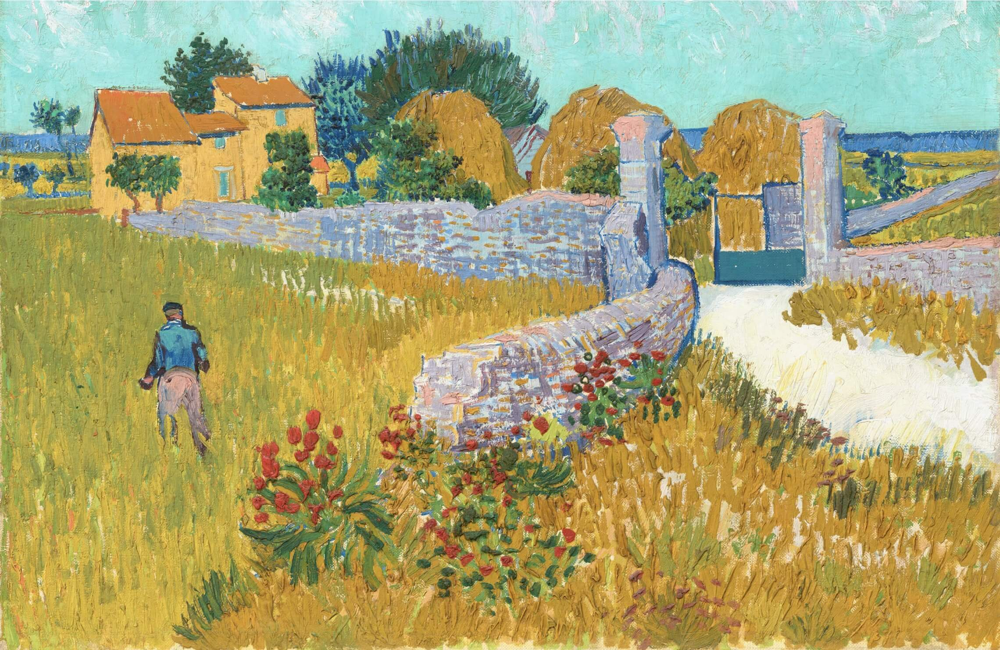
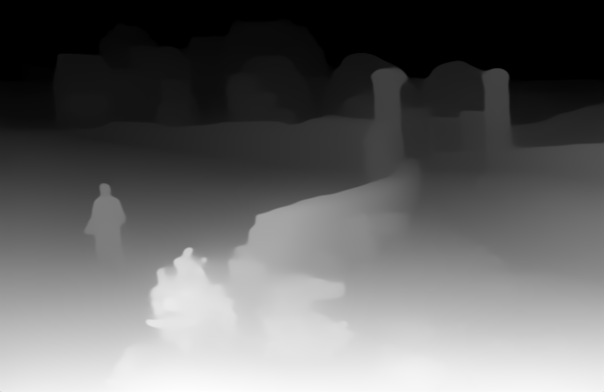
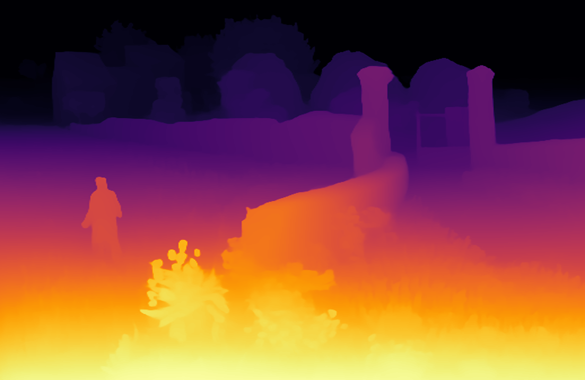

# Depth Estimation Example

Depth-estimation models estimate the relative distance from the camera for every pixel in an image.

## Depth Estimation Model

X-AnyLabeling includes [Depth Anything V1](../../../anylabeling/configs/auto_labeling/depth_anything_vit_b.yaml) and [Depth Anything V2](../../../anylabeling/configs/auto_labeling/depth_anything_v2_vit_b.yaml).

- **[Depth Anything V1](https://arxiv.org/abs/2401.10891)** is a highly practical solution for robust monocular depth estimation by training on a combination of 1.5M labeled images and 62M+ unlabeled images.
- **[Depth Anything V2](https://arxiv.org/abs/2406.09414)** significantly outperforms its predecessor, V1, in terms of fine-grained detail and robustness. In comparison to SD-based models, V2 boasts faster inference speed, a reduced number of parameters, and enhanced depth accuracy.

<video src="https://github.com/user-attachments/assets/6542cc1f-8031-4e44-88a9-8c40452d130b" controls width="100%">
</video>

## Usage

1. Import images (`Ctrl+I`) or a video (`Ctrl+O`) into X-AnyLabeling.
2. Select and load the Depth-Anything related model, or choose from other available depth estimation models.
3. Click `Run (i)` to process the current image. After checking the result, press `Ctrl+B` to run the model on all images.

The output, once completed, will be automatically stored in a `x-anylabeling-depth` subdirectory within the same folder as your original image.

<div style="display: flex; width: 100%; margin: 0; padding: 0;">

  <figure style="flex: 1; max-width: 33.3333%; margin: 0; padding: 0; display: flex; flex-direction: column; align-items: center;">
    
    <figcaption style="text-align: center;">Source</figcaption>
  </figure>

  <figure style="flex: 1; max-width: 33.3333%; margin: 0; padding: 0; display: flex; flex-direction: column; align-items: center;">
    
    <figcaption style="text-align: center;">Depth Anything V1 (Gray)</figcaption>
  </figure>

  <figure style="flex: 1; max-width: 33.3333%; margin: 0; padding: 0; display: flex; flex-direction: column; align-items: center;">
    
    <figcaption style="text-align: center;">Depth Anything V2 (Color)</figcaption>
  </figure>

</div>

> [!TIP]
> Two output modes are supported: grayscale and color. You can switch between these modes by modifying the `render_mode` parameter in the respective configuration file.

## Advanced: Mapping Relative Depth to a Custom Range

By default, these monocular models output relative depth: normalized values that indicate which regions are closer or farther. You can linearly map those values to a custom numeric range by adding the following parameters to the model configuration:

```yaml
min_depth: 0.5       # Lower bound of the mapped range
max_depth: 20.0      # Upper bound of the mapped range
save_raw_depth: true # Save the mapped values as a .npy file
```

**Example Configuration:**

```yaml
type: depth_anything_v2
name: depth_anything_v2_vit_b
display_name: Depth-Anything-V2-Base
model_path: depth_anything_v2_vitb.onnx
render_mode: color
min_depth: 1.0
max_depth: 50.0
save_raw_depth: true
```

When enabled, the output will include:
- **Visualization image**: Color or grayscale heatmap (same as before)
- **`*_depth.npy` file**: Depth values linearly mapped to the configured range

You can load and query the calibrated depth data using:

```python
import numpy as np
depth_map = np.load("image_depth.npy")
value = depth_map[y, x]  # Get the mapped value at pixel (x, y)
```

> [!NOTE]
> This operation is a linear remapping of relative model output; it does not turn a relative-depth model into a metric-depth model. Do not interpret the saved values as measured distances unless you have independently calibrated the model and camera for your scene. Leave `min_depth` and `max_depth` unset to keep the default visualization-only behavior.
