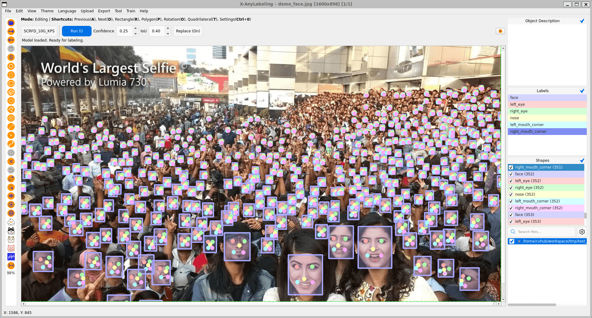

# Face Estimation Example

## Introduction

**Face estimation** covers face detection and facial landmark annotation.
X-AnyLabeling supports models that create a face rectangle and five facial
keypoints with a shared `group_id`, making it easy to keep each face and its
landmarks linked as one object.

## Supported Models

| Model | Provider | Output |
| --- | --- | --- |
| [SCRFD_10G_KPS](../../../anylabeling/configs/auto_labeling/scrfd_10g_bnkps.yaml) | InsightFace | Face rectangle + five landmarks |
| [YOLOv6Lite_l-Face](../../../anylabeling/configs/auto_labeling/yolov6lite_l_face.yaml) | MeiTuan | Face rectangle + five landmarks |
| [YOLOv6Lite_m-Face](../../../anylabeling/configs/auto_labeling/yolov6lite_m_face.yaml) | MeiTuan | Face rectangle + five landmarks |
| [YOLOv6Lite_s-Face](../../../anylabeling/configs/auto_labeling/yolov6lite_s_face.yaml) | MeiTuan | Face rectangle + five landmarks |

## Usage

1. Import your image files.
2. Select and load one of the face estimation models from the auto-labeling
   model list.
3. Click `Run (i)` to infer the current image, or use `Ctrl+M` to process all
   images in the current task.
4. Review the generated face rectangles and landmark points. Each detected face
   uses the same `group_id` for its rectangle and five points.

The generated landmarks are:

- `left_eye`
- `right_eye`
- `nose` or `nost_tip`, depending on the selected model
- `left_mouth_corner`
- `right_mouth_corner`

> [!TIP]
> Use the group ID filter to inspect one face at a time. Select a rectangle and
> its keypoints together if you need to move, hide, or edit a face as a group.

## Export

Face estimation annotations use standard X-AnyLabeling shapes: a `rectangle`
for each face and `point` shapes for facial landmarks. Export them with the
format that matches your downstream training or conversion workflow.
