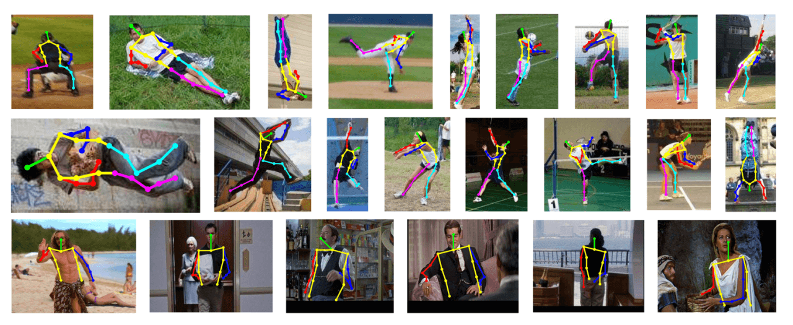
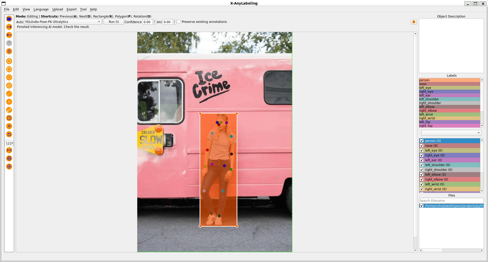

# Pose Estimation Example

## Introduction

**Pose estimation** is a task that involves identifying the location of specific points in an image, usually referred to as keypoints. The keypoints can represent various parts of the object such as joints, landmarks, or other distinctive features. 

## Usage

This guide will walk you through the process of performing [YOLO-Pose](https://docs.ultralytics.com/tasks/pose/) calibration tasks on X-AnyLabeling:

- Start by adding the image files.
- Then, tap the `rectangle` button on the left menu or press the `R` key to quickly create a rectangle shape and type in the matching `label` and `group_id` in the dialog.
- Next: Click the `Point` button on the left menu bar to draw keypoints on the object. Assign the same `group_id` to the keypoints as the corresponding rectangle to link them together. Keep in mind:
   - If a keypoint is not visible, you may omit it.
   - If a keypoint is obscured, check the `useDifficult` field.

For each object, all associated keypoints and the corresponding rectangle should have the same `group_id`, which must be unique within the current image.

> [!TIP]
> - Press `S` to show or `W` to hide the selected shape.
> - Use the group ID filter to easily check labeled shapes. For more details, see [Section 3.3](../../../docs/en/user_guide.md).
> - Select multiple shapes and press `G` to automatically assign sequential group IDs; press `U` to remove group IDs from all selected shapes.

## Export

To export your pose estimation annotations, proceed with the following steps:
1. Click on the `Export` button located in the menu bar at the top.
2. Select the `Export YOLO-Pose Annotations` option.
3. Upload your custom label file, e.g., [pose_classes.yaml](./pose_classes.yaml), to ensure the correct mapping of object classes.

These steps will facilitate the proper export of your pose estimation annotations for further use or analysis.

> [!TIP]
> For faster annotation, you can enable `auto_use_last_gid` (Ctrl+Shift+G) to automatically use the last group ID when creating new shapes.

To understand the dataset format for YOLO-Pose, refer to the [official documentation](https://docs.ultralytics.com/datasets/pose/#ultralytics-yolo-format) and consult the sample output file [here](./labels/human-pose.txt).
