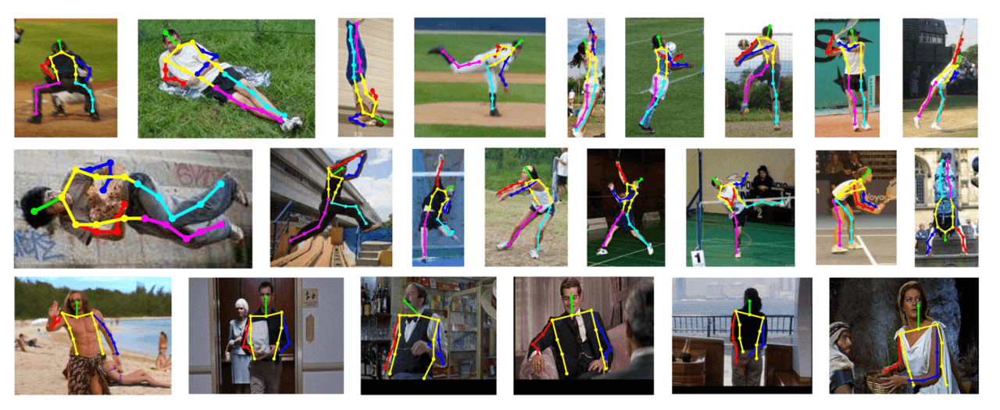
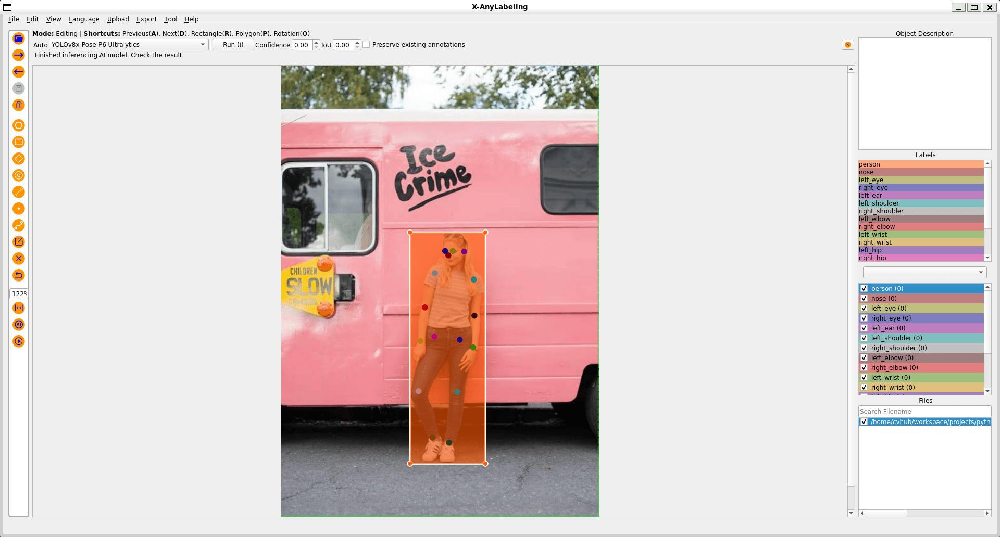

# Pose Estimation Example

## Introduction

**Pose estimation** identifies keypoints such as joints, landmarks, or other distinctive object features.

## Usage

To create annotations for a [YOLO pose dataset](https://docs.ultralytics.com/tasks/pose/):

- Start by adding the image files.
- Click the `Rectangle` button on the left toolbar, or press `R`, to draw a bounding box and assign its `label` and `group_id`.
- Next: Click the `Point` button on the left menu bar to draw keypoints on the object. Assign the same `group_id` to the keypoints as the corresponding rectangle to link them together. Keep in mind:
   - If a keypoint is not visible, you may omit it.
   - If a keypoint is obscured, check the `useDifficult` field.

For each object, all associated keypoints and the corresponding rectangle should have the same `group_id`, which must be unique within the current image.

> [!TIP]
> - Press `S` to hide selected shapes and `W` to show hidden shapes.
> - Use the group ID filter to inspect related shapes. For details, see [Shape Display](../../../docs/en/user_guide.md#33-shape-display).
> - Select multiple shapes and press `G` to automatically assign sequential group IDs; press `U` to remove group IDs from all selected shapes.

## Export

To export your pose estimation annotations, proceed with the following steps:
1. Click on the `Export` button located in the menu bar at the top.
2. Select the `Export YOLO-Pose Annotations` option.
3. Upload your custom label file, e.g., [pose_classes.yaml](./pose_classes.yaml), to ensure the correct mapping of object classes.

These steps will facilitate the proper export of your pose estimation annotations for further use or analysis.

> [!TIP]
> For faster annotation, press `Ctrl+Shift+G` to enable automatic reuse of the most recent group ID when creating shapes.

To understand the dataset format for YOLO-Pose, refer to the [official documentation](https://docs.ultralytics.com/datasets/pose/#ultralytics-yolo-format) and consult the sample output file [here](./labels/human-pose.txt).
