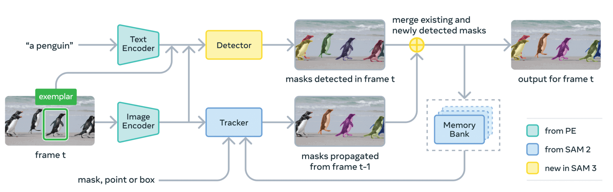

# SAM 3: Segment Anything with Concepts

## Overview

[SAM 3](https://ai.meta.com/research/publications/sam-3-segment-anything-with-concepts/) is a unified foundation model for promptable segmentation in images and videos. It can detect, segment, and track objects using text or visual prompts such as points, boxes, and masks. Compared to its predecessor SAM 2, SAM 3 introduces the ability to exhaustively segment all instances of an open-vocabulary concept specified by a short text phrase or exemplars.



X-AnyLabeling supports SAM 3 in two deployment modes:

| Mode | Backend | Visual Prompting | Speed |
| --- | --- | --- | --- |
| [Server-side](#server-side) | X-AnyLabeling-Server (PyTorch) | Supported | Fast |
| [Client-side](#client-side) | Local ONNX | Not supported | Slow |

## Server-side

### Installation

Please refer to [X-AnyLabeling-Server](https://github.com/CVHub520/X-AnyLabeling-Server) for download, installation, and server setup instructions.

### Usage

Launch the X-AnyLabeling client, press `Ctrl+A` or click the `AI` button in the left menu bar to open the auto-labeling panel. In the model dropdown list, select `Remote-Server`, then choose `Segment Anything 3`.

#### Text Prompting

<video src="https://github.com/user-attachments/assets/d442d08b-fff7-4673-9a61-1b4ea6862f7d" width="100%" controls>
</video>

1. Enter object names in the text field (e.g., `person`, `car`, `bicycle`)
2. Separate multiple classes with periods or commas: `person.car.bicycle` or `dog,cat,tree`
3. Click **Send** to initiate detection

#### Visual Prompting

<video src="https://github.com/user-attachments/assets/5a953314-2611-42fc-81b7-90fbe3b018ee" width="100%" controls>
</video>

1. Click **+Rect** or **-Rect** to activate drawing mode
2. Draw bounding boxes around target objects or regions of interest (use **+Rect** for positive prompts, **-Rect** for negative prompts)
3. Add multiple prompts for different object instances
4. Click **Run Rect** to process visual cues
5. Click **Finish** (or press `f`) to complete the object, enter the label category and confirm, or use **Clear** to remove all visual prompts

## Client-side

The client-side path runs the full SAM 3 pipeline locally using ONNX Runtime — no server required. All three ONNX models (image encoder, language encoder, decoder) are loaded directly inside X-AnyLabeling.

> [!WARNING]
> **Known limitations of the client-side mode:**
> - **Slow inference:** The full ViT-H image encoder runs on CPU/GPU via ONNX. Encoding a single image typically takes several seconds, which is noticeably slower than the server-side PyTorch path.
> - **Text prompts only:** Visual prompting (points, boxes) is not supported in this mode. Only text-based grounding is available.

### Installation

See the installation guide ([English](../../../docs/en/get_started.md) | [Chinese](../../../docs/zh_cn/get_started.md)) for environment setup details.

When you select the model for the first time, X-AnyLabeling will automatically download the six required files (three `.onnx` files plus their `.onnx.data` sidecars) to your local cache.

If your network connection is unstable, you can download them manually from the [Model Zoo](../../../docs/en/model_zoo.md) and place them in a local directory, then update the path fields in the config file as described in [Model Configuration](#model-configuration) below.

> [!NOTE]
> If you prefer to export the ONNX files yourself from the original PyTorch weights, see [`tools/onnx_exporter/export_sam3_onnx.py`](../../../tools/onnx_exporter/export_sam3_onnx.py) for the full setup instructions.

### Model Configuration

The default config is at [`anylabeling/configs/auto_labeling/sam3_vit_h.yaml`](../../../anylabeling/configs/auto_labeling/sam3_vit_h.yaml). If you place the model files in a custom directory, update the six path fields accordingly:

```yaml
encoder_model_path:        /path/to/sam3_image_encoder.onnx
encoder_model_data_path:   /path/to/sam3_image_encoder.onnx.data
language_encoder_path:     /path/to/sam3_language_encoder.onnx
language_encoder_data_path: /path/to/sam3_language_encoder.onnx.data
decoder_model_path:        /path/to/sam3_decoder.onnx
decoder_model_data_path:   /path/to/sam3_decoder.onnx.data
```

You can also tune the following inference parameters:

| Parameter | Default | Description |
| --- | --- | --- |
| `conf_threshold` | `0.5` | Minimum score to keep a predicted mask |
| `epsilon` | `0.001` | Polygon approximation precision (smaller = finer contours) |

### Usage

Launch X-AnyLabeling, press `Ctrl+A` or click the `AI` button in the left menu bar to open the auto-labeling panel. In the model dropdown list, select `Segment Anything 3 (ViT-H)`.

#### Text Prompting

1. Enter one or more object names in the text field (e.g., `person`, `truck`)
2. Separate multiple classes with commas or periods: `person,truck` or `person.truck`
3. Select the desired output mode: **Polygon**, **Rectangle**, or **Rotation**
4. Adjust **Confidence** and **Mask Fineness** as needed
5. Click **Send** to run inference

> [!NOTE]
> The image embedding is cached after the first run on each image, so repeated queries on the same image skip the encoder and only re-run the language encoder and decoder.

#### Batch Processing

Press `Ctrl+M` to apply the current text prompt across all images in the folder.

> [!TIP]
> Toggle **Replace (On/Off)** to control whether results overwrite existing annotations or are appended alongside them.
