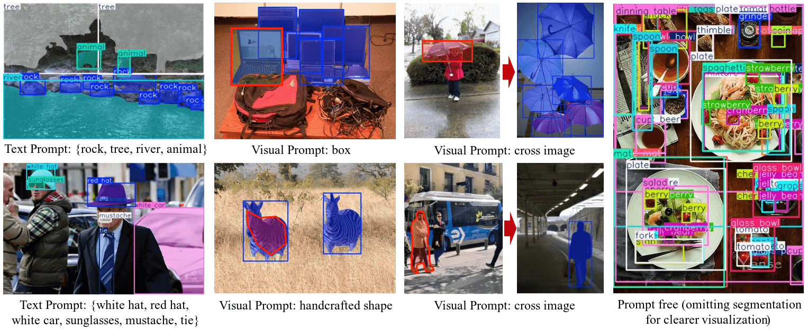

# YOLOE: Universal Object Detection in X-AnyLabeling

## Overview

YOLOE (You Only Look Once, Extended) brings state-of-the-art "anything" detection capabilities to X-AnyLabeling. Based on the research paper [YOLOE](https://arxiv.org/abs/2503.07465), this model enables real-time detection and segmentation of any object you can describe or indicate visually, eliminating traditional category constraints.



## Installation

### Prerequisites

Create a dedicated conda environment for YOLOE:

```bash
conda create -n yoloe python=3.10 -y
conda activate yoloe
```

### YOLOE Setup

Clone and install the YOLOE repository:

```bash
git clone https://github.com/THU-MIG/yoloe.git
cd yoloe
pip install -r requirements.txt
```

> **Note:** For complete YOLOE documentation, visit the [official repository](https://github.com/THU-MIG/yoloe/tree/main).

### X-AnyLabeling Integration

Install X-AnyLabeling in the same environment:

```bash
cd ..
git clone https://github.com/CVHub520/X-AnyLabeling.git
cd X-AnyLabeling
pip install -r requirements.txt
```

> **Note:** See our installation guide ([English](../../../docs/en/get_started.md) | [Chinese](../../../docs/zh_cn/get_started.md)) for detailed instructions.

Launch the application:

```bash
python anylabeling/app.py
```

## Detection Modes

https://github.com/user-attachments/assets/52cbdb5d-cc60-4be5-826f-903ea4330ca8

YOLOE supports three distinct detection modes, each optimized for different use cases:

### Text Prompting

Specify target objects using natural language descriptions.

**Usage:**
1. Enter object names in the text field (e.g., `person`, `car`, `bicycle`)
2. Separate multiple classes with periods or commas: `person.car.bicycle` or `dog,cat,tree`
3. Click **Send** to initiate detection

This mode leverages YOLOE's text understanding capabilities to identify objects based on semantic descriptions.

### Visual Prompting

Guide detection by marking examples directly on the image.

**Usage:**
1. Click **+Rect** to activate drawing mode
2. Draw bounding boxes around target objects or regions of interest
3. Add multiple prompts for different object instances
4. Click **Send** to process visual cues or use **Clear** to remove all visual prompts

Visual prompts help YOLOE understand object characteristics through spatial context and appearance.

### Prompt-Free Detection

Detect objects from a predefined class vocabulary without explicit prompting.

**Activation:** Click **Send** with no text input and no visual prompts.

**Class Configuration:** Customize the detection vocabulary in your YOLOE configuration file (e.g., `yoloe_v8l.yaml`):

**Option 1: List Format**
```yaml
type: yoloe
...
classes:
  - person
  - vehicle
  - animal
  - furniture
```

**Option 2: Dictionary Format**
```yaml
type: yoloe
...
classes:
  0: person
  1: vehicle
  2: animal
  3: furniture
```

**Option 3: External File**
```yaml
type: yoloe
...
classes: /path/to/classes.txt
```

Where `classes.txt` contains one class per line:
```text
person
vehicle
animal
furniture
```

**Default Behavior:** When no `classes` field is specified, X-AnyLabeling uses a comprehensive vocabulary from [here](../../../anylabeling/services/auto_labeling/configs/ram/ram_tag_list.txt).

## Batch Processing

Process multiple images efficiently using consistent detection parameters.

**Activation:** Press `Ctrl+M` (Windows/Linux) or `Cmd+M` (macOS)

**Supported Modes:**
- **Text Prompting:** Enter text prompts before starting batch processing to apply them across all images
- **Prompt-Free:** Leave text field empty to use configured class vocabulary for all images

> **Note:** Visual prompting is not available in batch mode due to its interactive nature.
