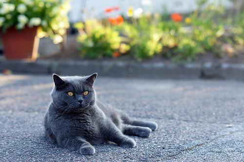
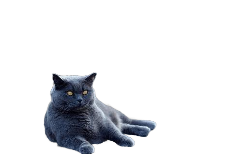

# Image Matting Example

## Introduction

| Image | Result |
|:---:|:---:|
|  |  |

**Image Matting** is the process of accurately estimating the foreground object in images and videos. It is a very important technique in image and video editing applications, particularly in film production for creating visual effects.

## Available Models

- **RMBG v1.4**: Faster processing with good quality results
- **RMBG v2.0**: Higher quality results with increased processing time
- **RMBG v2.0 Quantized**: Optimized version of v2.0 with better CPU performance

## Usage

1. Import your image (`Ctrl+I`) or video (`Ctrl+O`) file into the X-AnyLabeling.
2. Select and load the desired model version (`RMBG v1.4`, `RMBG v2.0`, or `RMBG v2.0 Quantized`).
3. Initiate the process by clicking `Run (i)`. Once you've verified that everything is set up correctly, use the keyboard shortcut `Ctrl+M` to process all images in one go.

The output, once completed, will be automatically stored in a `x-anylabeling-matting` subdirectory within the same folder as your original image.

## Performance Benchmark

Performance test processing 10 images with different model configurations:

| Model Version | Device | Processing Time (seconds) |
|---------------|--------|---------------------------|
| RMBG v1.4     | GPU    | **2**                     |
| RMBG v1.4     | CPU    | 9                         |
| RMBG v2.0     | GPU    | 13                        |
| RMBG v2.0     | CPU    | 122                       |
| RMBG v2.0 Quantized | GPU | 55                     |
| RMBG v2.0 Quantized | CPU | 105                    |

### Test Environment

- **CPU**: 13th Gen Intel(R) Core(TM) i5-13600K
- **GPU**: NVIDIA GeForce RTX 3060 (12GB VRAM)

> [!NOTE]
> RMBG v2.0 models are significantly slower on CPU. For optimal performance, GPU acceleration is highly recommended.
