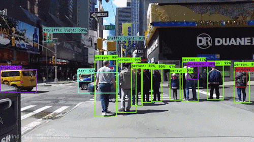

# Multi-Object Tracking Example

## Introduction

Multi-Object Tracking (MOT) technology is used to simultaneously identify and track multiple targets within video sequences, involving the association of targets across different frames.

## Usage

X-AnyLabeling is equipped with various detection and tracking algorithms, including `ByteTrack` and `OCSort`.

<video src="https://github.com/user-attachments/assets/836b4edb-ddee-4bdf-a061-dd0bc20edb1a" 
       controls 
       width="100%" 
       height="auto" 
       style="max-width: 720px; height: auto; display: block; object-fit: contain;">
</video>

Here's how to perform multi-object tracking using the tool:
1. Load the video file, e.g., [Bangkok.mp4](https://github.com/user-attachments/assets/b94db3da-c7fa-469c-a153-a7c98bb56e14). (Note: The file path must not contain Chinese characters!)
2. Load the tracking model, such as [yolov5m_bytetrack](../../anylabeling/configs/auto_labeling/yolov5m_bytetrack.yaml), [yolov8m_ocsort](../../anylabeling/configs/auto_labeling/yolov8m_ocsort.yaml), or a custom model.
3. Click to run, and after verifying that everything is correct, you can use the shortcut `Ctrl+M` to run all frames at once.

In this process, the `group_id` field represents the `track_id` of the current target box.

## Export

For instructions on exporting MOT annotations, please consult the user guide available:
- [English version](../../docs/en/user_guide.md)
- [Chinese version](../../docs/zh_cn/user_guide.md)
