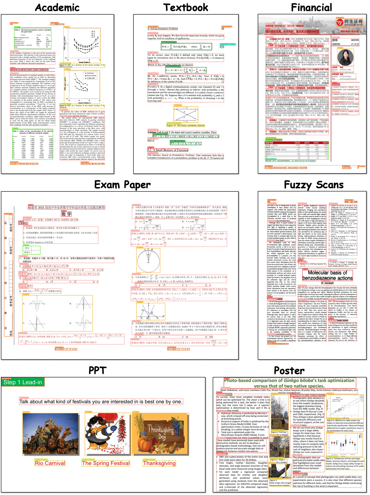

# Document Layout Analysis Example

## Introduction

**Document Layout Analysis** is used to identify and extract the layout structure of documents, including text blocks, images, tables, and other elements.

## Usage

1. Import your image (`Ctrl+I`) or video (`Ctrl+O`) file into the X-AnyLabeling.
2. Select and load the [DocLayout-YOLO](https://github.com/opendatalab/DocLayout-YOLO) model.
3. Initiate the process by clicking `Run (i)`. Once you've verified that everything is set up correctly, use the keyboard shortcut `Ctrl+M` to process all images in one go.
