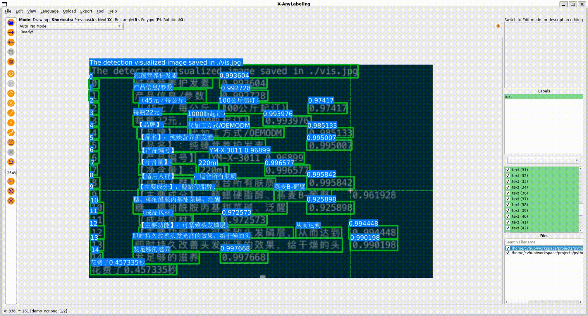

# Text Recognition Example

## Introduction

- **Text Detection**: Find the areas with text in the input image.
- **Text Recognition**: Understand the words in the image, usually from the images of text areas cut out from the text boxes detected.

## Usage

 

Currently, X-AnyLabeling supports both manual and automatic annotation of the PP-OCR dataset.

1. Manual Annotation Modes

The following modes are avaliable:
- **rectangle**: For drawing rectangle shape around text regions.
- **rotation**: For annotating text regions with a rotation shape.
- **polygon**: For "four-point" or "irregular polygon" annotation of text regions.

2. Automatic Annotation Mode

For automatic annotation, the tool is integrated with models from [PaddleOCR](https://github.com/PaddlePaddle/PaddleOCR). Users can select the appropriate model based on their needs or deploy custom models for assisted inference. 

Here's how to proceed with automatic annotation:
- Load the image or video file.
- Load the relevant PPOCR model.
- Click to run the annotation process.

> [!TIP]
> Starting from v3.2.3+, we support partial re-recognition functionality. When detection results are inaccurate, you can manually draw text boxes and use only the recognition part of the OCR pipeline. Simply draw your text regions first (currently only rectangle, rotation and polygon shapes are supported), select the shapes you want to re-recognize, then ensure the "Skip Det (On)" button is activated before running inference, otherwise, it will override your existing shapes.

When annotating PPOCR data, the `label` field values can be ignored; instead, you should focus on the `description` field. 
- To hide the text labels, you can use the shortcut `Ctrl+L`. 
- To modify the `description` field, you can use `Ctrl+E` to open the label manager and make corrections in the section of the pop-up dialog.

> [!TIP]
> Starting from X-AnyLabeling v3.2.4+, you can use **Loop Select Shapes** (Ctrl+Shift+C) to sequentially select each text region on the canvas for efficient text recognition annotation. This allows you to quickly cycle through all detected text boxes and edit their recognition results without manually clicking each one. You can also directly click the `Select/Unselect` button in the middle right layout of the screen to select/deselect all shapes.

## Export

For instructions on exporting PP-OCR Rec annotations, please consult the user guide available:
- [English version](../../../docs/en/user_guide.md)
- [Chinese version](../../../docs/zh_cn/user_guide.md)

The exported annotations can be directly used for the training of PP-OCR detection and recognition models.
