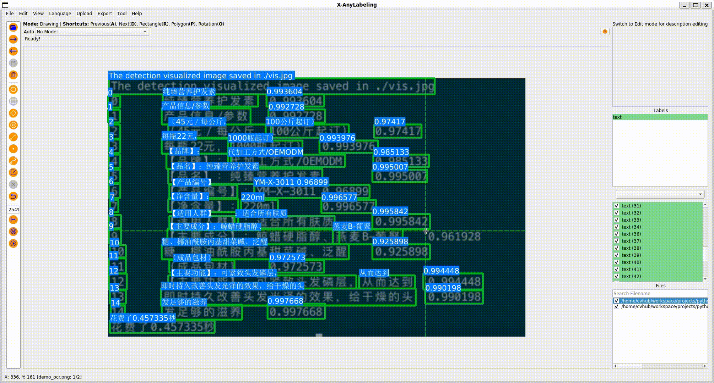

# Text Recognition Example

## Introduction

- **Text Detection**: Find the areas with text in the input image.
- **Text Recognition**: Understand the words in the image, usually from the images of text areas cut out from the text boxes detected.

## Usage

Currently, X-AnyLabeling supports both manual and automatic annotation of the PP-OCR dataset.

1. Manual Annotation Modes

The following modes are available:
- **rectangle**: For drawing rectangle shape around text regions.
- **rotation**: For annotating text regions with a rotation shape.
- **quadrilateral**: For four-point (quad) annotation of text regions.

2. Automatic Annotation Mode

For automatic annotation, the tool is integrated with models from [PaddleOCR](https://github.com/PaddlePaddle/PaddleOCR). Users can select the appropriate model based on their needs or deploy custom models for assisted inference.

Here's how to proceed with automatic annotation:
- Load the image or video file.
- Load the relevant PPOCR model.
- Click to run the annotation process.

> [!TIP]
> Partial re-recognition uses existing rectangles, rotations, or quadrilaterals as text regions. Select the shapes, enable `Skip Det (On)`, and run inference. If detection is not skipped, the new detection results may replace the existing shapes.

> [!NOTE]
> In batch mode, `Skip Det (On)` loads existing JSON annotations as text regions, so recognition can be rerun without selecting shapes in every image.

When annotating PPOCR data, the `label` field values can be ignored; instead, you should focus on the `description` field.
- To hide the text labels, you can use the shortcut `Ctrl+L`.
- To modify the `description` field, you can use `Ctrl+E` to open the label manager and make corrections in the section of the pop-up dialog.

> [!TIP]
> Press `Ctrl+Shift+C` to select text regions sequentially. You can also use `Select/Unselect` in the right panel to select or clear all shapes.

## Export

For instructions on exporting PP-OCR Rec annotations, please consult the user guide available:
- [English version](../../../docs/en/user_guide.md)
- [Chinese version](../../../docs/zh_cn/user_guide.md)

The exported annotations can be directly used for the training of PP-OCR detection and recognition models.
