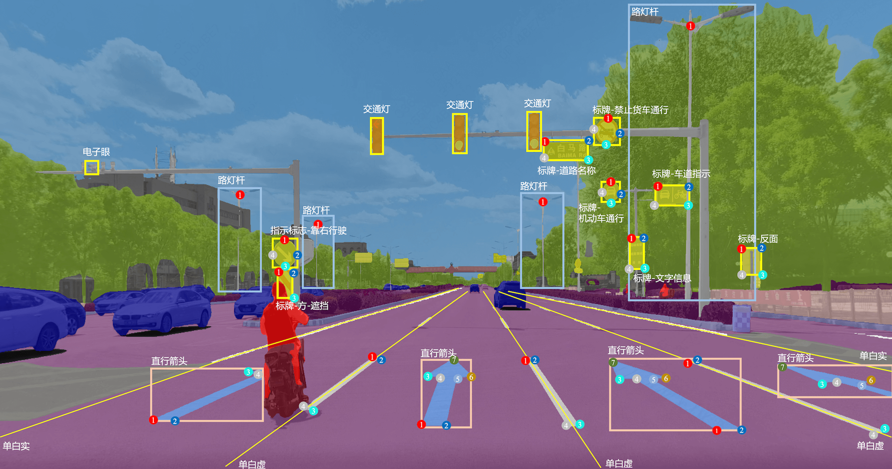
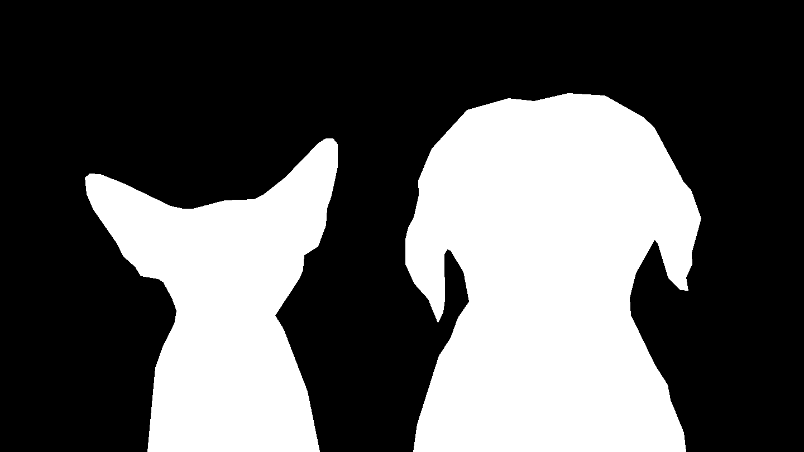
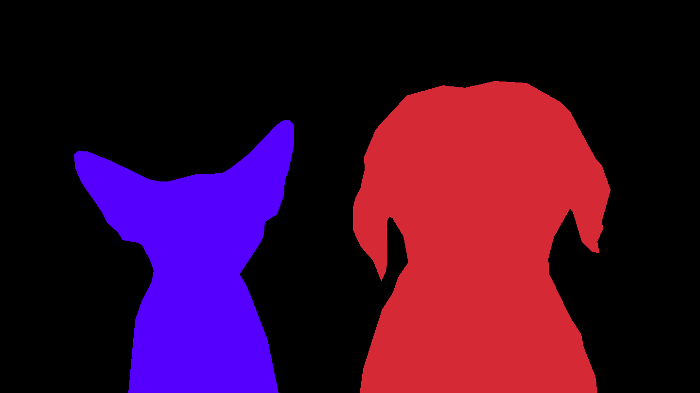

# Image Segmentation Example

## Introduction

**Image segmentation** is a computer vision technique that assigns a label to every pixel in an image such that pixels with the same label share certain characteristics, which can divide into these:
- Semantic segmentation: Labels pixels by category without distinguishing individual objects.
- Instance segmentation: Labels each object instance separately, even if they belong to the same category.

## Usage

### Manual-Labeling Guidelines

Here's how to mark polygon objects:

- First, add the picture files.
- Next, click the `polygon` button on the side menu or press the `P` key to make a polygon shape fast.
- Last, type in the matching name in the label dialog.

To modify the polygon shape, use the shortcut `Ctrl+J` to go to edit mode fast. Move the mouse pointer to the point you want to edit and hold it to drag. You can also do these things:

- Add a point: Click on any side of the shape and drag at the spot where you want a new point.
- Remove a point: Hold the Shift key and click on the point you want to go away.
- Move the shape: Put the mouse pointer inside the shape and hold to drag it around.

### Auto-Labeling Guidelines

Here's a guide on how to utilize the Segment Anything series models for efficient labeling.

- Click the `AI` icon on the left side of the menu bar, or use the shortcut `Ctrl+A` to turn on the AI module for labeling.
- From the dropdown menu labeled `Model`, select a model from the `Segment Anything Models` series; `SAM2 Large` is recommended for optimal performance!

> [!NOTE]
> As the model size progresses from `tiny` to `huge`, there is a continuous improvement in accuracy, though this is accompanied by a gradual decline in processing speed. Also, `Quant` means the model has been quantized.

Furthermore, we can also use prompting to specify further and control the region we want segmented:

- `Point (q)`: Add a positive point;
- `Point (e)`: Add a negative point;
- `+Rect`: Draw a rectangle around the object;
- `Clear (b)`: Erase all auto-segment marks.

For instance, if we want to segment only the region with plant branches and leaves and exclude the pot which holds the plant, we can simply pass points on the plant region as positive points and the points on the potted region as negative points. This indicates to the model to predict a segmentation mask for the region, which includes the positive points and excludes the negative points.

After completing your markings, press the shortcut `f`, enter the desired label name, and then save the object.

## Export

### Semantic Segmentation

| Image | Mask |
|:---:|:---:|
|  |  |

**Binary semantic segmentation** categorizes each pixel in an image as either **foreground** or **background**. For instance, in the Cat & Dog segmentation task, you can isolate objects by following the calibration process.

Post-completion, use the `Export` button to save your work by selecting `Export Mask Annotations`, choosing the [mask_grayscale_map.json](./binary_semantic_segmentation/mask_grayscale_map.json), and setting the save path. Ensure the category names in the mapping file correspond to your annotated object classes.

| Image | Mask |
|:---:|:---:|
|  |  |

**Multi-Class semantic segmentation** extends the concept by assigning each pixel to one of several predefined classes, distinguishing between various objects like people, cars, animals, etc. As with binary segmentation, follow the calibration process, then export using the same `Export Mask Annotations` option, but adjust the category names in the [mask_color_map.json](./multiclass_semantic_segmentation/mask_color_map.json) to reflect the multiple classes you've annotated.

For both methods, refer to the provided [binary mask](./binary_semantic_segmentation/masks/cat_dog.png) and [multi-class mask](./multiclass_semantic_segmentation/masks/cat_dog.png) for output examples.

## Instance Segmentation

To export your instance segmentation annotations, proceed with the following steps:
1. Click on the `Export` button located in the menu bar at the top.
2. Select the `Export YOLO-Seg Annotations` option.
3. Upload your custom label file, e.g., [classes.txt](./instance_segmentation/classes.txt), to ensure the correct mapping of object classes.

These steps will facilitate the proper export of your instance segmentation annotations for further use or analysis.

For detailed output examples, refer to [this file](./instance_segmentation/labels/cat_dog.txt).
