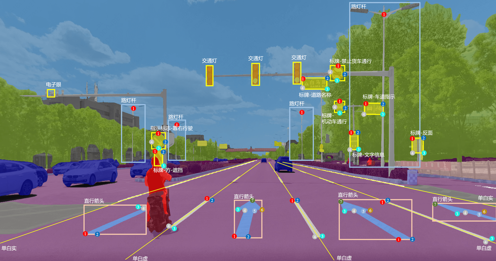
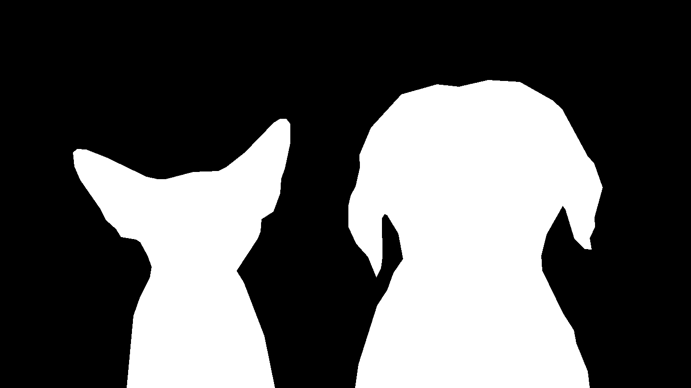
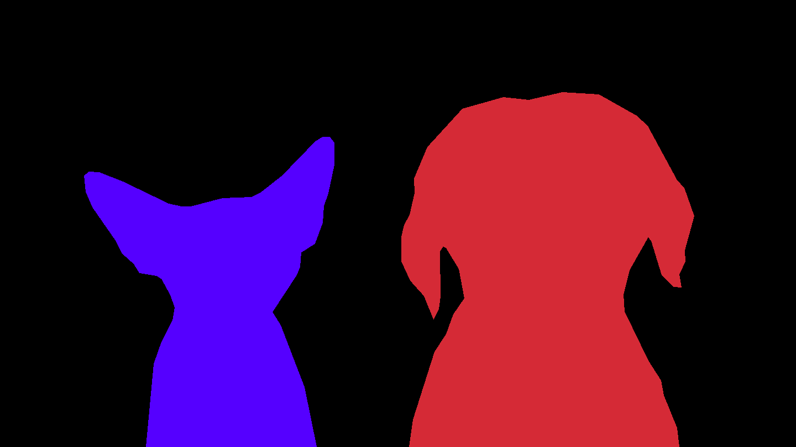

# Image Segmentation Example

## Introduction

**Image segmentation** assigns a class or instance label to pixels. Common tasks include:
- Semantic segmentation: Labels pixels by category without distinguishing individual objects.
- Instance segmentation: Labels each object instance separately, even if they belong to the same category.

## Usage

### Manual-Labeling Guidelines

To annotate polygons manually:

- Add the image files.
- Click the `Polygon` button on the left toolbar, or press `P`, to draw a polygon.
- Enter the class name in the label dialog.

Press `Ctrl+J` to enter edit mode. Drag vertices or shapes as needed:

- Add a point: Click on any side of the shape and drag at the spot where you want a new point.
- Remove a point: Hold `Shift` and click the vertex.
- Move the shape: Put the mouse pointer inside the shape and hold to drag it around.

### Auto-Labeling Guidelines

To use a Segment Anything model:

- Click the `AI` icon on the left side of the menu bar, or use the shortcut `Ctrl+A` to turn on the AI module for labeling.
- Select a model from the `Segment Anything Models` group in the `Model` dropdown.

> [!NOTE]
> As the model size progresses from `tiny` to `huge`, there is a continuous improvement in accuracy, though this is accompanied by a gradual decline in processing speed. Also, `Quant` means the model has been quantized.

Use prompts to control the target region:

- `Point (Q)`: Add a positive point;
- `Point (E)`: Add a negative point;
- `+Rect`: Draw a rectangle around the object;
- `Clear (b)`: Erase all auto-segment marks;
- `AMD`: Enable automatic mask decoding for real-time segmentation.

For example, to segment a plant while excluding its pot, place positive points on the plant and negative points on the pot. Press `F` when the mask is ready, enter a label, and save the object.

> [!TIP]
> You can adjust the mask fineness by dragging the slider to control the precision of segmentation boundaries. The default value is 0.001 - lower values produce more detailed and precise masks with finer boundaries, while higher values create coarser masks with simplified contours.

**Auto Mask Decode (AMD)** continuously adds prompt points as the pointer moves and updates the mask in real time. Enable `AMD`, place the first point, and move the pointer along the target. Double-click the canvas, or press `F`, to finish. Click `Clear`, or press `B`, to exit without saving.

<video src="https://github.com/user-attachments/assets/0384b172-ad26-4ff5-8648-6020ada3a86a" width="100%" controls>
</video>

The AMD feature includes several configurable parameters that can be adjusted in [canvas.py](../../anylabeling/views/labeling/widgets/canvas.py) for optimal performance:

| Parameter | Default Value | Description |
|-----------|---------------|-------------|
| `AUTO_DECODE_DELAY_MS` | 100 | Delay in milliseconds before triggering auto-decode after mouse movement |
| `MAX_AUTO_DECODE_MARKS` | 42 | Maximum number of tracking points to maintain performance |
| `AUTO_DECODE_MOVE_THRESHOLD` | 5.0 | Minimum pixel distance for mouse movement to trigger new point |

> [!TIP]
> AMD mode works best when you move the mouse slowly along object boundaries to get precise segmentation results. The feature is particularly useful for refining complex boundaries with continuous feedback.

For small objects in high-resolution images, enable `TinyObj`. The model crops around a rectangle prompt with padding (20% by default), processes the crop, and maps the result back to the original image.

> [!TIP]
> You can adjust the `padding_ratio` parameter in the model configuration file (e.g., `sam2_hiera_base.yaml`) to control the padding size around the rectangle prompt. The default value is 0.2 (20%) - increase it for more context or decrease it for tighter cropping.

<video src="https://github.com/user-attachments/assets/1d4b1071-29ed-4e4f-843d-1c77772c05c4" width="100%" controls>
</video>

## Export

### Semantic Segmentation

| Image | Mask |
|:---:|:---:|
|  |  |

**Binary semantic segmentation** categorizes each pixel as foreground or background.

Select `Export` > `Export Mask Annotations`, choose [mask_grayscale_map.json](./binary_semantic_segmentation/mask_grayscale_map.json), and set the output path. The category names in the mapping file must match the annotation labels.

| Image | Mask |
|:---:|:---:|
|  |  |

**Multi-class semantic segmentation** assigns each pixel to one of several predefined classes. Export it with `Export Mask Annotations` and update [mask_color_map.json](./multiclass_semantic_segmentation/mask_color_map.json) so its category names match your labels.

For both methods, refer to the provided [binary mask](./binary_semantic_segmentation/masks/cat_dog.png) and [multi-class mask](./multiclass_semantic_segmentation/masks/cat_dog.png) for output examples.

## Instance Segmentation

[YOLOv8-SAM2.1](../../anylabeling/configs/auto_labeling/yolov8s_sam2_hiera_base.yaml) is one available combined model: YOLOv8 proposes objects and SAM2.1 generates their masks.

To export your instance segmentation annotations, proceed with the following steps:
1. Click on the `Export` button located in the menu bar at the top.
2. Select the `Export YOLO-Seg Annotations` option.
3. Upload your custom label file, e.g., [classes.txt](./instance_segmentation/classes.txt), to ensure the correct mapping of object classes.

These steps will facilitate the proper export of your instance segmentation annotations for further use or analysis.

For detailed output examples, refer to [this file](./instance_segmentation/labels/cat_dog.txt).
