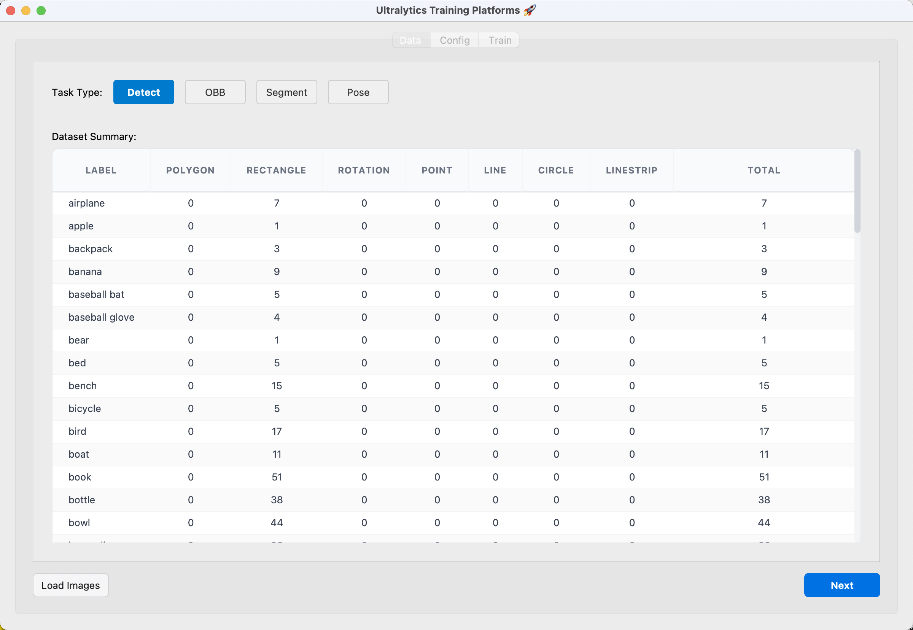
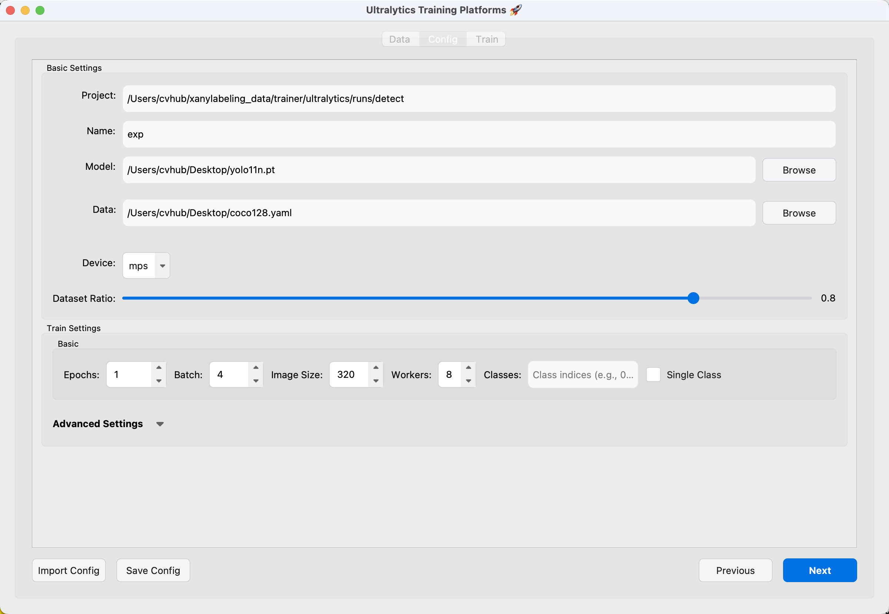
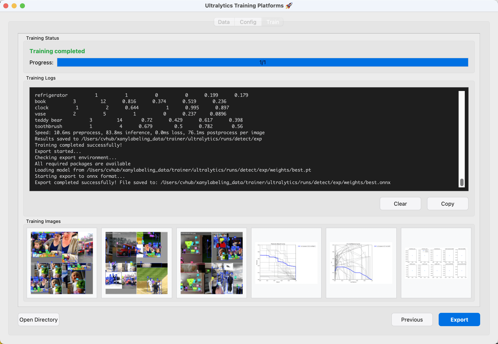

# Ultralytics Training with X-AnyLabeling 🚀

This guide walks you through training Ultralytics models directly within the X-AnyLabeling GUI. You can prepare your dataset, configure training parameters, launch a training job, and monitor its progress—all from one convenient interface.

<video src="https://github.com/user-attachments/assets/c0ab2056-2743-4a2c-ba93-13f478d3481e" width="100%" controls>
</video>

## Prerequisites¶

- OS: Windows/Linux/macOS
- Python: 3.9 -- 3.12


## Installation

1. **Create and activate a virtual environment**

Using `conda` is recommended to manage your dependencies.

```bash
conda create -n x-anylabeling-yolo python=3.12 -y
conda activate x-anylabeling-yolo
```

2. **Install Ultralytics**

For the fastest installation, we recommend using `uv`. It can also automatically detect your CUDA version to install the correct PyTorch build.

```bash
pip install --upgrade uv
uv pip install ultralytics --torch-backend=auto
```

> **Note**: To select a specific CUDA backend (e.g., `cu121`), set `--torch-backend=cu121`. See the [`uv` PyTorch integration guide](https://docs.astral.sh/uv/guides/integration/pytorch/) for more details.

3. **Clone the repository and install dependencies**

```bash
git clone https://github.com/CVHub520/X-AnyLabeling.git
cd X-AnyLabeling
```

Choose the requirements file that matches your system and needs:
-   `requirements-gpu-dev.txt`: For development with GPU support.
-   `requirements-gpu.txt`: For running with GPU support.
-   `requirements-dev.txt`: For CPU-only development.
-   `requirements.txt`: For CPU-only execution.
-   `requirements-macos.txt`: For running wit MPS support.
-   `requirements-macos-dev.txt`: For MPS-only development.

Install the required packages using `uv`:

```bash
# Replace [suffix] with your choice, e.g., gpu-dev
uv pip install -r requirements-[suffix].txt
```

> [!NOTE]
> **(macOS only)** Install PyQt dependencies from conda-forge:

```bash
conda install -c conda-forge pyqt==5.15.9 pyqtwebengine
```

---

To launch the GUI, run the following command from the repository root:

```python
python anylabeling/app.py
```

> For more details, please refer to [get_started.md](../../../docs/en/get_started.md)


## Quickstart Guide

Once your images are loaded and labeled in the application, you can start the training process by navigating to the main menu and selecting `Train` -> `Ultralytics`.

### 1. Data Tab

This tab provides a summary of your current dataset. Your first step is to configure the dataset for training.



-   **Task Type**: Select the type of model you want to train: [Classify](https://docs.ultralytics.com/tasks/classify/), [Detect](https://docs.ultralytics.com/tasks/detect/), [OBB](https://docs.ultralytics.com/tasks/obb/), [Segment](https://docs.ultralytics.com/tasks/segment/), or [Pose](https://docs.ultralytics.com/tasks/pose/).
-   **Dataset Summary**: Review the class distribution and ensure you have a sufficient number of labels (a count of 20+ is required). If your dataset isn't loaded, you can do so here.

When your data is correctly configured, click **Next**.

### 2. Configuration Tab

Here, you'll set up the core training parameters and hyperparameters.



#### Basic Settings
-   **Project** and **Name**: These fields define the output directory for your training run, which will be saved to `<Project>/<Name>`. The project path is set automatically based on the task type.
-   **Model**: Path to a pretrained model checkpoint (`.pt` file) to use as a starting point.
-   **Data**: Path to your dataset's configuration file (`.yaml`) for det/seg/obb/pose tasks, or dataset directory for classification tasks. For classification one, you can leave this blank, as the tool will automatically generate one based on `flag` filed for you. For details on the format, see the [official Ultralytics documentation](https://docs.ultralytics.com/datasets/).
-   **Device**: Automatically detects available hardware (`CPU`, `CUDA`, `MPS`). Select your desired training device.
-   **Dataset Ratio**: A slider to set the train/validation split for your dataset.

> ![NOTE]
> For `Pose` estimation tasks, an additional field will appear to specify a keypoint configuration YAML file. See the [example file](https://github.com/CVHub520/X-AnyLabeling/blob/main/assets/yolov8_pose.yaml) for the required format.

After v2.3.4+, X-AnyLabeling has support for `Classify` tasks and supports two data preparation modes.

- **Flags-based Classification**: Use X-AnyLabeling's built-in image classification flags. For quick annotation tutorials, refer to official [guide](../../../docs/en/image_classifier.md) and example ([EN](../../../docs/zh_cn/image_classifier.md) | [ZH](../../classification/image-level/README.md))

- **Pre-organized Dataset**: If you already have a local structured classification dataset, set the **Data** field to dataset directory on `Configuration Tab`. The expected structure is:

```
dataset/
├── train/
│   ├── class1/
│   │   ├── image1.jpg
│   │   └── image2.jpg
│   └── class2/
│       ├── image3.jpg
│       └── image4.jpg
├── val/ (optional)
│   ├── class1/
│   └── class2/
└── test/ (optional)
    ├── class1/
    └── class2/
```

> [!NOTE]
> When using the last mode, the tool will directly use your organized dataset without additional processing.

#### Train Settings
This section contains common hyperparameters like epochs, batch size, and image size. For more advanced options, expand the **Advanced Settings** dropdown.

For detailed explanations of each parameter, please refer to the [Ultralytics documentation on training](https://docs.ultralytics.com/modes/train/).

> [!TIP]
> You can save your current settings as a JSON file or import a previous configuration. When you're finished, click **Next** to proceed to the training screen.

### 3. Train Tab

This is the main dashboard for monitoring your training job.



The interface is split into four parts:
-   **Training Status**: Shows the current state (`Training`, `Completed`, `Error`) and a real-time progress bar.
-   **Training Logs**: A live feed of the console output from the training process.
-   **Training Images**: Displays key visualizations, such as training batches and validation metrics (e.g., PR curves). Click an image to view it larger.
-   **Actions**:
    -   `Open Directory`: Opens the output folder for the current training run.
    -   `Previous`: Returns to the configuration tab.
    -   `Start Training`: Begins the training process. This button will change to `Stop Training` while a job is running.
    -   `Export`: After a successful run, this button appears, allowing you to export the best model checkpoint to formats like ONNX.

## Next Steps

After your model is trained and exported, you can load it as a [custom model](https://github.com/CVHub520/X-AnyLabeling/blob/main/docs/en/custom_model.md) in X-AnyLabeling to perform inference and continue improving your dataset.
