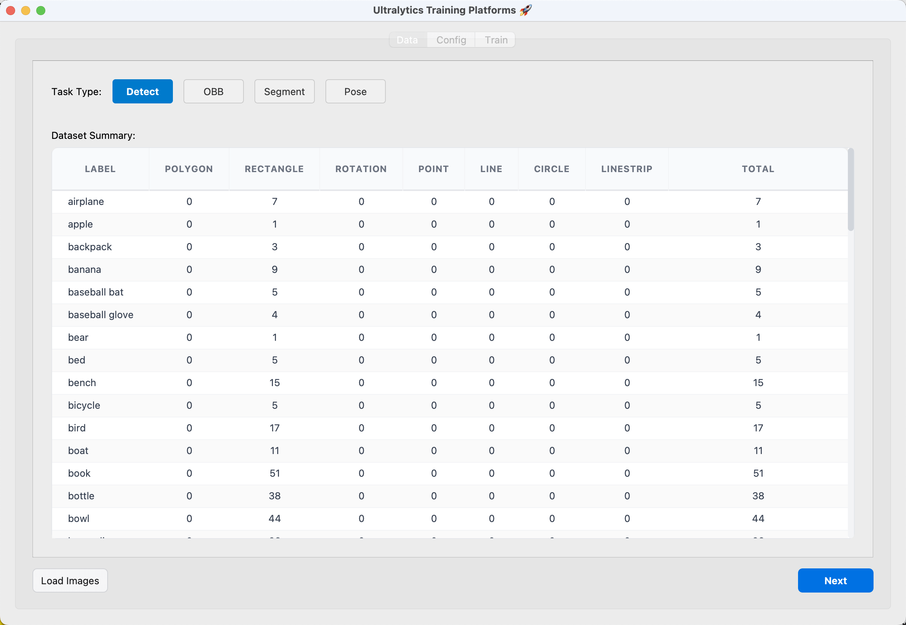
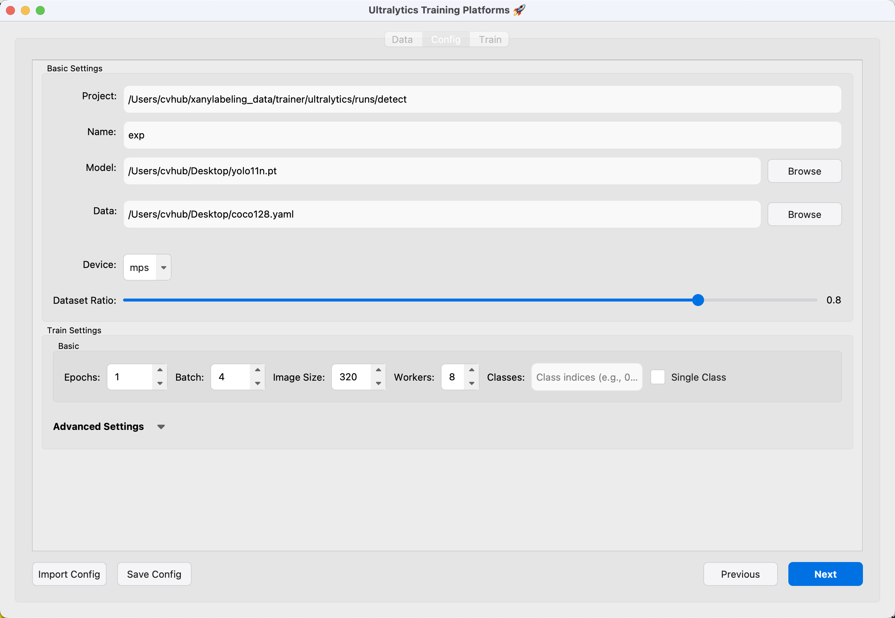
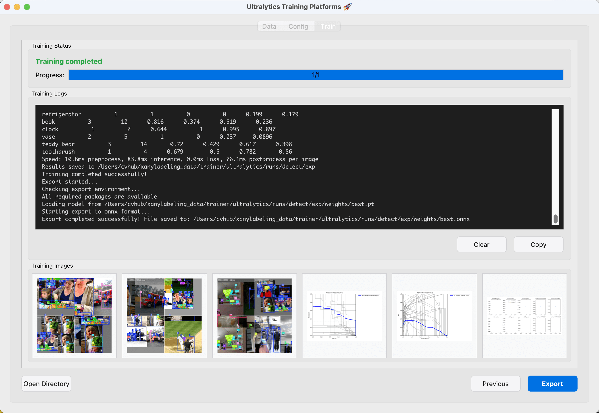

# Ultralytics Training

X-AnyLabeling provides a graphical workflow for training, monitoring, exporting, and loading Ultralytics models using either the current workspace or an existing organized dataset.

<video src="https://github.com/user-attachments/assets/c0ab2056-2743-4a2c-ba93-13f478d3481e" width="100%" controls>
</video>

## Quick Start

From the top menu bar in the main window, select `Train > Ultralytics` to open the training window; preloading images in the labeling workspace is not required.

The training window is fully decoupled from the main labeling interface, allowing you to continue labeling data while training runs in the background.

When training or export is in progress, closing the training window only hides it without stopping the task; reopen it from the same menu.

### 1. Select the task and data source

Open the `Data` tab and select `Classify`, `Detect`, `OBB`, `Segment`, or `Pose`.

X-AnyLabeling currently supports two ways to prepare data for training:

a. **Workspace data**

Use this mode when annotations are managed by X-AnyLabeling.

Load the image directory in the main interface or click `Load Images` in the training window. The `Data` tab displays the class and annotation summary for the current workspace.

When training starts, X-AnyLabeling converts the current annotations and creates a timestamped dataset snapshot. Images are linked when supported and copied as a fallback. Changes made in the labeling interface after training starts are used by the next run, not the active run.

b. **Existing dataset**

Use this mode when the data is already organized for Ultralytics. Select the task and click `Next` without loading images into the workspace.

For detection, segmentation, obb, and pose, select a dataset YAML whose `path`, `train`, and `val` entries resolve to existing directories and whose `names` entry defines the classes. X-AnyLabeling uses this dataset directly without copying images or regenerating the YAML.

For classification, select a directory organized by class under `train`, with optional `val` and `test` directories.

> See the [Ultralytics dataset documentation](https://docs.ultralytics.com/datasets/) for task-specific formats.

### 2. Configure training

The `Config` tab contains the output, environment, model, data, device, and training parameters.

- `Project` and `Name` define the experiment directory as `<Project>/<Name>`.
- `Env` is the Python executable used for environment detection, training, and export. Source installations default to the interpreter that launched X-AnyLabeling; packaged applications leave it empty. Select the executable from an environment that contains a compatible PyTorch and Ultralytics installation. If no such environment exists, create one by following the [official Ultralytics installation guide](https://docs.ultralytics.com/quickstart/), then select its Python executable here.
- `Model` accepts a local `.pt` checkpoint. With an external environment, it also accepts a bare Ultralytics model name such as `yolo11n.pt`, which Ultralytics downloads when required.
- `Data` selects the data source. A complete dataset YAML or classification directory activates existing-dataset mode. With workspace data, X-AnyLabeling generates the train and validation dataset from the loaded annotations.
- `Device` is populated from the selected environment and supports CPU, CUDA, or MPS when available.
- `Dataset Ratio` controls the workspace train/validation split. It is not applied to an existing dataset.
- `Pose Config` is required for pose tasks and defines the keypoint structure.

Common hyperparameters are available under `Train Settings`. Additional optimization, augmentation, loss, and checkpoint options are under `Advanced Settings`. `Plots` is enabled by default so training visualizations are generated. `Only Checked Files` limits workspace training to annotations marked as checked.

See the [Ultralytics train settings](https://docs.ultralytics.com/modes/train/#train-settings) for parameter definitions.

Configurations can be saved to or imported from JSON. Click `Next` after validation succeeds.

### 3. Run and monitor training

Click `Start Training` in the `Train` tab. The log states whether the run uses a workspace snapshot or an existing dataset before preparation begins.

The tab provides progress, training logs, and images generated in the experiment directory. Move the pointer over the log area to reveal copy and clear actions. Training images keep the primary six visualizations first; additional files can be viewed with the horizontal scrollbar or mouse wheel.

If `<Project>/<Name>` already contains `weights/best.pt`, X-AnyLabeling can load the existing experiment instead of retraining. The latest saved training log and available result images are restored.

Use `Stop Training` to end the active process. Exiting X-AnyLabeling while training or export is active asks for confirmation before stopping the background task.

### 4. Export and apply a model

After training completes, click `Export` and select an output format. The same action becomes `Stop` while an external export is running and returns to `Export` when the task finishes or is stopped.

ONNX exports provide an `Apply` action after export completes. Applying the model creates `<Project>/<Name>/<Name>.yaml`, references `weights/best.onnx`, registers the configuration as a custom model, and loads it in the main auto-labeling panel.

## License

Ultralytics is distributed under the AGPL-3.0 license. Review the [Ultralytics license](https://github.com/ultralytics/ultralytics/blob/main/LICENSE) before distributing or providing a training-based service. X-AnyLabeling remains licensed under GPL-3.0.
