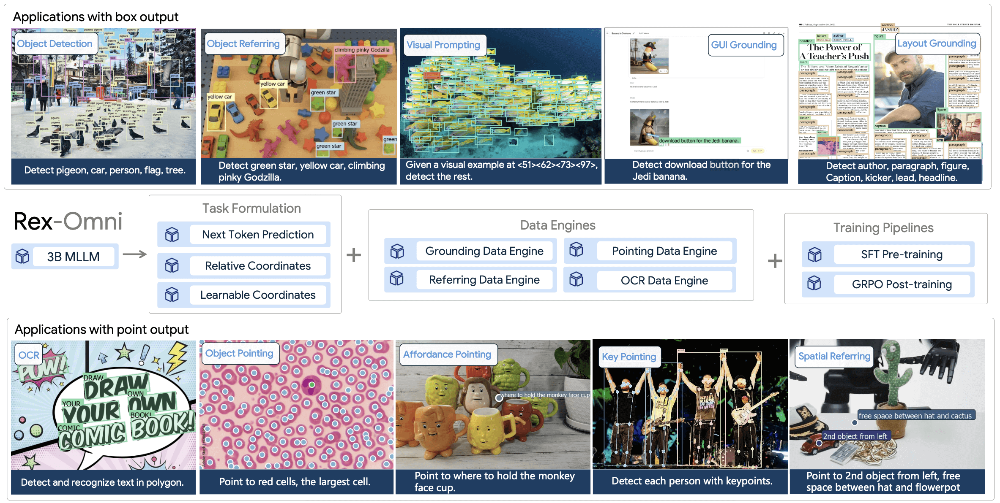

# Rex-Omni Example

  Video Demo: 
  <a href="https://youtu.be/wUTFtcFhfoY">Youtube</a> & 
  <a href="https://www.bilibili.com/video/BV15sz7BqETx">Bilibili</a>

## Introduction

[Rex-Omni](https://arxiv.org/abs/2510.12798) is a 3B-parameter Multimodal Large Language Model (MLLM) that redefines object detection and a wide range of other visual perception tasks as a simple next-token prediction problem.

Here, we will show you how to use Rex-Omni on X-AnyLabeling to perform various vision tasks.

Let's get started!

## Installation

You'll need to get X-AnyLabeling-Server up and running first. Check out the [installation guide](https://github.com/CVHub520/X-AnyLabeling-Server) for the details. Make sure you're running at least v0.0.5 of the server and v3.3.6 of the X-AnyLabeling client, otherwise you might run into compatibility issues.

Once that's done, head over to `configs/models.yaml` and enable `rexomni`. There's an [example config](https://github.com/CVHub520/X-AnyLabeling-Server/blob/main/configs/models.yaml) you can reference if you're not sure how to set it up.

You can tweak the settings in [rexomni.yaml](https://github.com/CVHub520/X-AnyLabeling-Server/blob/main/configs/auto_labeling/rexomni.yaml) to fit your needs. By default, the `backend` is set to `"transformers"`. For faster inference, we recommend configuring `backend: "vllm"` and `attn_implementation: "flash_attention_2"` to accelerate model inference. 

> [!NOTE]
> You need to install compatible versions of `vllm` and `flash-attn` packages separately if you want to use these acceleration options.

## Getting Started

Rex-Omni supports multiple vision tasks. Select the desired task from the task dropdown in the X-AnyLabeling interface.

### Object Detection

The **Detection** task detects objects and returns bounding boxes based on text prompts.

**Usage:**
1. Select the "Detection" task from the task dropdown
2. Enter object categories in the text input field (use dots to separate multiple classes, e.g., `person.car.bicycle`)
3. Click the "Send" button to run inference

### Keypoint Detection

Rex-Omni supports two keypoint detection modes:

#### Keypoint (Person/Hand)
Detects human/hand keypoints with skeleton visualization. No text prompt required.

**Usage:**
1. Select the "Keypoint (Person/Hand)" task from the task dropdown
2. Click the "Run" button to detect person keypoints

#### Keypoint (Animal)
Detects animal keypoints with skeleton visualization. Requires a text prompt specifying the animal category.

**Usage:**
1. Select the "Keypoint (Animal)" task from the task dropdown
2. Enter a single animal category (e.g., `cat`, `dog`, `horse`) or `animal` to detect all animal types
3. Click the "Send" button to run inference

### Optical Character Recognition (OCR)

Rex-Omni provides four OCR modes with different output formats:

#### OCR Box (Word Level)
Word-level text detection and recognition in bounding boxes.

**Usage:**
1. Select the "OCR Box (Word Level)" task from the task dropdown
2. Click the "Run" button to detect and recognize text at word level

#### OCR Box (Text Line Level)
Text line-level text detection and recognition in bounding boxes.

**Usage:**
1. Select the "OCR Box (Text Line Level)" task from the task dropdown
2. Click the "Run" button to detect and recognize text at line level

#### OCR Polygon (Word Level)
Word-level text detection and recognition in polygon shapes.

**Usage:**
1. Select the "OCR Polygon (Word Level)" task from the task dropdown
2. Click the "Run" button to detect and recognize text at word level with polygon shapes

#### OCR Polygon (Text Line Level)
Text line-level text detection and recognition in polygon shapes.

**Usage:**
1. Select the "OCR Polygon (Text Line Level)" task from the task dropdown
2. Click the "Run" button to detect and recognize text at line level with polygon shapes

### Pointing

The **Pointing** task points to objects based on text descriptions.

**Usage:**
1. Select the "Pointing" task from the task dropdown
2. Enter an object description in the text input field
3. Click the "Send" button to run inference

### Visual Prompting

The **Visual Prompting** task finds similar objects based on visual examples (reference boxes).

> [!NOTE]
> This task requires interactive rectangle prompts and does not support batch processing.

**Usage:**
1. Select the "Visual Prompting" task from the task dropdown
2. Click the "Add Positive Rect" button to add reference bounding boxes
3. Draw rectangles around example objects you want to find
4. Click the "Run Rect" button to detect similar objects
5. Use "Clear" to remove all prompts or "Finish Object" to complete the current annotation

> [!TIP]
> All tasks except **Visual Prompting** support batch processing. You can run inference on the entire dataset of the current task with a single click using the batch processing feature in X-AnyLabeling.
